# Cordell Compiler
Cordell Compiler is a compact hobby compiler for Cordell Programming Language with a simple syntax, inspired by C and Rust. It is designed for studying compilation, code optimization, translation, and low-level microcode generation.

# Main idea of this project
Main goal of this project is learning of compilers architecture and porting one to CordellOS project (I want to code apps for OS inside this OS). Also, according to my bias to assembly and C languages (I just love them), this language will stay "low-level" as it possible, but some features can be added in future with strings (inbuild concat, comparison and etc).

# Usefull links and literature
- Aarne Ranta. *Implementing Programming Languages. An Introduction to Compilers and Interpreters*
- Aho, Lam, Sethi, Ullman. *Compilers: Principles, Techniques, and Tools (Dragon Book)*
- Andrew W. Appel. *Modern Compiler Implementation in C (Tiger Book)*
- Cytron et al. *Efficiently Computing Static Single Assignment Form and the Control Dependence Graph* (1991)
- Daniel Kusswurm. *Modern x86 Assembly Language Programming. Covers x86 64-bit, AVX, AVX2 and AVX-512. Third Edition*

# Summary
This `README` file contains the main information about this compiler and the development approaches I’ve learned while working on it. This repository also includes a `github.io` site with similar content and some interactive sections. For convenience, a `Navigation` block with quick links to the topics in this file is provided below.

## Navigation
- [Introduction](#introduction)
- [EBNF](#ebnf)
- [Code snippet](#sample-code-snippet)
- [Tokenization part](#tokenization-part)
   - [Example of tokenized code](#example-of-tokenized-code)
- [Markup part](#markup-part)
   - [Example of markup result](#example-of-markup-result)
- [AST part](#ast-part)
   - [Example of AST](#example-of-ast)
   - [AST optimization](#ast-optimization)
- [HIR part](#hir-part)
   - [Example of HIR](#example-of-hir)
- [CFG part](#cfg-part)
   - [Example of CFG](#example-of-cfg)
- [Dominant calculation](#dominant-calculation)
   - [Strict dominance](#strict-dominance)
   - [Dominance frontier](#dominance-frontier)
- [SSA form](#ssa-form)
   - [Phi function](#phi-function)
- [Liveness analyzer part](#liveness-analyzer-part)
   - [USE and DEF](#use-and-def)
   - [IN and OUT](#in-and-out)
   - [Point of deallocation](#point-of-deallocation)

## Introduction
For additional experience, I chose to take on an extra challenge — creating a programming language. This language has an `EBNF-defined` syntax, its own [VS Code extension](https://github.com/j1sk1ss/CordellCompiler/tree/HIR_LIR_SSA/vscode), and documentation. While explaining each layer of the compiler, I will also provide direct examples written in this language.

## EBNF
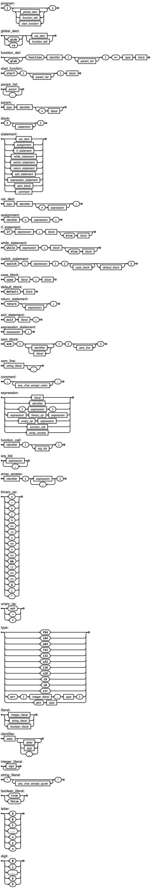

## Sample code snippet
The code below demonstrates the main capabilities of the language, excluding features such as while loops, syscalls, strings, and other advanced constructs. This code will be referenced in other parts of this `README`, and is presented here as an initial example before all further explanations.
```cpl
{
    function sum(i32 a, i32 b) => i32 {
        arr c[2, i32] = { a, b };
        return c[0] + c[1];
    }

    start(i64 argc, ptr u64 argv) {
        i32 a = 10;
        i32 b = 10;
        i32 c = 10;
        i32 d = 10;
        i32 k = 10;
        i32 f = 10;
        if sum(a, b) > (a * b + c + d + k + f); {
            exit 1;
        }
        
        i32 l = ref f;
        exit dref l;
    }
}
```

## Tokenization part
The tokenization part is responsible for splitting the input byte sequence into basic tokens. This module ignores all whitespace and separator symbols (such as newlines and tabs). It also classifies each token into one of the basic types: `number`, `string`, `delimiter`, `comma`, or `dot`.
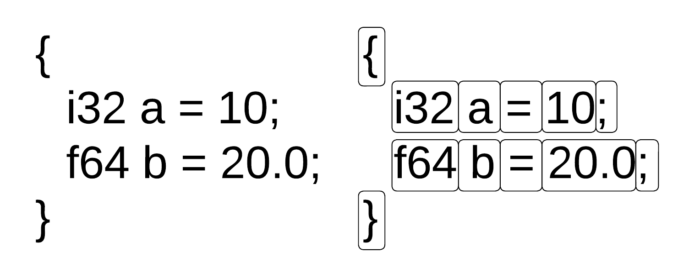

### Example of tokenized code
Code above will produce next list of tokens.
```
line=1, type=1, data=[{], 
line=1, type=2, data=[function], 
line=1, type=2, data=[sum], 
line=1, type=1, data=[(], 
line=1, type=2, data=[i32], 
line=1, type=2, data=[a], 
line=1, type=7, data=[,], 
line=1, type=2, data=[i32], 
line=1, type=2, data=[b], 
line=1, type=1, data=[)], 
line=1, type=0, data=[=>], 
<...>
line=16, type=1, data=[}], 
line=17, type=2, data=[i32], 
line=17, type=2, data=[l], 
line=17, type=0, data=[=], 
line=17, type=2, data=[ref], 
line=17, type=2, data=[f], 
line=18, type=6, data=[;], 
line=18, type=2, data=[exit], 
line=18, type=2, data=[dref], 
line=18, type=2, data=[l], 
line=19, type=6, data=[;], 
line=20, type=1, data=[}]
```

## Markup part
The markup stage is the second part of tokenization, but it is separated from the tokenizer in this compiler due to a different design approach. It operates only on the list of tokens and includes support for scopes. The main idea is to perform basic semantic markup of variables — for example, if we declare a variable `i32 a`, all occurrences of `a` within the corresponding scope can be marked as having the `i32` type.
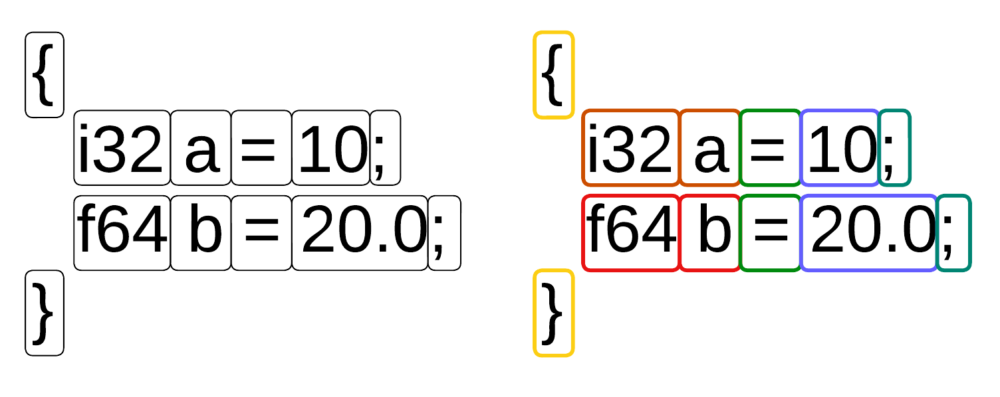

### Example of markup result
```
line=1, type=12, data=[{], 
line=1, type=44, data=[function], 
line=1, type=45, data=[sum], 
line=1, type=10, data=[(], 
line=1, type=24, data=[i32], 
line=1, type=79, data=[a], 
line=1, type=7, data=[,], 
line=1, type=24, data=[i32], 
line=1, type=79, data=[b], 
line=1, type=11, data=[)], 
line=1, type=39, data=[=>],
<...>
line=13, type=6, data=[;], 
line=14, type=12, data=[{], 
line=14, type=38, data=[exit], 
glob line=14, type=3, data=[1], 
line=15, type=6, data=[;], 
line=16, type=13, data=[}], 
line=17, type=24, data=[i32], 
line=17, type=79, data=[l], 
line=17, type=62, data=[=], 
line=17, type=79, data=[f], ref 
line=18, type=6, data=[;], 
line=18, type=38, data=[exit], 
line=18, type=79, data=[l], dref 
line=19, type=6, data=[;], 
line=20, type=13, data=[}]
```

## AST part
Next, we need to parse this sequence of marked tokens to construct an `AST` (Abstract Syntax Tree). There are many approaches to achieve this — for example, `LL` parsing, `LR` parsing, or even `hybrid` techniques that combine `LL` and `LR`. A more complete list of parser types can be found [here](https://www.geeksforgeeks.org/compiler-design/types-of-parsers-in-compiler-design/) or in related compiler design books.
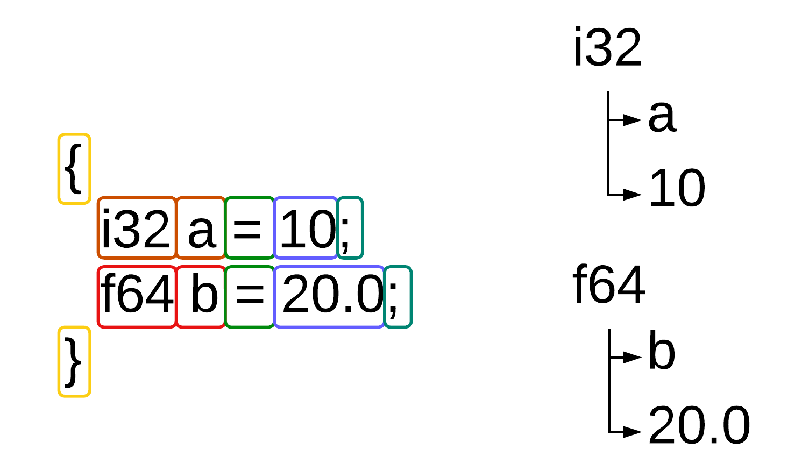

### Example of AST
```
[ block ]
   { scope, id=1 }
      [function] (t=44, v_id=0, s_id=0)
         [sum] (t=45, v_id=0, s_id=0)
            [i32] (t=24, v_id=0, s_id=0)
         { scope, id=2 }
            [i32] (t=24, v_id=0, s_id=0)
               [a] (t=79, v_id=0, s_id=2)
            [i32] (t=24, v_id=0, s_id=0)
               [b] (t=79, v_id=1, s_id=2)
            { scope, id=3 }
               [arr] (t=32, v_id=0, s_id=0)
                  [c] (t=87, v_id=2, s_id=3)
                  [2] (t=3, v_id=0, s_id=0, glob)
                  [i32] (t=24, v_id=0, s_id=0)
                  [a] (t=79, v_id=0, s_id=2)
                  [b] (t=79, v_id=1, s_id=2)
               [return] (t=37, v_id=0, s_id=3)
                  [+] (t=53, v_id=0, s_id=0)
                     [c] (t=87, v_id=2, s_id=3)
                        [0] (t=3, v_id=0, s_id=0, glob)
                     [c] (t=87, v_id=2, s_id=3)
                        [1] (t=3, v_id=0, s_id=0, glob)
      [start] (t=36, v_id=1, s_id=0)
         [i64] (t=23, v_id=0, s_id=0)
            [argc] (t=78, v_id=3, s_id=1)
         [u64] (t=27, ptr, v_id=0, s_id=0)
            [argv] (t=82, ptr, v_id=4, s_id=1)
         [ block ]
            { scope, id=4 }
               [i32] (t=24, v_id=0, s_id=0)
                  [a] (t=79, v_id=5, s_id=4)
                  [10] (t=3, v_id=0, s_id=0, glob)
               [i32] (t=24, v_id=0, s_id=0)
                  [b] (t=79, v_id=6, s_id=4)
                  [10] (t=3, v_id=0, s_id=0, glob)
               [i32] (t=24, v_id=0, s_id=0)
                  [c] (t=79, v_id=7, s_id=4)
                  [10] (t=3, v_id=0, s_id=0, glob)
               [i32] (t=24, v_id=0, s_id=0)
                  [d] (t=79, v_id=8, s_id=4)
                  [10] (t=3, v_id=0, s_id=0, glob)
               [i32] (t=24, v_id=0, s_id=0)
                  [k] (t=79, v_id=9, s_id=4)
                  [10] (t=3, v_id=0, s_id=0, glob)
               [i32] (t=24, v_id=0, s_id=0)
                  [f] (t=79, v_id=10, s_id=4)
                  [10] (t=3, v_id=0, s_id=0, glob)
               [if] (t=51, v_id=0, s_id=4)
                  [>] (t=67, v_id=0, s_id=0)
                     [sum] (t=46, v_id=0, s_id=0)
                        [a] (t=79, v_id=5, s_id=4)
                        [b] (t=79, v_id=6, s_id=4)
                     [+] (t=53, v_id=0, s_id=0)
                        [+] (t=53, v_id=0, s_id=0)
                           [+] (t=53, v_id=0, s_id=0)
                              [+] (t=53, v_id=0, s_id=0)
                                 [*] (t=55, v_id=0, s_id=0)
                                    [a] (t=79, v_id=5, s_id=4)
                                    [b] (t=79, v_id=6, s_id=4)
                                 [c] (t=79, v_id=7, s_id=4)
                              [d] (t=79, v_id=8, s_id=4)
                           [k] (t=79, v_id=9, s_id=4)
                        [f] (t=79, v_id=10, s_id=4)
                  { scope, id=5 }
                     [exit] (t=38, v_id=0, s_id=5)
                        [1] (t=3, v_id=0, s_id=0, glob)
               [i32] (t=24, v_id=0, s_id=0)
                  [l] (t=79, v_id=11, s_id=4)
                  [f] (t=79, ref, v_id=10, s_id=4)
               [exit] (t=38, v_id=0, s_id=4)
                  [l] (t=79, dref, v_id=11, s_id=4)
```

### AST optimization
Now we have a correct `AST` representation of the input code. Before proceeding further, we can optionally perform some optimizations at this stage. We will not spend much time here and will only cover a few examples. Note that `AST-level` optimizations are mostly redundant in this project and are included primarily for learning purposes.
- Condition unrolling: If we have an `if` statement with a constant condition, such as `if 1 { ... }`, or similar constructs with `while` or `switch`, we can unroll them by removing the condition and keeping only the scope that will always execute.
- Dead function elimination: This simple technique removes all unused functions.
- Dead scope elimination: If a scope does not affect the environment, it can be removed.

## HIR part
Now we need to convert our `AST` into a simpler representation. A common approach here is to convert the `AST` into `Three-Address Code` (3AC).
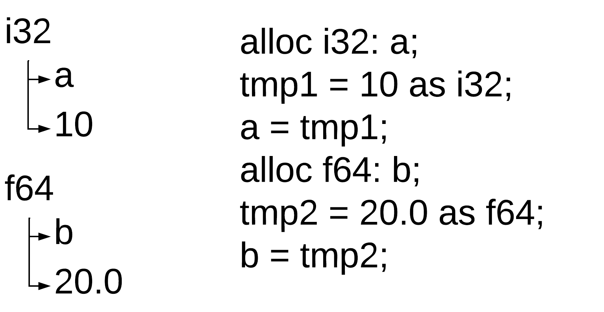

### HIR optimization
- Constant folding
- HIR Peephole optimization

### Example of HIR
```
{
    fn sum(i32 a, i32 b) -> i32
    {
        alloc i32s a0;
        load_arg(i32s a0);
        alloc i32s b1;
        load_arg(i32s b1);
        {
            prm_st(i32s a0);
            prm_st(i32s b1);
            alloc arrs c2, size: n2;
            i32t tmp12 = arrs c2[n0];
            i32t tmp13 = arrs c2[n1];
            i32t tmp14 = i32t tmp12 + i32t tmp13;
            return i32t tmp14;
        }
    }
    
    start {
        alloc i64s argc3;
        load_starg(i64s argc3);
        alloc u64s argv4;
        load_starg(u64s argv4);
        {
            alloc i32s a5;
            i32t tmp15 = n10 as i32;
            i32s a5 = i32t tmp15;
            alloc i32s b6;
            i32t tmp16 = n10 as i32;
            i32s b6 = i32t tmp16;
            alloc i32s c7;
            i32t tmp17 = n10 as i32;
            i32s c7 = i32t tmp17;
            alloc i32s d8;
            i32t tmp18 = n10 as i32;
            i32s d8 = i32t tmp18;
            alloc i32s k9;
            i32t tmp19 = n10 as i32;
            i32s k9 = i32t tmp19;
            alloc i32s f10;
            i32t tmp20 = n10 as i32;
            i32s f10 = i32t tmp20;
            store_arg(i32s a5);
            store_arg(i32s b6);
            i32t tmp21 = call sum(i32 a, i32 b) -> i32, argc c2;
            i32t tmp22 = i32s a5 * i32s b6;
            i32t tmp23 = i32t tmp22 + i32s c7;
            i32t tmp24 = i32t tmp23 + i32s d8;
            i32t tmp25 = i32t tmp24 + i32s k9;
            i32t tmp26 = i32t tmp25 + i32s f10;
            i32t tmp27 = i32t tmp21 > i32t tmp26;
            if i32t tmp27, goto l73;
            {
                exit n1;
            }
            l73:
            alloc i32s l11;
            u64t tmp28 = &(i32s f10);
            i32t tmp29 = u64t tmp28 as i32;
            i32s l11 = i32t tmp29;
            exit i32s l11;
        }
    }
}
```

## CFG part
With `3AC`, we can move on to `CFG` (Control Flow Graph) creation. There are several ways to split `3AC` into basic blocks. One approach is using `leaders`, while another is to create a block for every command. The second approach is straightforward — each `3AC` instruction becomes its own block. The `leaders` approach, described in the *Dragon Book*, defines three rules for identifying the start of a block:

- The first instruction in a function.
- The target of a JMP instruction.
- The instruction immediately following a JMP.

In this compiler, both approaches are implemented, but for the following explanations, we will use the approach of creating a block for every command.

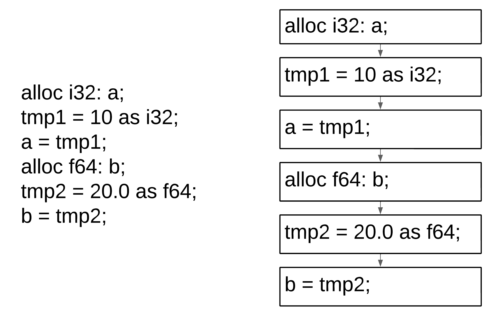

### Example of CFG
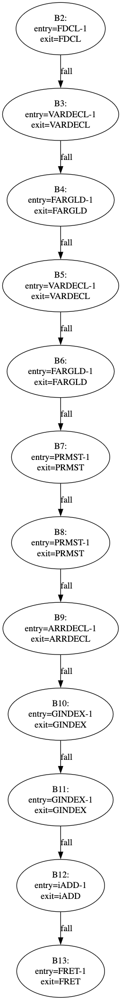

## Dominant calculation
With the `CFG`, we can determine the dominators of each block. In simple terms, a dominator of a block `Y` is a block `X` that appears on every path from the entry block to `Y`. For example, the following figure illustrates how this works:
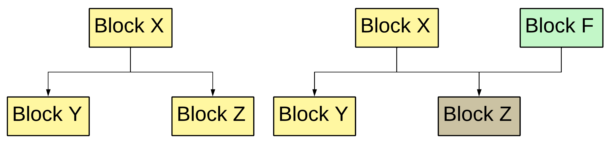

### Strict dominance
Strict dominance tells us which block strictly dominates another. A block `X` strictly dominates block `Y` if `X` dominates `Y` and `X` != `Y`. Why do we need this? The basic dominance relation marks all blocks that dominate a given block, but later analyses often require only the closest one. A block `X` is said to be the immediate dominator of `Y` if `X` strictly dominates `Y`, and there is no other block `Z` such that `Z` strictly dominates `Y` and is itself strictly dominated by `X`.
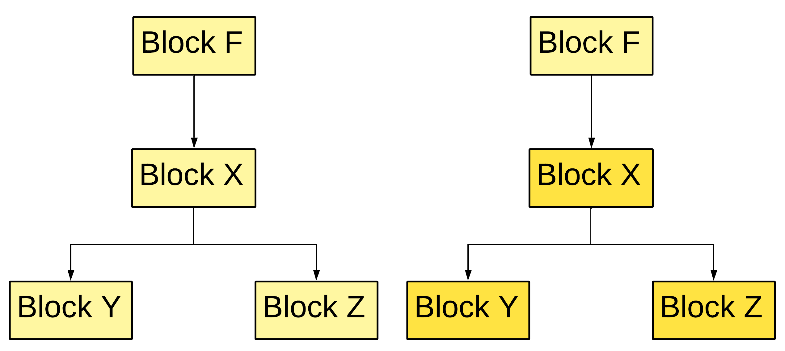

### Dominance frontier
The dominance frontier of a block `X` is the set of blocks where the dominance of `X` ends. More precisely, it represents all the blocks that are partially influenced by `X`: `X` dominates at least one of their predecessors, but does not dominate the block itself. In other words, it marks the boundary where control flow paths from inside `X’s` dominance region meet paths coming from outside.
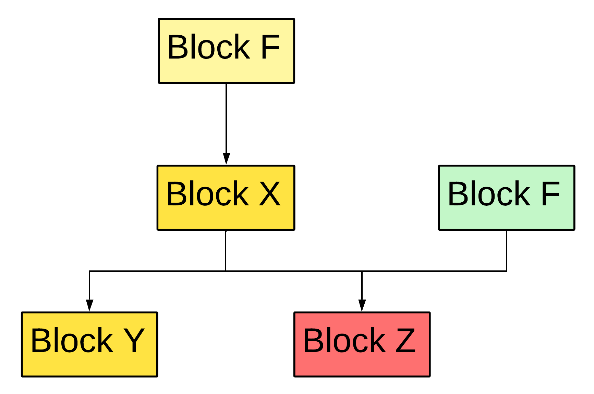

## SSA form
Static Single Assignment (SSA) form requires renaming all assigned variables so that each assignment creates a new, unique variable. A simple example is shown below:
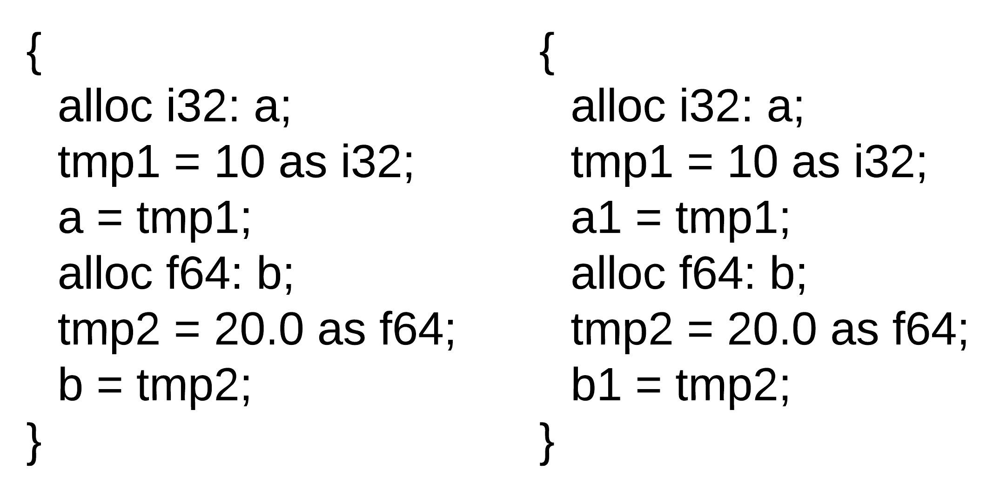

### Phi function
But here we encounter a problem. What should we do in this specific case?
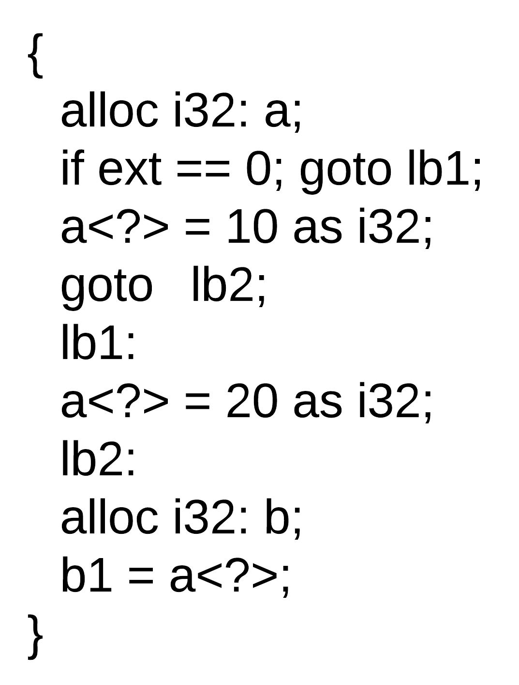

Which version of the variable `a` should be used in the declaration of `b`? The answer is simple — `both`. Here’s the twist: in `SSA` form, we can use a `φ (phi)` function, which tells the compiler which variable version to use. An example of a `φ` function is shown below:
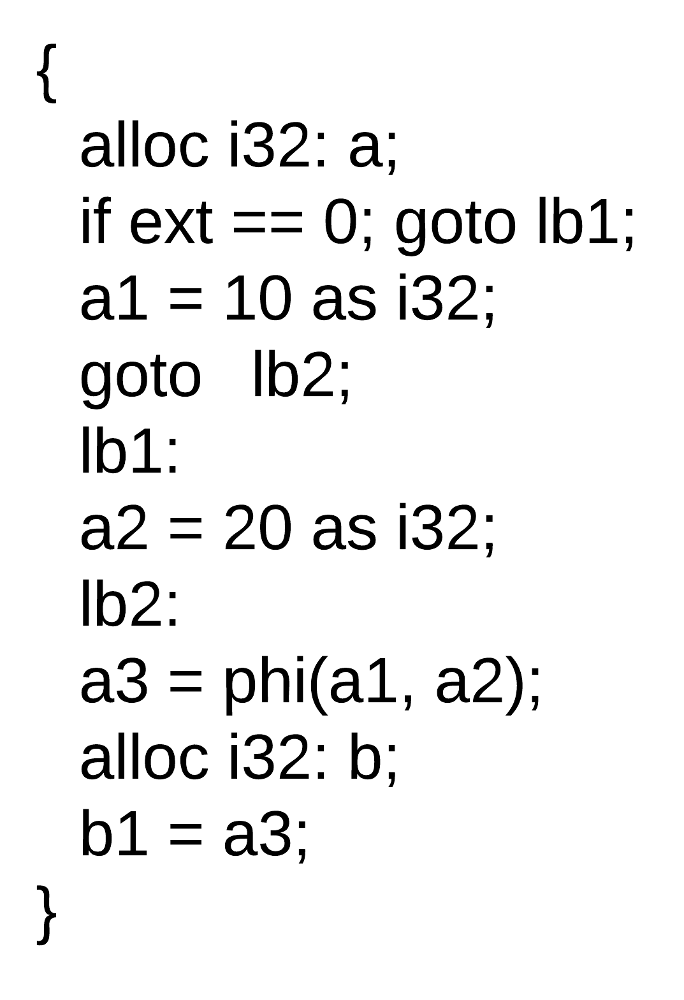
But how do we determine where to place this function? Here, we use previously computed dominance information. We traverse the entire symbol table of variables. For each variable, we collect the set of blocks where it is defined (either declared or assigned). Then, for each block with a definition, we take its dominance frontier blocks and insert a `φ` function there.
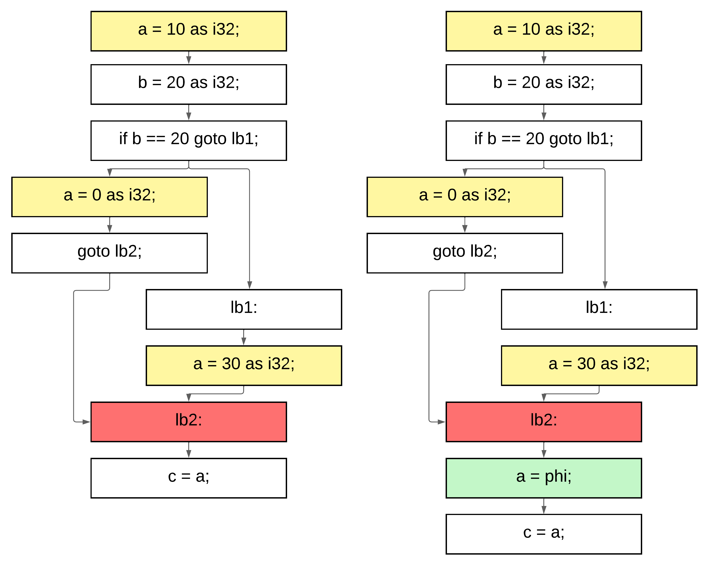
Then, during the SSA renaming process, we keep track of each block that passes through a φ-function block, recording the version of the variable and the block number. This completes the SSA renaming phase, producing the following result:
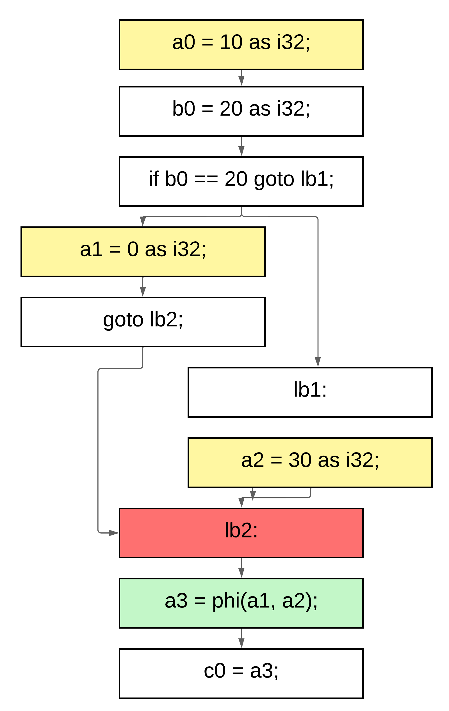

## Liveness analyzer part
Several optimization techniques are based on data-flow analysis. Data-flow analysis itself relies on liveness analysis, which in turn depends on the program’s `SSA` form and control-flow graph (CFG). Now that we have established these fundamental representations, we can proceed with the `USE–DEF–IN–OUT` computation process.

### USE and DEF
`USE` and `DEF` are two sets associated with every `CFG` block. These sets represent all definitions and usages of variables within the block (recall that the code is already in `SSA` form). In short:
- `DEF` contains all variables that are written (i.e., assigned a new value).
- `USE` contains all variables that are read (i.e., their value is used).
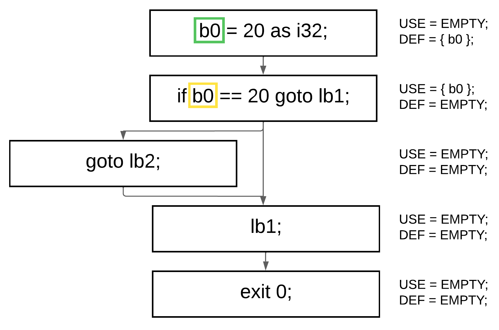

### IN and OUT
`IN` and `OUT` is a little bit complex part here. 
```
OUT[B] = union(IN[S])
IN[B]  = union(USE[B], OUT[B] − DEF[B])
```

First of all, to make the calculation much faster, we should traverse our list of `CFG` blocks in reverse order, computing `IN` and `OUT` for each block using the formulas above, and repeat this process until it stabilizes. Stabilization occurs when the previous sets (`primeIN` and `primeOUT`) are equal to the current sets (`currIN` and `currOUT`). This means that for every block we should maintain four sets:

- primeIN
- currIN
- primeOUT
- currOUT

After each iteration, the current values are copied into the corresponding prime sets, preparing them for the next comparison cycle.
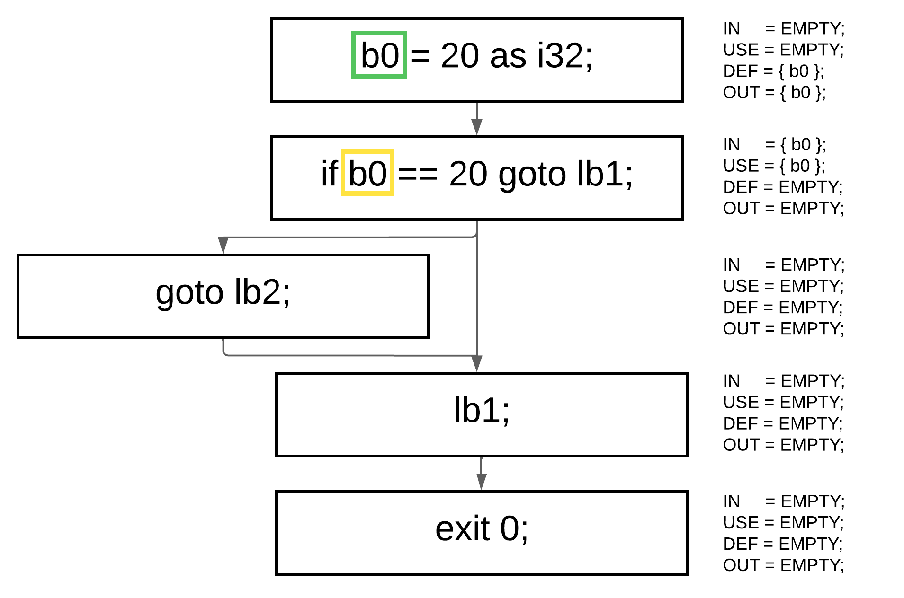

### Point of deallocation
At this point, we can determine where each variable dies. If a variable appears in the `IN` or `DEF` set but is not present in the `OUT` set, it means the variable is no longer used after this block, and we can safely insert a special `kill` instruction to mark it as dead. However, an important detail arises when dealing with pointer types. To handle them correctly, we construct a special structure called an `aliasmap`, which tracks ownership relationships between variables. This map records which variable owns another — meaning that one variable’s lifetime depends on another’s. For example, in code like this:
```cpl
{
   i32 a0 = 10;
   ptr i32 b0 = ref a0;
   dref b0 = 20;
}
```
the variable `a` is owned by `b`, so we must not kill `a` while `b` is still alive. In other words, the liveness of `a` depends on the liveness of `b`, and this dependency is preserved through the aliasmap.
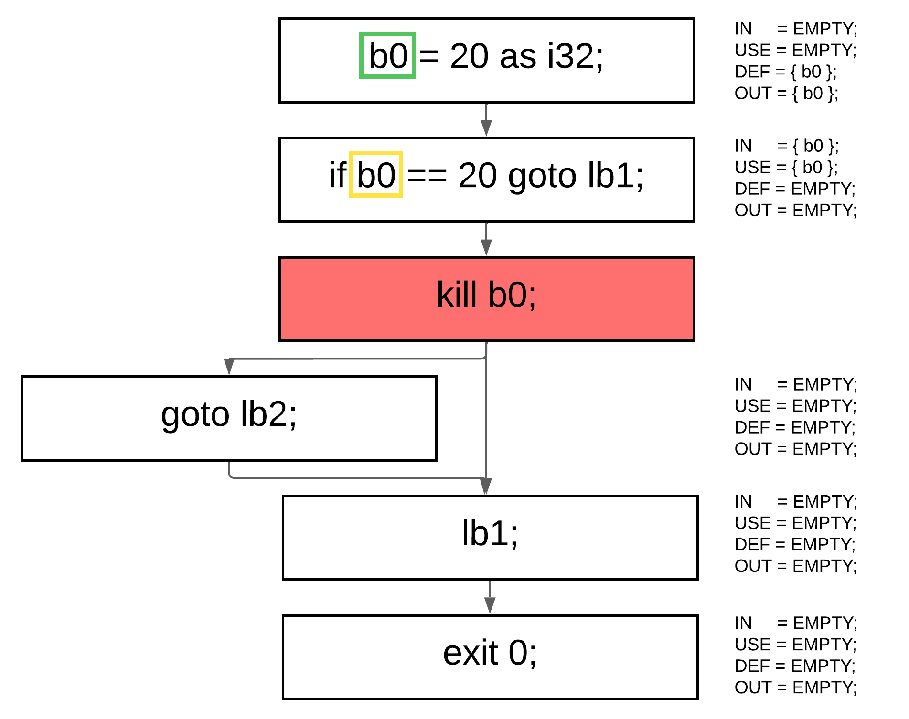

### Example code
```cpl
{
    fn sum(i32 a, i32 b) -> i32
    {
        alloc i32s a0;
        kill c0
        load_arg(i32s a0);
        alloc i32s b1;
        kill c1
        load_arg(i32s b1);
        {
            prm_st(i32s a0);
            kill c0
            prm_st(i32s b1);
            kill c1
            alloc arrs c2, size: n2;
            i32t tmp12 = arrs c2[n0];
            i32t tmp13 = arrs c2[n1];
            kill c2
            i32t tmp30 = i32t tmp12 + i32t tmp13;
            kill c12
            kill c13
            return i32t tmp30;
            kill c30
        }
    }
    
    start {
        alloc i64s argc3;
        kill c3
        load_starg(i64s argc3);
        kill c3
        alloc u64s argv4;
        kill c4
        load_starg(u64s argv4);
        kill c4
        {
            alloc i32s a5;
            kill c5
            i32t tmp15 = n10 as i32;
            i32s a31 = i32t tmp15;
            kill c15
            alloc i32s b6;
            kill c6
            i32t tmp16 = n10 as i32;
            i32s b32 = i32t tmp16;
            kill c16
            alloc i32s c7;
            kill c7
            i32t tmp17 = n10 as i32;
            i32s c33 = i32t tmp17;
            kill c17
            alloc i32s d8;
            kill c8
            i32t tmp18 = n10 as i32;
            i32s d34 = i32t tmp18;
            kill c18
            alloc i32s k9;
            kill c9
            i32t tmp19 = n10 as i32;
            i32s k35 = i32t tmp19;
            kill c19
            alloc i32s f10;
            kill c10
            i32t tmp20 = n10 as i32;
            i32s f36 = i32t tmp20;
            kill c20
            store_arg(i32s a31);
            store_arg(i32s b32);
            i32t tmp21 = call sum(i32 a, i32 b) -> i32, argc c2;
            i32t tmp37 = i32s a31 * i32s b32;
            kill c32
            kill c31
            i32t tmp38 = i32t tmp37 + i32s c33;
            kill c37
            kill c33
            i32t tmp39 = i32t tmp38 + i32s d34;
            kill c38
            kill c34
            i32t tmp40 = i32t tmp39 + i32s k35;
            kill c35
            kill c39
            i32t tmp41 = i32t tmp40 + i32s f36;
            kill c40
            i32t tmp27 = i32t tmp21 > i32t tmp41;
            kill c21
            kill c41
            if i32t tmp27, goto l73;
            kill c27
            {
                exit n1;
            }
            l73:
            alloc i32s l11;
            kill c11
            u64t tmp28 = &(i32s f36);
            i32t tmp29 = u64t tmp28 as i32;
            kill c28
            i32s l42 = i32t tmp29;
            kill c29
            exit i32s l42;
            kill c42
        }
    }
}
```

## Register allocation part
### Graph coloring
## LIR (x86_64) part
## Codegen (nasm) part