# Cordell Compiler
Cordell Compiler is a compact hobby compiler for the `Cordell Programming Language` with a simple syntax, inspired by C and Rust. It is designed for studying compilation, code optimization, translation, and low-level microcode generation.
- *This README still in work*

# Main idea of this project
Main goal of this project is learning of compilers architecture and porting one to the `CordellOS` project (I just want to code apps for `my` OS inside `my` OS). Also, according to my bias to `assembly` and `C` languages (I just love them), this language will stay "low-level" as it possible, but some features can be added in future with strings (inbuild concat, comparison, etc).

# Used links and literature
- Aarne Ranta. *Implementing Programming Languages. An Introduction to Compilers and Interpreters*
- Aho, Lam, Sethi, Ullman. *Compilers: Principles, Techniques, and Tools (Dragon Book)*
- Andrew W. Appel. *Modern Compiler Implementation in C (Tiger Book)*
- Cytron et al. *Efficiently Computing Static Single Assignment Form and the Control Dependence Graph* (1991)
- Daniel Kusswurm. *Modern x86 Assembly Language Programming. Covers x86 64-bit, AVX, AVX2 and AVX-512. Third Edition*
- Jason Robert, Carey Patterson. *Basic Instruction Scheduling (and Software Pipelining)* (2001)

# Summary
This `README` file contains the main information about this compiler and the development approaches I’ve learned while working on it. This repository also includes a `github.io` site with similar content and some interactive sections. For convenience, a `Navigation` block with quick links to the topics in this file is provided below.

## Navigation
- [Introduction](#introduction)
- [EBNF](#ebnf)
- [Code snippet](#sample-code-snippet)
- [Tokenization part](#tokenization-part)
   - [Example of tokenized code](#example-of-tokenized-code)
- [Markup part](#markup-part)
   - [Example of markup result](#example-of-markup-result)
- [AST part](#ast-part)
   - [Example of AST](#example-of-ast)
   - [AST optimization](#ast-optimization)
- [HIR part](#hir-part)
   - [Example of HIR](#example-of-hir)
- [CFG part](#cfg-part)
   - [Example of CFG](#example-of-cfg)
- [Dominant calculation](#dominant-calculation)
   - [Strict dominance](#strict-dominance)
   - [Dominance frontier](#dominance-frontier)
- [SSA form](#ssa-form)
   - [Phi function](#phi-function)
- [DAG part](#dag-part)
- [HIR optimization](#hir-optimization)
   - [Constant folding / propagation (First pass)](#constant-folding--propagation-first-pass)
   - [Dead Function Elimination (DFE)](#dead-function-elimination-dfe)
   - [Tail Recursion Elimination (TRE)](#tail-recursion-elimination-tre)
   - [Function inlining](#function-inlining)
   - [Loop canonicalization](#loop-canonicalization)
   - [Loop Invariant Code Motion (LICM)](#loop-invariant-code-motion-licm)
- [LIR part](#lir-part)
- [LIR instruction planning](#lir-instruction-planning)
- [LIR (x86_64) instruction selection](#lir-x86_64-instruction-selection)
- [LIR applying const propagation](#lir-applying-const-propagation)
- [LIR x86_64 example](#lir-x86_64-example)
- [Liveness analyzer part](#liveness-analyzer-part)
   - [USE and DEF](#use-and-def)
   - [IN and OUT](#in-and-out)
   - [Point of deallocation](#point-of-deallocation)
- [Register allocation part](#register-allocation-part)
   - [Graph coloring](#graph-coloring)
- [LIR peephole optimization](#lir-peephole-optimization)
   - [PTRN domain specific language](#ptrn-domain-specific-language)
   - [First pass](#first-pass)
   - [Second pass](#second-pass)
   - [Third pass](#third-pass)
- [Codegen (nasm) part](#codegen-nasm-part)
   - [Example of generated code](#example-of-generated-code)

## Project structure
- `examples/` - CordellLanguage code examples.
- `include/` - Include headers of this compiler and standart libs.
- `src/` - Source files of this compiler.
- `std/` - Standart libs that are used in this compiler.
- `tests/` - Tests folder for this complier.
- `vscode/` - VScode CordellLanguage extention.
- `commits.py` - Special commit tool for better maintaining this project.
- `Makefile` - Main build script.

## Introduction
For additional experience, I chose to take on an extra challenge — creating a programming language. This language has an `EBNF-defined` syntax, its own [VS Code extension](https://github.com/j1sk1ss/CordellCompiler/tree/HIR_LIR_SSA/vscode), and documentation. While explaining each layer of the compiler, I will also provide direct examples written in this language.

## EBNF
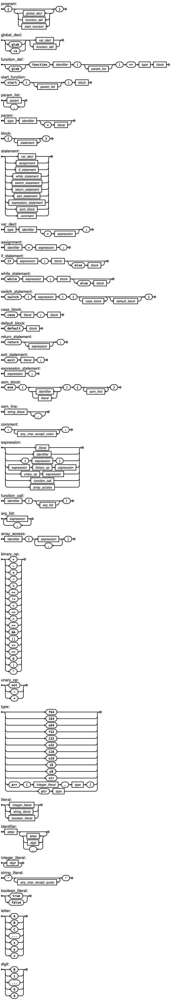

## Sample code snippet
The code below demonstrates the main capabilities of the language, excluding features such as while loops, syscalls, strings, and other advanced constructs. This code will be referenced in other parts of this `README`, and is presented here as an initial example before all further explanations.
```cpl
{
    function sum(i32 a, i32 b) => i32 {
        arr c[2, i32] = { a, b };
        return c[0] + c[1];
    }

    start(i64 argc, ptr u64 argv) {
        i32 a = 10;
        i32 b = 10;
        i32 c = 10;
        i32 d = 10;
        i32 k = 10;
        i32 f = 10;
        if sum(a, b) > (a * b + c + d + k + f); {
            exit 1;
        }
        
        i32 l = ref f;
        exit dref l;
    }
}
```

## Tokenization part
The tokenization part is responsible for splitting the input byte sequence into basic tokens. This module ignores all whitespace and separator symbols (such as newlines and tabs). It also classifies each token into one of the basic types: `number`, `string`, `delimiter`, `comma`, or `dot`.
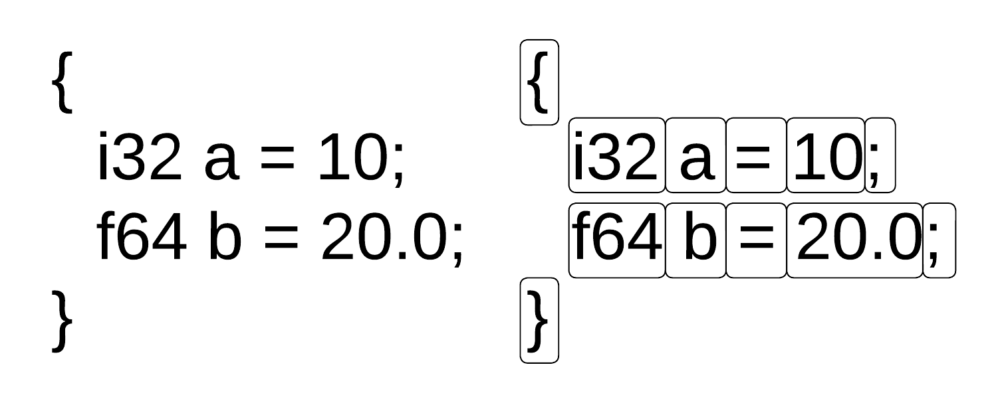

### Example of tokenized code
Code above will produce next list of tokens.
```
line=1, type=1, data=[{], 
line=1, type=2, data=[function], 
line=1, type=2, data=[sum], 
line=1, type=1, data=[(], 
line=1, type=2, data=[i32], 
line=1, type=2, data=[a], 
line=1, type=7, data=[,], 
line=1, type=2, data=[i32], 
line=1, type=2, data=[b], 
line=1, type=1, data=[)], 
line=1, type=0, data=[=>], 
<...>
line=16, type=1, data=[}], 
line=17, type=2, data=[i32], 
line=17, type=2, data=[l], 
line=17, type=0, data=[=], 
line=17, type=2, data=[ref], 
line=17, type=2, data=[f], 
line=18, type=6, data=[;], 
line=18, type=2, data=[exit], 
line=18, type=2, data=[dref], 
line=18, type=2, data=[l], 
line=19, type=6, data=[;], 
line=20, type=1, data=[}]
```

## Markup part
The markup stage is the second part of tokenization, but it is separated from the tokenizer in this compiler due to a different design approach. It operates only on the list of tokens and includes support for scopes. The main idea is to perform basic semantic markup of variables — for example, if we declare a variable `i32 a`, all occurrences of `a` within the corresponding scope can be marked as having the `i32` type.
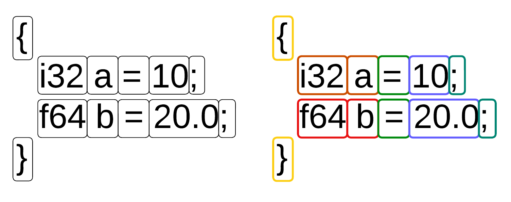

### Example of markup result
```
line=1, type=12, data=[{], 
line=1, type=44, data=[function], 
line=1, type=45, data=[sum], 
line=1, type=10, data=[(], 
line=1, type=24, data=[i32], 
line=1, type=79, data=[a], 
line=1, type=7, data=[,], 
line=1, type=24, data=[i32], 
line=1, type=79, data=[b], 
line=1, type=11, data=[)], 
line=1, type=39, data=[=>],
<...>
line=13, type=6, data=[;], 
line=14, type=12, data=[{], 
line=14, type=38, data=[exit], 
glob line=14, type=3, data=[1], 
line=15, type=6, data=[;], 
line=16, type=13, data=[}], 
line=17, type=24, data=[i32], 
line=17, type=79, data=[l], 
line=17, type=62, data=[=], 
line=17, type=79, data=[f], ref 
line=18, type=6, data=[;], 
line=18, type=38, data=[exit], 
line=18, type=79, data=[l], dref 
line=19, type=6, data=[;], 
line=20, type=13, data=[}]
```

## AST part
Next, we need to parse this sequence of marked tokens to construct an `AST` (Abstract Syntax Tree). There are many approaches to achieve this — for example, `LL` parsing, `LR` parsing, or even `hybrid` techniques that combine `LL` and `LR`. A more complete list of parser types can be found [here](https://www.geeksforgeeks.org/compiler-design/types-of-parsers-in-compiler-design/) or in related compiler design books.
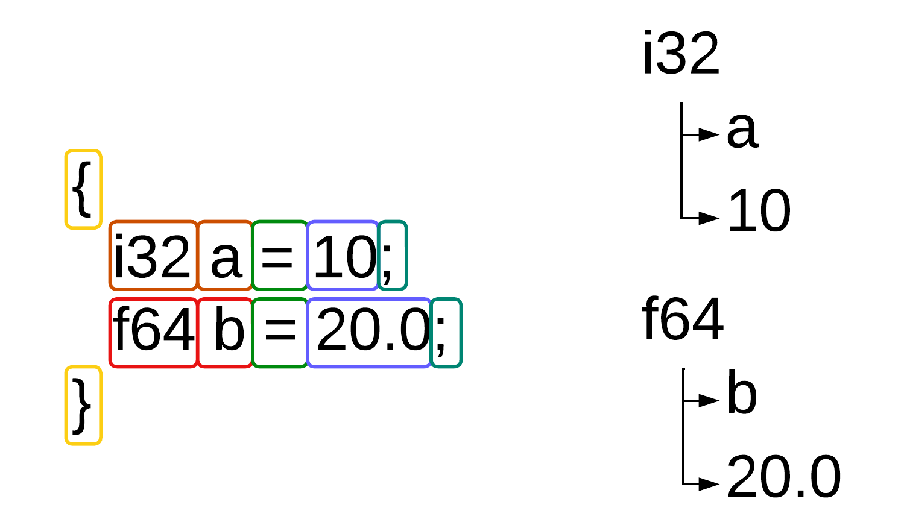

### Example of AST
```
[ block ]
   { scope, id=1 }
      [function] (t=44, v_id=0, s_id=0)
         [sum] (t=45, v_id=0, s_id=0)
            [i32] (t=24, v_id=0, s_id=0)
         { scope, id=2 }
            [i32] (t=24, v_id=0, s_id=0)
               [a] (t=79, v_id=0, s_id=2)
            [i32] (t=24, v_id=0, s_id=0)
               [b] (t=79, v_id=1, s_id=2)
            { scope, id=3 }
               [arr] (t=32, v_id=0, s_id=0)
                  [c] (t=87, v_id=2, s_id=3)
                  [2] (t=3, v_id=0, s_id=0, glob)
                  [i32] (t=24, v_id=0, s_id=0)
                  [a] (t=79, v_id=0, s_id=2)
                  [b] (t=79, v_id=1, s_id=2)
               [return] (t=37, v_id=0, s_id=3)
                  [+] (t=53, v_id=0, s_id=0)
                     [c] (t=87, v_id=2, s_id=3)
                        [0] (t=3, v_id=0, s_id=0, glob)
                     [c] (t=87, v_id=2, s_id=3)
                        [1] (t=3, v_id=0, s_id=0, glob)
      [start] (t=36, v_id=1, s_id=0)
         [i64] (t=23, v_id=0, s_id=0)
            [argc] (t=78, v_id=3, s_id=1)
         [u64] (t=27, ptr, v_id=0, s_id=0)
            [argv] (t=82, ptr, v_id=4, s_id=1)
         [ block ]
            { scope, id=4 }
               [i32] (t=24, v_id=0, s_id=0)
                  [a] (t=79, v_id=5, s_id=4)
                  [10] (t=3, v_id=0, s_id=0, glob)
               [i32] (t=24, v_id=0, s_id=0)
                  [b] (t=79, v_id=6, s_id=4)
                  [10] (t=3, v_id=0, s_id=0, glob)
               [i32] (t=24, v_id=0, s_id=0)
                  [c] (t=79, v_id=7, s_id=4)
                  [10] (t=3, v_id=0, s_id=0, glob)
               [i32] (t=24, v_id=0, s_id=0)
                  [d] (t=79, v_id=8, s_id=4)
                  [10] (t=3, v_id=0, s_id=0, glob)
               [i32] (t=24, v_id=0, s_id=0)
                  [k] (t=79, v_id=9, s_id=4)
                  [10] (t=3, v_id=0, s_id=0, glob)
               [i32] (t=24, v_id=0, s_id=0)
                  [f] (t=79, v_id=10, s_id=4)
                  [10] (t=3, v_id=0, s_id=0, glob)
               [if] (t=51, v_id=0, s_id=4)
                  [>] (t=67, v_id=0, s_id=0)
                     [sum] (t=46, v_id=0, s_id=0)
                        [a] (t=79, v_id=5, s_id=4)
                        [b] (t=79, v_id=6, s_id=4)
                     [+] (t=53, v_id=0, s_id=0)
                        [+] (t=53, v_id=0, s_id=0)
                           [+] (t=53, v_id=0, s_id=0)
                              [+] (t=53, v_id=0, s_id=0)
                                 [*] (t=55, v_id=0, s_id=0)
                                    [a] (t=79, v_id=5, s_id=4)
                                    [b] (t=79, v_id=6, s_id=4)
                                 [c] (t=79, v_id=7, s_id=4)
                              [d] (t=79, v_id=8, s_id=4)
                           [k] (t=79, v_id=9, s_id=4)
                        [f] (t=79, v_id=10, s_id=4)
                  { scope, id=5 }
                     [exit] (t=38, v_id=0, s_id=5)
                        [1] (t=3, v_id=0, s_id=0, glob)
               [i32] (t=24, v_id=0, s_id=0)
                  [l] (t=79, v_id=11, s_id=4)
                  [f] (t=79, ref, v_id=10, s_id=4)
               [exit] (t=38, v_id=0, s_id=4)
                  [l] (t=79, dref, v_id=11, s_id=4)
```

### AST optimization
Now we have a correct `AST` representation of the input code. Before proceeding further, we can optionally perform some optimizations at this stage. We will not spend much time here and will only cover a few examples. Note that `AST-level` optimizations are mostly redundant in this project and are included primarily for learning purposes.
- Condition unrolling: If we have an `if` statement with a constant condition, such as `if 1 { ... }`, or similar constructs with `while` or `switch`, we can unroll them by removing the condition and keeping only the scope that will always execute.
- Dead function elimination: This simple technique removes all unused functions.
- Dead scope elimination: If a scope does not affect the environment, it can be removed.

## HIR part
Now we need to convert our `AST` into a simpler representation. A common approach here is to convert the `AST` into `Three-Address Code` (3AC).
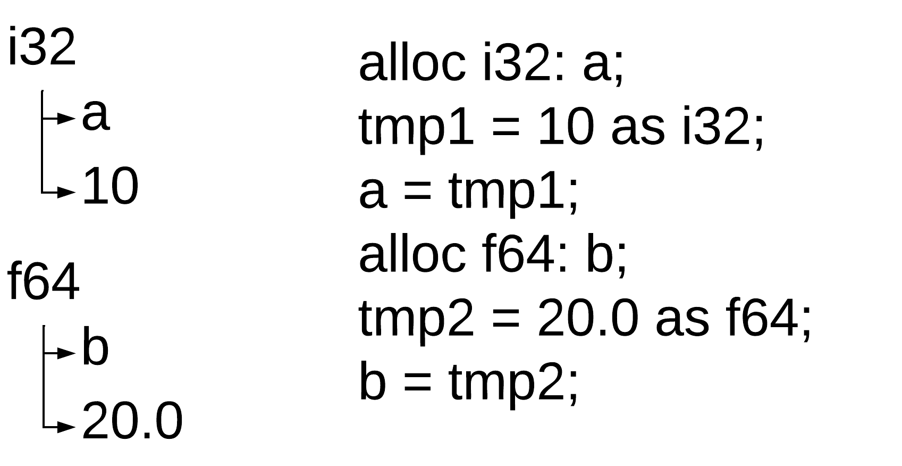

### Example of HIR
```
{
    fn sum(i32 a, i32 b) -> i32
    {
        i32s %0 = alloc(8);
        i32s %0 = load_arg();
        i32s %1 = alloc(8);
        i32s %1 = load_arg();
        {
            use i32s %0;
            use i32s %1;
            arrs %2 = alloc(num?: 2);
            u64t %12 = &(arrs %2);
            i64t %13 = num?: 0 * cnst?: 4;
            u64t %15 = i64t %13 as u64;
            u64t %14 = u64t %12 + u64t %15;
            i32t %16 = *(u64t %14);
            u64t %17 = &(arrs %2);
            i64t %18 = num?: 1 * cnst?: 4;
            u64t %20 = i64t %18 as u64;
            u64t %19 = u64t %17 + u64t %20;
            i32t %21 = *(u64t %19);
            i32t %22 = i32t %16 + i32t %21;
            return i32t %22;
        }
    }
    
    start {
        {
            i64s %3 = alloc(8);
            i64s %3 = load_starg();
            u64s %4 = alloc(8);
            u64s %4 = load_starg();
            {
                i32s %5 = alloc(8);
                i32t %23 = num?: 10 as i32;
                i32s %5 = i32t %23;
                i32s %6 = alloc(8);
                i32t %24 = num?: 10 as i32;
                i32s %6 = i32t %24;
                i32s %7 = alloc(8);
                i32t %25 = num?: 10 as i32;
                i32s %7 = i32t %25;
                i32s %8 = alloc(8);
                i32t %26 = num?: 10 as i32;
                i32s %8 = i32t %26;
                i32s %9 = alloc(8);
                i32t %27 = num?: 10 as i32;
                i32s %9 = i32t %27;
                i32s %10 = alloc(8);
                i32t %28 = num?: 10 as i32;
                i32s %10 = i32t %28;
                use i32s %5;
                use i32s %6;
                i32t %29 = call sum(i32 a, i32 b) -> i32, argc args: i32s %5 i32s %6 ;
                i32t %30 = i32s %5 * i32s %6;
                i32t %31 = i32t %30 + i32s %7;
                i32t %32 = i32t %31 + i32s %8;
                i32t %33 = i32t %32 + i32s %9;
                i32t %34 = i32t %33 + i32s %10;
                i32t %35 = i32t %29 > i32t %34;
                if i32t %35, goto lb67, else goto lb69;
                lb67:
                {
                    exit num?: 1;
                }
                goto lb69;
                lb69:
                i32s %11 = alloc(8);
                u64t %36 = &(i32s %10);
                i32t %37 = u64t %36 as i32;
                i32s %11 = i32t %37;
                exit i32s %11;
            }
        }
    }
}
```

## CFG part
With `3AC`, we can move on to `CFG` (Control Flow Graph) creation. There are several ways to split `3AC` into basic blocks. One approach is using `leaders`, while another is to create a block for every command. The second approach is straightforward — each `3AC` instruction becomes its own block. The `leaders` approach, described in the *Dragon Book*, defines three rules for identifying the start of a block:

- The first instruction in a function.
- The target of a JMP instruction.
- The instruction immediately following a JMP.

In this compiler, both approaches are implemented, but for the following explanations, we will use the approach of creating a block for every command.


### Example of CFG
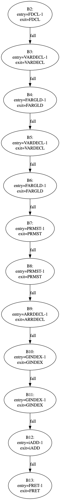

## Dominant calculation
With the `CFG`, we can determine the dominators of each block. In simple terms, a dominator of a block `Y` is a block `X` that appears on every path from the entry block to `Y`. For example, the following figure illustrates how this works:
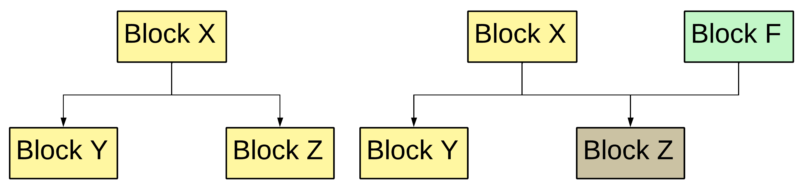

### Strict dominance
Strict dominance tells us which block strictly dominates another. A block `X` strictly dominates block `Y` if `X` dominates `Y` and `X` != `Y`. Why do we need this? The basic dominance relation marks all blocks that dominate a given block, but later analyses often require only the closest one. A block `X` is said to be the immediate dominator of `Y` if `X` strictly dominates `Y`, and there is no other block `Z` such that `Z` strictly dominates `Y` and is itself strictly dominated by `X`.
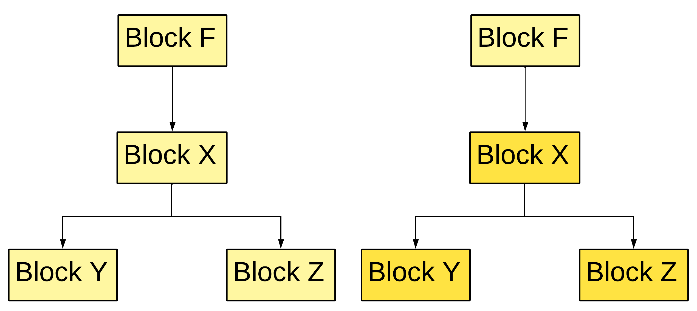

### Dominance frontier
The dominance frontier of a block `X` is the set of blocks where the dominance of `X` ends. More precisely, it represents all the blocks that are partially influenced by `X`: `X` dominates at least one of their predecessors, but does not dominate the block itself. In other words, it marks the boundary where control flow paths from inside `X’s` dominance region meet paths coming from outside.
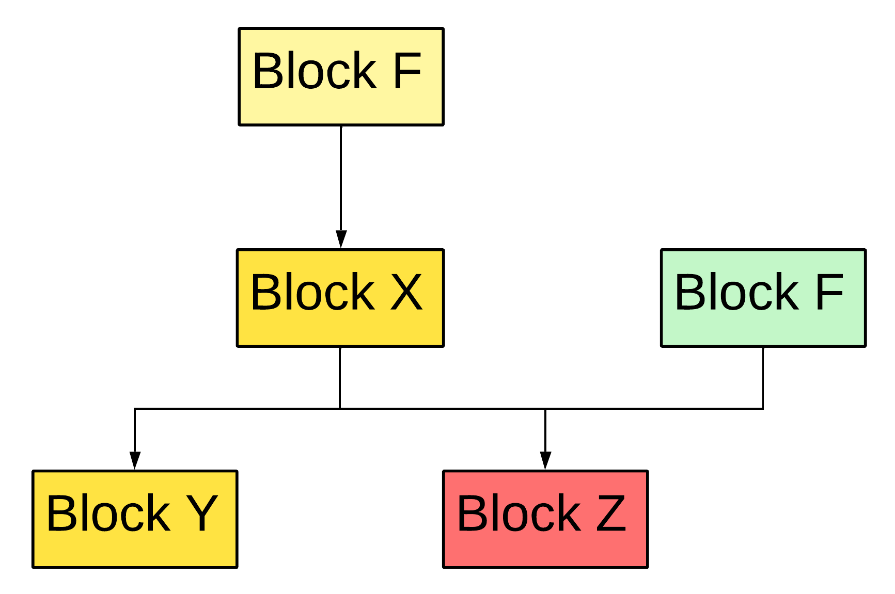

## SSA form
Static Single Assignment (SSA) form requires renaming all assigned variables so that each assignment creates a new, unique variable. A simple example is shown below:
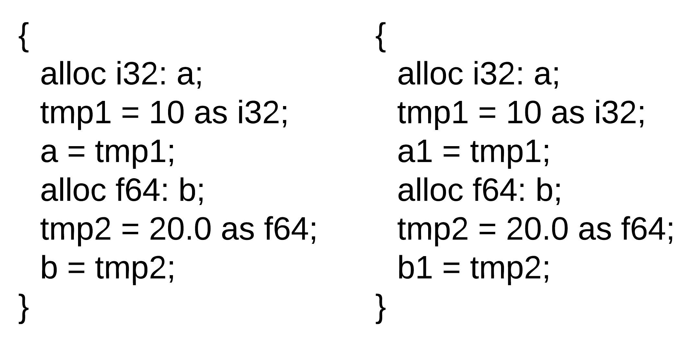

### Phi function
But here we encounter a problem. What should we do in this specific case?
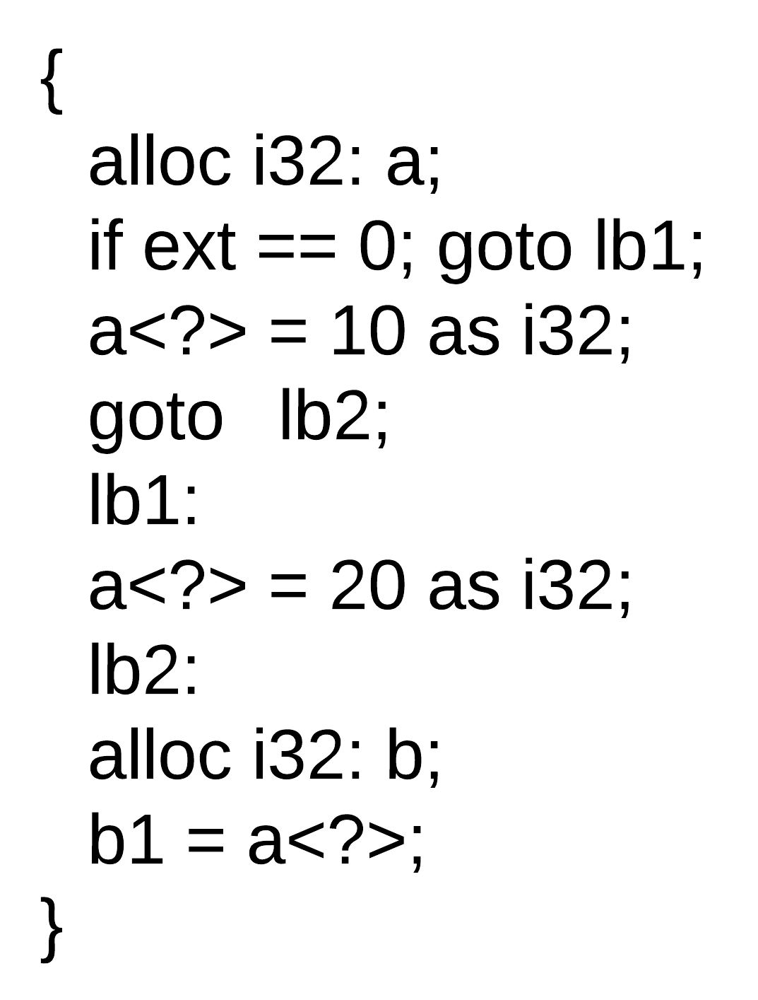

Which version of the variable `a` should be used in the declaration of `b`? The answer is simple — `both`. Here’s the twist: in `SSA` form, we can use a `φ (phi)` function, which tells the compiler which variable version to use. An example of a `φ` function is shown below:
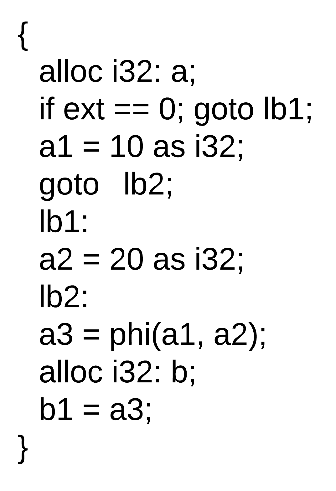
But how do we determine where to place this function? Here, we use previously computed dominance information. We traverse the entire symbol table of variables. For each variable, we collect the set of blocks where it is defined (either declared or assigned). Then, for each block with a definition, we take its dominance frontier blocks and insert a `φ` function there.
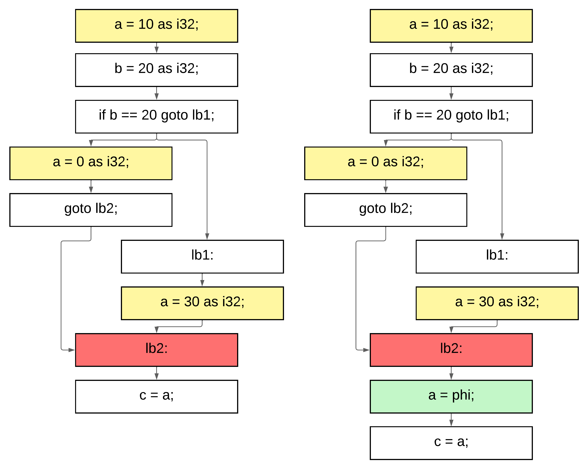
Then, during the SSA renaming process, we keep track of each block that passes through a φ-function block, recording the version of the variable and the block number. This completes the SSA renaming phase, producing the following result:
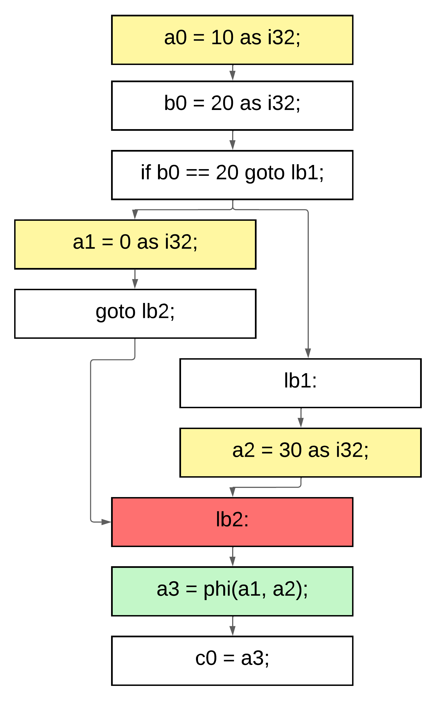

## DAG part
With the complete `SSA` form, we can move on to the first optional optimizations. The first one requires building a `DAG` (Directed Acyclic Graph) representation of the code. In short, a `DAG` shows how every value in the program is derived. In other words, this graph illustrates how each variable obtains its value (with some exceptions for `arrays` and `strings`).
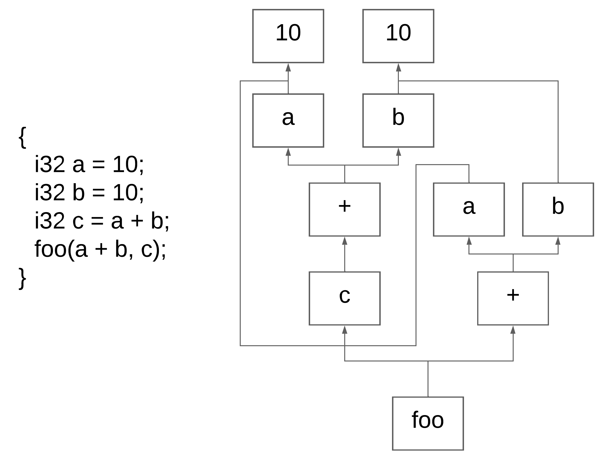

Then, when we build the "basic" DAG, we check and merge all nodes that share the same hash (computed as a hash of their child nodes). If the nodes are identical and the base node is located in a dominating block, we can safely merge them.
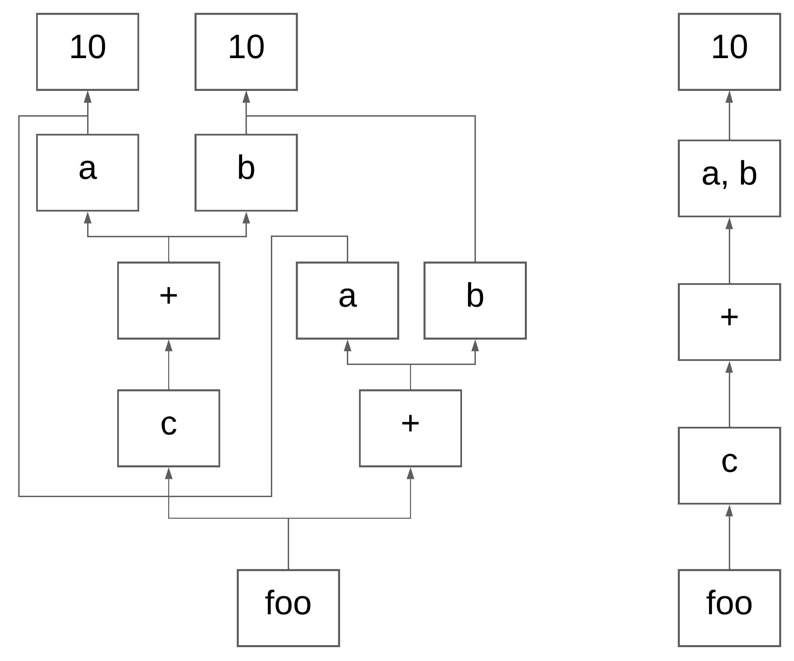

The result of using the DAG is optimized code with Common Subexpression Elimination applied.
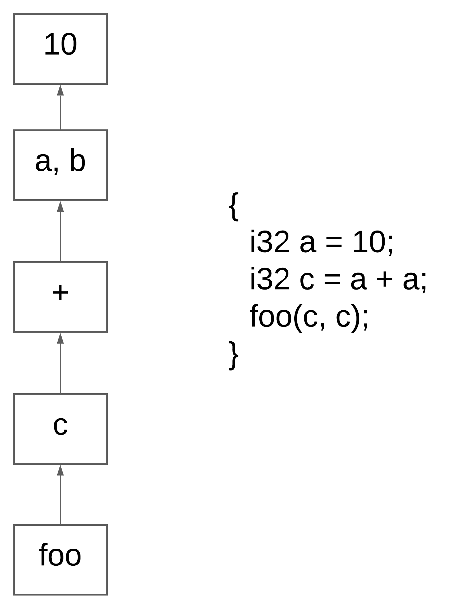

### Example code
```cpl
{
    start(i64 argc, ptr u64 argv) {
        i32 a = 10;
        ptr i32 b = ref a;
        dref b = 11;
        i32 c = 10;
        exit c;
    }
}
```
->
```
{
    start {
        {
            i64s %0 = alloc(8);
            i64s %0 = load_starg();
            u64s %1 = alloc(8);
            u64s %1 = load_starg();
            {
                i32s %2 = alloc(8);
                i32t %5 = num?: 10 as i32;
                i32s %2 = i32t %5;
                u64s %3 = alloc(8);
                u64t %6 = &(i32s %2);
                u64s %3 = u64t %6;
                u64t %7 = num?: 11 as u64;
                *(u64s %3) = u64t %7;
                i32s %4 = alloc(8);
                i32t %8 = num?: 10 as i32;
                i32s %4 = i32t %8;
                exit i32s %4;
            }
        }
    }
}
```

## HIR optimization
Before we going any further, we should optimize our HIR with avaliable meta-information from this level. The simplest optimization here is the `constant fold` optimization due to availability of `DAG`. Same situation with `DFE` optimization. Let's speak about this approaches. 

### Constant folding / propagation (First pass)
With formed `DAG` we can tell wich value is assigned to each variable. We don't transform code at this stage, we only define variable values in symtable. Also, we track arithmetics, that's why we can perform simple operations with already defined variables from symtable.
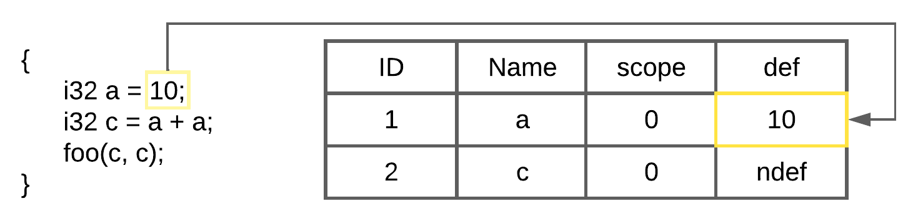

### Dead Function Elimination (DFE)
Dead function elimination, similar to `HIR` constant folding, won't transform source code. Instead of transformation, this optimization will mark all unused functions as unused. This approuch based on `Call Graph`, that can be seen below.
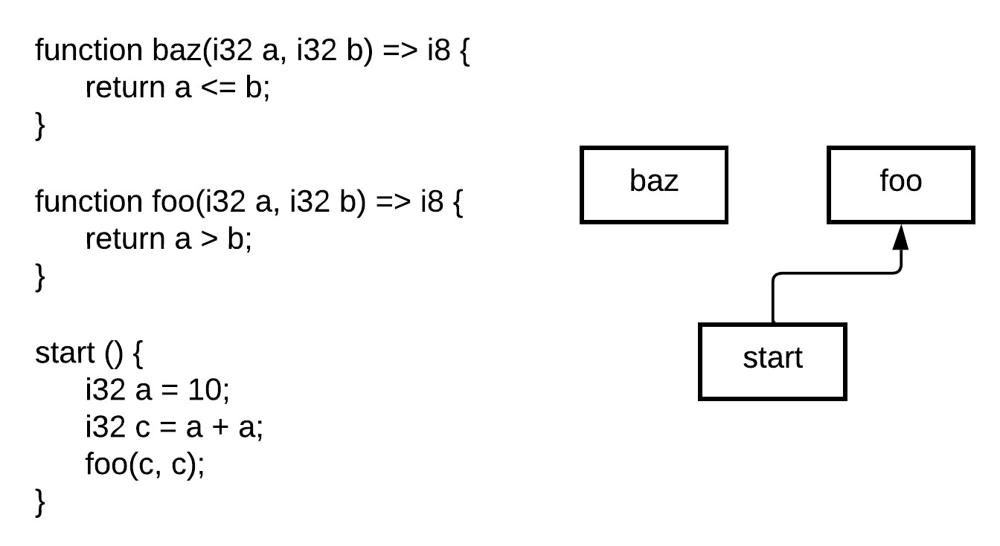

### Tail Recursion Elimination (TRE)
Tail recursion elimination (based on CFG) find all functions where happens self-invoking at the end. The simplest example here is below:
```cpl
function foo(i32 a = 10) => i8 {
   if a > 20; { return a; }
   return foo(a + 1);
}
```

When we found such function, we determine if it ready for `TRE`. Then we transform it into the cycle:
```cpl
function foo(i32 a = 10) => i8 {
lbX:
   if a > 20; { return a; }
   a += 1;
goto lbX;
}
```

This optimization save us from stackframe allocation that has high price, especially if recursion occurs frequently.

### Function inlining
The function inlining happens, when function call gets 3 or more euristic score. What the euristic score? Each function call evaluated with the next params:
- Is function call in cycle? `+2`
- One from the following:
   - Is function size (in BaseBlocks) lower then 2? `+3`
   - Is function size (in BaseBlocks) lower then 5? `+2`
   - Is function size (in BaseBlocks) lower then 10? `+1`
   - Is function size (in BaseBlocks) larger then 15? `-3`

When function call marked as `inline candidate`, compiler simply copy all contents from function body, replace argument assign and return:
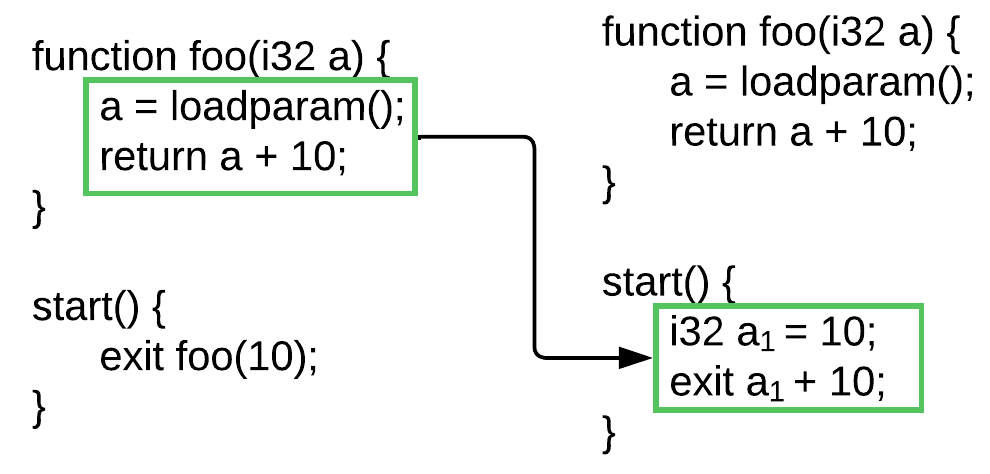

### Loop canonicalization
Loop canonicalization is the important step before the LICM optimization. The main idea of this stage - is to create one entry and exit point in the loop. Let's consider next `CFG`: 
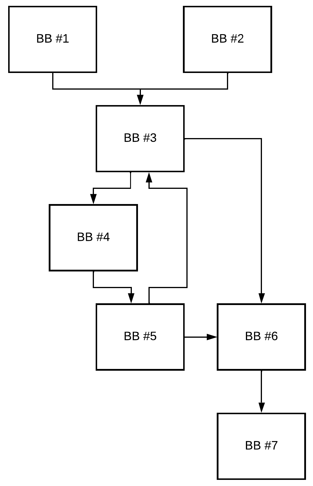

Main problem here, that we have `critical edge` from `BB1` to `BB3`, that permits us from motion some redundant code from loop. To solve it, we can simply create a `preheader` base block:
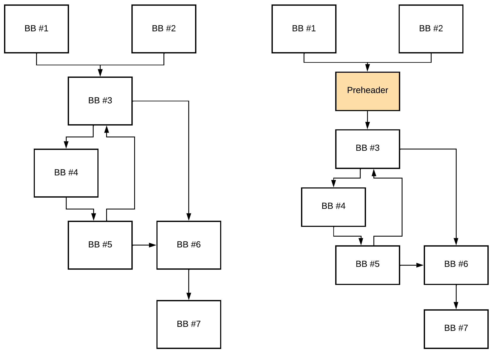

### Loop Invariant Code Motion (LICM)
Which `HIR` operations we can safely move from loop?
- Those which didn't use inductive variables
- Those which didn't use loop variables

## LIR part
In the same way as during `HIR` generation, we now produce an intermediate representation similar to `3AC` — but using only two addresses. This step is relatively straightforward, as it primarily involves adapting instructions to the target machine’s addressing model. Because the exact implementation depends heavily on the target architecture (register count, instruction set, addressing modes, etc.), we typically don’t spend much time optimizing or generalizing this layer. Its main goal is simply to bridge the high-level `HIR` representation and the target-specific assembly form, ensuring that each instruction can be directly translated to a valid machine instruction.
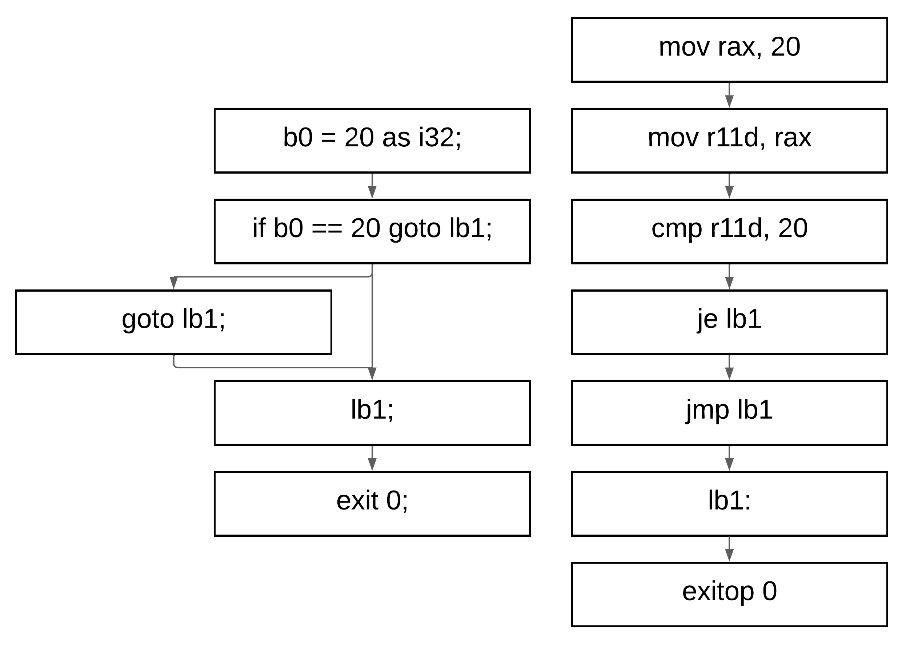

## LIR instruction planning
## LIR (x86_64) instruction selection
## LIR applying const propagation

## Liveness analyzer part
Several optimization techniques are based on data-flow analysis. Data-flow analysis itself relies on liveness analysis, which in turn depends on the program’s `SSA` form and control-flow graph (CFG). Now that we have established these fundamental representations, we can proceed with the `USE–DEF–IN–OUT` computation process.

### USE and DEF
`USE` and `DEF` are two sets associated with every `CFG` block. These sets represent all definitions and usages of variables within the block (recall that the code is already in `SSA` form). In short:
- `DEF` contains all variables that are written (i.e., assigned a new value).
- `USE` contains all variables that are read (i.e., their value is used).
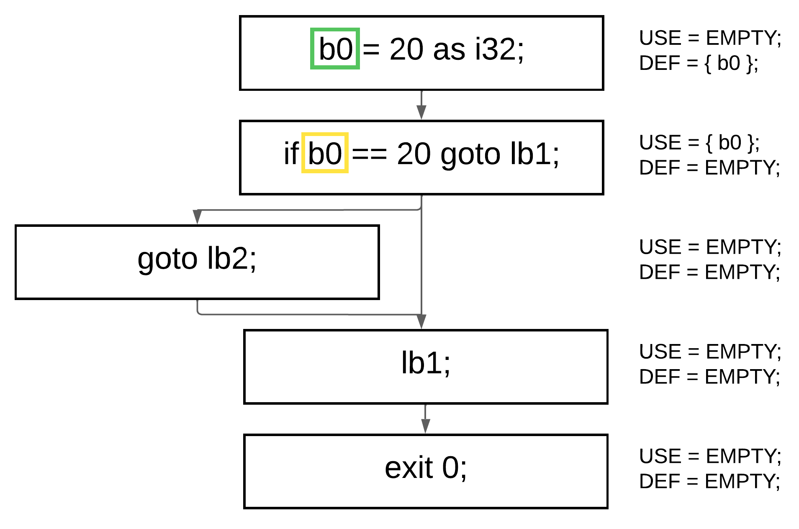

### IN and OUT
`IN` and `OUT` is a little bit complex part here. 
```
OUT[B] = union(IN[S])
IN[B]  = union(USE[B], OUT[B] − DEF[B])
```

First of all, to make the calculation much faster, we should traverse our list of `CFG` blocks in reverse order, computing `IN` and `OUT` for each block using the formulas above, and repeat this process until it stabilizes. Stabilization occurs when the previous sets (`primeIN` and `primeOUT`) are equal to the current sets (`currIN` and `currOUT`). This means that for every block we should maintain four sets:

- primeIN
- currIN
- primeOUT
- currOUT

After each iteration, the current values are copied into the corresponding prime sets, preparing them for the next comparison cycle.
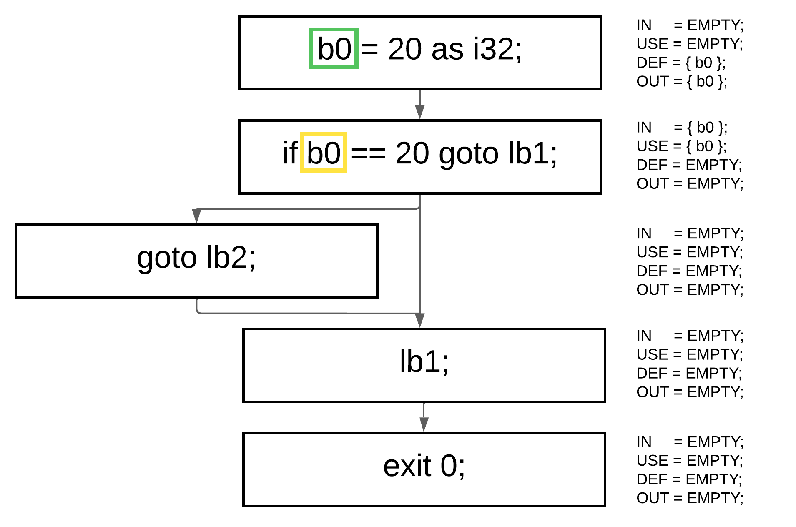

### Point of deallocation
At this point, we can determine where each variable dies. If a variable appears in the `IN` or `DEF` set but is not present in the `OUT` set, it means the variable is no longer used after this block, and we can safely insert a special `kill` instruction to mark it as dead. However, an important detail arises when dealing with pointer types. To handle them correctly, we construct a special structure called an `aliasmap`, which tracks ownership relationships between variables. This map records which variable owns another — meaning that one variable’s lifetime depends on another’s. For example, in code like this:
```cpl
{
   i32 a0 = 10;
   ptr i32 b0 = ref a0;
   dref b0 = 20;
}
```
the variable `a` is owned by `b`, so we must not kill `a` while `b` is still alive. In other words, the liveness of `a` depends on the liveness of `b`, and this dependency is preserved through the aliasmap.
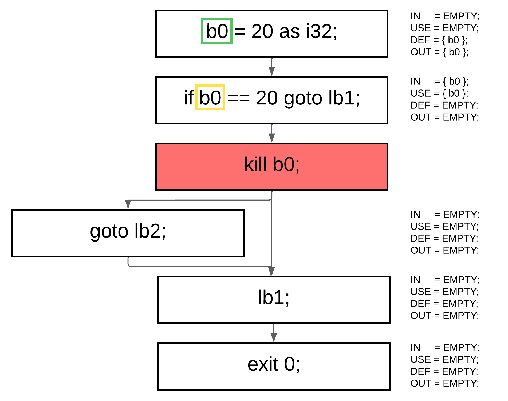

## Register allocation part
Now that we have the `IN`, `OUT`, `DEF`, and `USE` sets, we can construct an interference graph. The idea is straightforward: we create a vertex for each variable in the symbol table, and then, for every `CFG` block, we connect (i.e., add an edge between) each variable from the block’s `DEF` set with every variable from its `OUT` set. This connection represents that these two variables are live at the same time. The resulting structure is the interference graph, where:
- Vertices represent program variables.
- Edges represent liveness conflicts (interference) between variables.
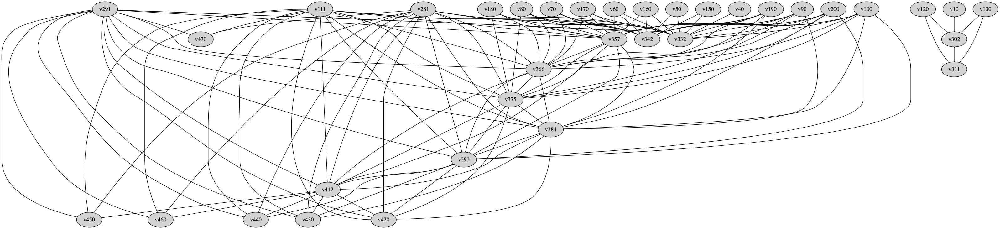

### Graph coloring
Now we can determine which variables can share the same register using graph coloring. The solution to this problem is purely mathematical, and there are many possible strategies to color a graph. In short, the goal is to assign a color to every node (variable) in such a way that no two connected nodes share the same color. The output of this algorithm is a colored interference graph, where each color represents a distinct physical register, and all variables with the same color can safely reuse the same register without overlapping lifetimes.
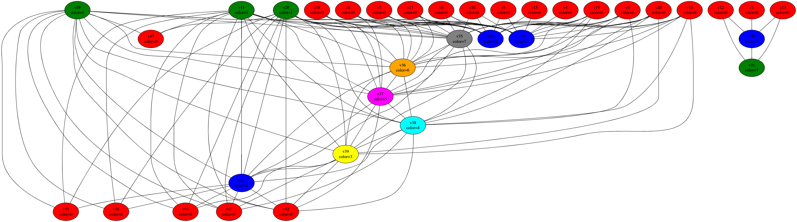

## LIR peephole optimization
### PTRN domain specific language
### First pass
### Second pass
### Third pass

### LIR example
From the HIR we can produce a high level of the LIR:

```
fn strlen(i8* s) -> i64
{
    %12 = ldparam();
    {
        kill(cnst: 0);
        kill(cnst: 1);
        %13 = num: 0;
        %14 = %13;
        %8 = num: 1 as u64;
        lb10:
        %6 = *(%15);
        cmp %6, cnst: 0;
        jne lb11;
        je lb12;
        lb11:
        {
            %7 = %15 + %8;
            %16 = %7;
            %9 = %14 + num: 1;
            %17 = %9;
        }
        %14 = %17;
        %15 = %16;
        jmp lb10;
        lb12:
        return %14;
    }
}
kill(cnst: 14);

start {
    {
        %18 = strt_loadarg();
        %19 = strt_loadarg();
        {
            %4 = str_alloc(str(Hello world!));
            %5 = arr_alloc(X);
            %10 = &(%5);
            kill(cnst: 3);
            kill(cnst: 18);
            kill(cnst: 4);
            kill(cnst: 19);
            kill(cnst: 10);
            kill(cnst: 5);
            kill(cnst: 2);
            stparam(%10);
            call strlen(i8* s) -> i64;
            %11 = fret();
            exit %11;
        }
    }
    kill(cnst: 11);
}
```

## LIR x86_64 instruction selection

Next step is LIR lowering. The most common way here - instruction selection. This is the first machine-depended step in compiler, that's why here we have some abstractions and implementations of different asm dialetcs (e.g., nasm x86_64 gnu, at&at x86_64 gnu, etc.).

```
fn strlen(i8* s) -> i64
{
    {
        r11 = num: 0;
        r9 = r11;
        rdi = rdi;
        rbx = num: 1 as u64;
        lb10:
        r8 = *(rsi);
        cmp r8, cnst: 0;
        je lb12;
        jne lb11;
        lb11:
        {
            rax = rsi;
            rax = rax + rbx;
            rax = rax;
            rdx = rax;
            rsi = rdx;
            rax = r9;
            rax = rax + rbx;
            r10 = rax;
            rcx = r10;
            r9 = rcx;
            rbx = num: 1;
            rbx = rbx;
        }
        jmp lb10;
        lb12:
        return r9;
    }
}

start {
    {
        rbx = [rbp + 16];
        rax = rax;
        rbx = [rbp + 8];
        [rbp - 16] = num: 0;
        [rbp - 15] = num: 1;
        rdx = &([rbp - 16]);
        rdi = rdx;
        {
            [rbp - 29] = cnst: 72;
            [rbp - 28] = cnst: 101;
            [rbp - 27] = cnst: 108;
            [rbp - 26] = cnst: 108;
            [rbp - 25] = cnst: 111;
            [rbp - 24] = cnst: 32;
            [rbp - 23] = cnst: 119;
            [rbp - 22] = cnst: 111;
            [rbp - 21] = cnst: 114;
            [rbp - 20] = cnst: 108;
            [rbp - 19] = cnst: 100;
            [rbp - 18] = cnst: 33;
            [rbp - 17] = cnst: 0;
            kill(cnst: 4);
            kill(cnst: 5);
            call strlen(i8* s) -> i64;
            exit rax;
        }
    }
}
```

Maybe you have notice, that we also apply register allocation here. The reason why we wait till this stage, is `pre-coloring`. Main idea, that we precolor some variables with already known registers like `rax` and `rbx` in arithmetics, `rdi`, `rsi`... in ABI function call etc.

## Codegen (nasm) part
After completing the full code transformation pipeline, we can safely convert our `LIR` form into the `ASM` form, with a few small tricks applied during the unwrap process of special `LIR` instructions such as `EXITOP`, `STRT`, and others.
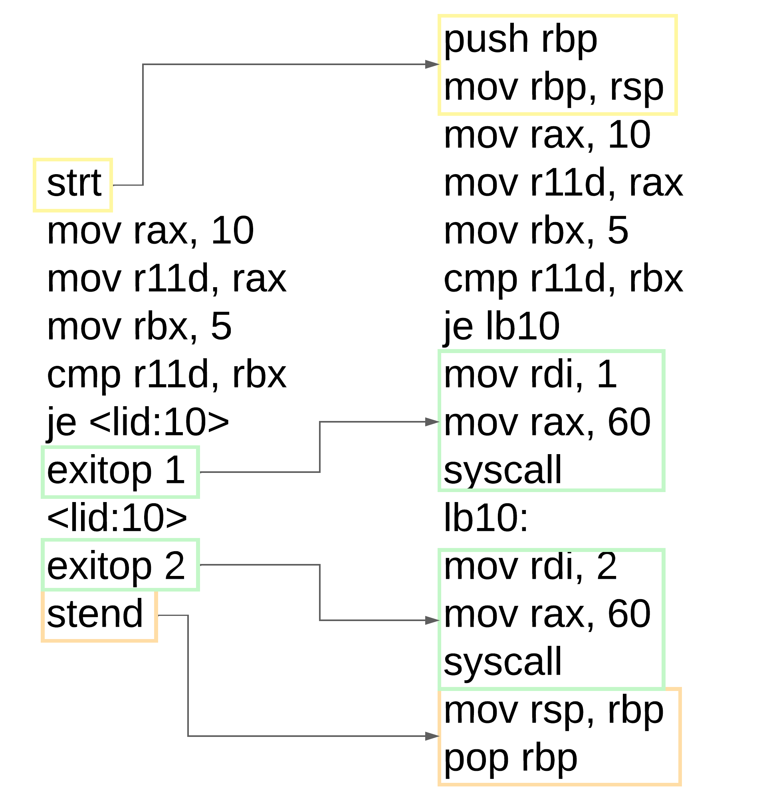

### Example of generated code
```
section .data
section .rodata
section .bss
section .text
global _cpl_start
_cpl_sum:
push rbp
mov rbp, rsp
sub rsp, 8
mov r13d, edi
mov r12d, esi
mov [rbp - 8], r12d
mov [rbp - 4], r13d
mov rbx, 0
imul rbx, 4
lea rax, [rbp - 8]
add rax, rbx
mov rax, [rax]
mov r11d, eax
mov rbx, 1
imul rbx, 4
lea rax, [rbp - 8]
add rax, rbx
mov rax, [rax]
mov r11d, eax
mov rax, r11d
mov rbx, r11d
add rax, rbx
mov r11d, eax
mov rax, r11d
mov rsp, rbp
pop rbp
ret
; op=14
global _start
_start:
push rbp
mov rbp, rsp
sub rsp, 32
mov rax, [rbp + 8]
mov r13, rax
lea rax, [rbp + 16]
mov r13, rax
mov rax, 10
mov eax, rax
mov r11d, eax
mov rax, r11d
mov [rbp - 8], eax
mov rax, 10
mov eax, rax
mov r11d, eax
mov rax, r11d
mov [rbp - 16], eax
mov rax, 10
mov eax, rax
mov r11d, eax
mov rax, r11d
mov [rbp - 24], eax
mov rax, 10
mov eax, rax
mov r11d, eax
mov rax, r11d
mov r15d, eax
mov rax, 10
mov eax, rax
mov r11d, eax
mov rax, r11d
mov r14d, eax
mov rax, 10
mov eax, rax
mov r11d, eax
mov rax, r11d
mov [rbp - 32], eax
push r11
push r12
push r13
push r14
push r15
mov rdi, [rbp - 16]
mov rsi, [rbp - 8]
call _cpl_[rbp - 8]
mov r13d, eax
pop r15
pop r14
pop r13
pop r12
pop r11
mov rax, [rbp - 8]
mov rbx, [rbp - 16]
imul rax, rbx
mov r11d, eax
mov rax, r11d
mov rbx, [rbp - 24]
add rax, rbx
mov r11d, eax
mov rax, r11d
mov rbx, r15d
add rax, rbx
mov r11d, eax
mov rax, r11d
mov rbx, r14d
add rax, rbx
mov r11d, eax
mov rax, r11d
mov rbx, [rbp - 32]
add rax, rbx
mov r11d, eax
mov rax, r13d
mov rbx, r11d
cmp rax, rbx
movzx rax, al
mov r11d, eax
cmp r11d, 0
jne lb73
mov rax, 60
mov rdi, 1
syscall
lb73:
lea rax, [rbp - 32]
mov r12, rax
mov rax, r12
mov eax, rax
mov r12d, eax
mov rax, r12d
mov r11d, eax
mov rax, 60
mov rdi, r11d
syscall
; op=4
```
