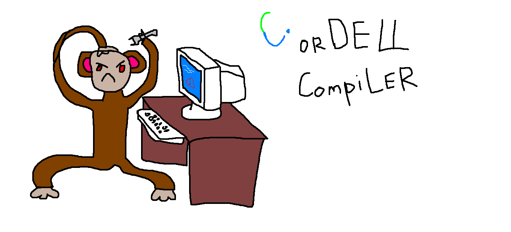

# Cordell Compiler
Cordell Compiler is a compact hobby compiler for the `Cordell Programming Language` (CPL), inspired by C's low-level explicitness and parts of Rust's syntax. Its primary purpose is to study compilation, code optimization, translation, and low-level code generation. It is also my personal testbed for compiler experiments.

- *This README is still in progress.*

# Main idea of this project
The main goal of this project is to learn compiler architecture and eventually port the compiler to my other project, `CordellOS`. The personal motivation is simple: I want to write programs for my own OS inside my own OS.

Given my bias toward `assembly` and `C`, CPL is intended to stay as low-level as possible. Some convenience features may still be added later, especially around strings, such as built-in concatenation and comparison.

# Summary
This `README` contains the main information about the compiler and the implementation approaches I learned while building it. In short, it is an attempt to collect the most useful notes for building a similar optimizing compiler, or a better one.

This repository also includes a [documentation site](https://j1sk1ss.github.io/CordellCompiler/#/) with related content and interactive sections. The navigation below provides quick links to the main topics in this file.

- [Introduction](#introduction)
- [Code snippet](#sample-code-snippet)
- [Compilation pipeline](#compilation-pipeline)
- [PP part](#pp-part)
- [Tokenization part](#tokenization-part)
- [Markup part](#markup-part)
- [AST part](#ast-part)
   - [AST optimization](#ast-optimization)
- [HIR part](#hir-part)
- [CFG part](#cfg-part)
- [Dominator calculation](#dominator-calculation)
   - [Strict dominance](#strict-dominance)
   - [Dominance frontier](#dominance-frontier)
- [SSA form](#ssa-form)
   - [Phi function](#phi-function)
- [DAG part](#dag-part)
- [HIR optimization](#hir-optimization)
   - [Constant folding / propagation (First pass)](#constant-folding--propagation-first-pass)
   - [Dead Function Elimination (DFE)](#dead-function-elimination-dfe)
   - [Tail Recursion Elimination (TRE)](#tail-recursion-elimination-tre)
   - [Function inlining](#function-inlining)
   - [Loop canonicalization](#loop-canonicalization)
   - [Loop Invariant Code Motion (LICM)](#loop-invariant-code-motion-licm)
- [LIR part](#lir-part)
- [LIR instruction planning](#lir-instruction-planning)
- [LIR (x86_64) instruction selection](#lir-x86_64-instruction-selection)
- [LIR applying const propagation](#lir-applying-const-propagation)
- [From HIR to LIR example](#from-hir-to-lir-example)
- [Liveness analyzer part](#liveness-analyzer-part)
   - [USE and DEF](#use-and-def)
   - [IN and OUT](#in-and-out)
   - [Point of deallocation](#point-of-deallocation)
- [Register allocation part](#register-allocation-part)
   - [Graph coloring](#graph-coloring)
- [LIR peephole optimization](#lir-peephole-optimization)
   - [PTRN domain-specific language](#ptrn-domain-specific-language)
   - [First pass](#first-pass)
   - [Second pass](#second-pass)
   - [Third pass](#third-pass)
- [Codegen (nasm) part](#codegen-nasm-part)
   - [Example of generated code](#example-of-generated-code)

## Introduction
This compiler is not primarily about creating a language with complex syntax and high-level abstractions. CPL does not even support structures. The main goal is to implement modern code optimization techniques, observe how input code can be transformed into a higher-performance version of itself, and test ideas such as neural-network-based heuristics and compressed symbol tables. This `README` describes what has been implemented so far. </br>

In short, CPL has an `EBNF-defined` [[?]](https://en.wikipedia.org/wiki/Extended_Backus%E2%80%93Naur_form) syntax, its own [VS Code extension](https://github.com/j1sk1ss/CordellCompiler/tree/HIR_LIR_SSA/vscode), and a small [documentation site](https://j1sk1ss.github.io/CordellCompiler/). If you are more interested in the language than in the compiler pipeline, start with the documentation site. </br>

P.S.: *The language itself is not the main subject of this README, but while explaining each compiler layer I will use direct examples written in CPL. Its surface grammar is close enough to C-like languages to make the examples readable.*

## Sample code snippet
Let us start with the simple code snippet below. It demonstrates the general shape of CPL, while leaving out some already supported features such as `while` loops, `syscall`, and condition operators, which are described later. </br>

Every compilation starts from raw source code. The example below is a classic "Hello world" program. Later in this README, this example is compiled for my MacBook Pro 15" 2012 running macOS Catalina.

<details>
<summary><strong>The basic "Hello World" program</strong></summary>

```cpl
#include "print_h.cpl"

@[entry("_main")]
function main(i32 argc, ptr ptr i8 argv) {
    arr msg[0, i8] = "Hello world!";
    print(ref msg);
    exit 0;
}
```
</details>

P.S.: *The code above is used in several later sections, so it is worth expanding the block and keeping it in mind.*

## Compilation pipeline
<p align="center">
  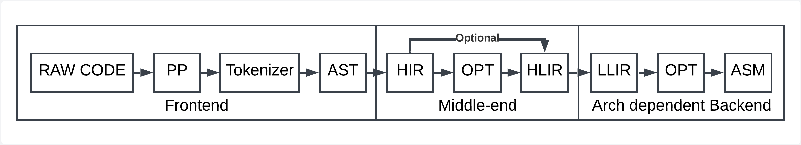
  <br>
  <em>Figure 1 — Compiler pipeline</em>
</p>

## PP part
Before the main compiler pipeline starts, source code may need preprocessing. Preprocessing is optional in many compilers, but it is necessary here because CPL uses a header-style organization. This stage handles directives similar to `gcc -E`, including `include`, `define`, `undef`, `ifdef`, and `ifndef`. These directives behave similarly to their C/C++ counterparts, except that `define` does not currently support function-like macros with different arguments. </br>

Let us return to the snippet above and include all header files into the final code. This is similar to what `gcc -E` does when it creates a single preprocessed translation unit:
```cpl
: string_h.cpl :
#ifndef STRING_H_
#define STRING_H_ 0
: Get the size of the provided string
    Params
    - `s` - Input string.

    Returns the size (i64). :
function strlen(ptr i8 s) -> i64;
#endif

: print_h.cpl :
#ifndef PRINT_H_
#define PRINT_H_ 0
#include "string_h.cpl"
: Basic print function that is based on
    a syscall invoke.
    Params
    - `msg` - Input message to print.
    
    Returns i0, which means "nothing". :
function print(ptr i8 msg) -> i0;
#endif

: basic.cpl :
#include "print_h.cpl"
@[entry("_main")]
function main(i32 argc, ptr ptr i8 argv) {
    arr msg[0, i8] = "Hello world!";
    print(ref msg);
    exit 0;
}
```

Now the compiler removes comments and resolves definitions and conditional directives. This is done with a small directive table: conceptually similar to a symbol table, but much simpler, storing only a directive name and its linked content. Conditional preprocessing checks whether a name exists in this table and then decides whether to emit the nested code. </br>

In short, the code above looks like this after preprocessing:
```cpl
#line 0 "/Users/nikolaj/Documents/Repositories/CordellCompiler/tests/test_code/preproc/print_h.cpl"
#line 0 "/Users/nikolaj/Documents/Repositories/CordellCompiler/tests/test_code/preproc/string_h.cpl"
function strlen(ptr i8 s) -> i64;
#line 4 "/Users/nikolaj/Documents/Repositories/CordellCompiler/tests/test_code/preproc/print_h.cpl"
function print(ptr i8 msg) -> i0;
#line 2 "/Users/nikolaj/Documents/Repositories/CordellCompiler/tests/test_code/preproc/basic.cpl"
@[entry("_main")]
function main(i32 argc, ptr ptr i8 argv) {
    arr msg[0, i8] = "Hello world!";
    print(ref msg);
    exit 0;
}
```

The generated `line` directive marks source locations for the later tokenization process. The tokenizer needs this information to know where each preprocessed fragment came from.

## Tokenization part
The tokenization stage splits the input byte sequence, produced by `fread`, into basic tokens. This module ignores whitespace and separator symbols such as newlines and tabs. It also classifies tokens into basic categories such as `number`, `string`, `delimiter`, `comma`, `dot`, and `line_directive`. </br>

In short, this stage is a DFA that does more than split input by spaces or commas. It combines characters according to rules such as:
- If an unknown character appears while the current token is numeric, the character is appended to the number.
- If an unknown numeric character appears while the current token is a sign, the sign is converted into a signed number.
- If an unknown numeric token appears while the current token is a string, the number is appended to the string.
- If a string character appears while the current token is numeric, the character is appended to the number.

<p align="center">
  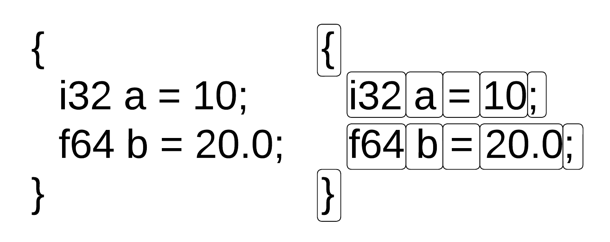
  <br>
  <em>Figure 2 — Basic token generation</em>
</p>

## Markup part
The markup stage is the second part of token processing. Most compilers do not separate the tokenizer and markup stage in this way, but this compiler does. The markup stage operates on the token list produced by the tokenizer and adds scope-aware semantic information. </br>
The main idea is to perform basic semantic markup for variables. For instance, if we declare some `i32` variable with the name `a` in a scope with `id=10`, all occurrences of `a` within the corresponding scope can be marked as having the `i32` type.

<p align="center">
  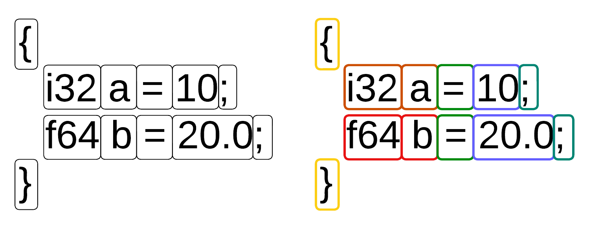
  <br>
  <em>Figure 3 — Token markup</em>
</p>

The code from the [Sample code snippet](#sample-code-snippet) section produces the following list of marked tokens:
<details>
<summary><strong>List of tokens</strong></summary>

```
line=1, type=17, data=[{],
line=3, type=1, data=[code_utesting/prep/print_h.cpl],
line=3, type=1, data=[/Users/nikolaj/Documents/Repositories/CordellCompiler/tests/code_utesting/prep/string_h.cpl],
line=3, type=65, data=[function],
line=3, type=66, data=[strlen],
line=3, type=15, data=[(],
line=3, type=44, data=[i8], ptr
line=3, type=108, data=[s], ptr
line=3, type=16, data=[)],
line=3, type=58, data=[->],
line=3, type=41, data=[i64],
line=3, type=9, data=[;],
line=7, type=1, data=[code_utesting/prep/print_h.cpl],
line=7, type=65, data=[function],
line=7, type=66, data=[print],
line=7, type=15, data=[(],
line=7, type=49, data=[str], ptr
line=7, type=108, data=[msg], ptr
line=7, type=16, data=[)],
line=7, type=58, data=[->],
line=7, type=38, data=[i0],
line=7, type=9, data=[;],
line=11, type=1, data=[/private/var/folders/74/d7gcqwxd1x9__83fh6m_lb6c0000gn/T/tmpmx4fkhq_.cpl],
line=4, type=55, data=[start],
line=4, type=15, data=[(],
line=4, type=41, data=[i64],
line=4, type=108, data=[argc],
line=4, type=10, data=[,],
line=4, type=45, data=[u64], ptr
line=4, type=108, data=[argv], ptr
line=4, type=16, data=[)],
line=4, type=17, data=[{],
line=5, type=49, data=[str],
line=5, type=108, data=[msg],
line=5, type=94, data=[=],
line=5, type=122, data=[Hello world!],
line=5, type=9, data=[;],
line=6, type=67, data=[print],
line=6, type=15, data=[(],
line=6, type=20, data=[ref],
line=6, type=108, data=[msg],
line=6, type=16, data=[)],
line=6, type=9, data=[;],
line=7, type=57, data=[exit],
line=7, type=5, data=[0],
line=7, type=9, data=[;],
line=8, type=18, data=[}],
line=9, type=18, data=[}],
```
</details>

## AST part
Next, we need to parse this sequence of marked tokens to build an `AST` structure (Abstract Syntax Tree). There are many approaches to achieve this, for example `LL` parsing, `LR` parsing, or hybrid techniques that combine `LL` and `LR`. A more complete list of parser types can be found [[here]](https://www.geeksforgeeks.org/compiler-design/types-of-parsers-in-compiler-design/) or in related compiler design books (see [Used links and literature](#used-links-and-literature) section). This compiler uses the `LL` approach.

<p align="center">
  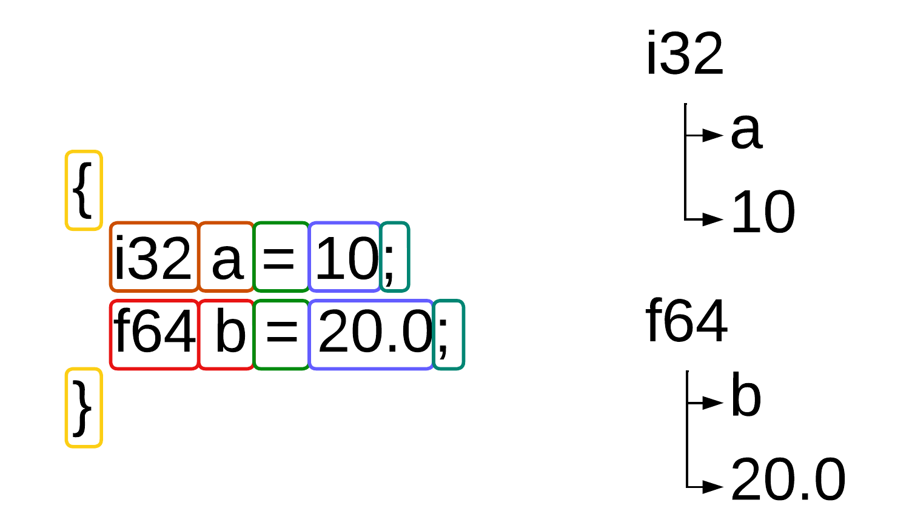
  <br>
  <em>Figure 4 — Basic AST generation</em>
</p>

The AST generated from the [Markup part](#markup-part)'s list of marked tokens:
<details>
<summary><strong>Cordell Compiler's AST dump</strong></summary>

```
{ scope, id=0 }
   { scope, id=1 }
      [function] (t=55, v_id=-1, s_id=0)
         [strlen] (t=56, v_id=0, s_id=0)
            [i64] (t=34, v_id=-1, s_id=0)
         { scope, id=2 }
            [i8] (t=37, ptr, v_id=-1, s_id=0)
               [s] (t=92, ptr, v_id=0, s_id=2)
            { scope, id=3 }
               [i64] (t=34, v_id=-1, s_id=0)
                  [l] (t=89, v_id=1, s_id=3)
                  [0] (t=3, v_id=-1, s_id=0, glob)
               [while] (t=61, v_id=0, s_id=3)
                  [s] (t=92, ptr, dref, v_id=0, s_id=2)
                  { scope, id=4 }
                     [+=] (t=69, v_id=-1, s_id=0)
                        [s] (t=92, ptr, v_id=0, s_id=2)
                        [1] (t=3, v_id=-1, s_id=0, glob)
                     [+=] (t=69, v_id=-1, s_id=0)
                        [l] (t=89, v_id=1, s_id=3)
                        [1] (t=3, v_id=-1, s_id=0, glob)
               [return] (t=48, v_id=0, s_id=3)
                  [l] (t=89, v_id=1, s_id=3)
      [start] (t=47, v_id=1, s_id=0)
         [i64] (t=34, v_id=-1, s_id=0)
            [argc] (t=89, v_id=2, s_id=1)
         [u64] (t=38, ptr, v_id=-1, s_id=0)
            [argv] (t=93, ptr, v_id=3, s_id=1)
         { scope, id=0 }
            { scope, id=5 }
               [str] (t=42, v_id=-1, s_id=0)
                  [msg] (t=97, v_id=4, s_id=5)
                  [Hello world!] (t=99, v_id=0, s_id=0, glob)
               [syscall] (t=53, v_id=-1, s_id=0)
                  [0] (t=3, v_id=-1, s_id=0, glob)
                  [1] (t=3, v_id=-1, s_id=0, glob)
                  [msg] (t=97, ref, v_id=4, s_id=5)
                  [strlen] (t=57, v_id=0, s_id=0)
                     [msg] (t=97, ref, v_id=4, s_id=5)
               [exit] (t=49, v_id=0, s_id=5)
                  [0] (t=3, v_id=-1, s_id=0, glob)
```
</details>

At this point, a compiler could either go straight to code generation or first lower the program into an intermediate representation. Cordell Compiler does not allow skipping the IR phase, so it uses the second approach.

### AST optimization
Once we have a correct `AST` representation of the input code, we can optionally apply several available optimizations. We will not spend much time here and will cover only a few examples. Note that `AST-level` optimizations are mostly redundant in the current compiler; they were much more useful before the project had an `IR` level.
- `Condition unrolling`. If we have an `if` statement with a constant condition, such as `if 1; { ... }`, or similar situation with a `while` keyword or a `switch` statement, we can unroll them by removing the condition and keeping only the body.
- `Dead scope elimination`. If a scope does not affect the environment, it can be safely removed.

To understand what they actually do, we can consider the next example of `DSE` (Dead Scope Elimination):
```cpl
start() {
    {
        i32 a = 10;
        a += 10 * 10 - 11;
    }
    exit 1;
}
```

According to the compiler's markup logic, the `exit` statement cannot see the variable `a`. The scope also has no effect on the surrounding environment: it does not call anything, change anything outside the scope, return, or exit. Therefore, this scope can be safely removed at the AST level. </br>

P.S.: *I kept these optimizations because they do not duplicate the existing HIR or LIR optimizations. Older compiler versions had more AST-level optimizations; see the v2.0 and v1.0 tags on GitHub if you are interested.*

## HIR part
The `AST` representation of the input code must be flattened for later optimization phases. A common approach is to convert the `AST` structure into a list of `Three-Address Code` (3AC) [[?]](https://web.stanford.edu/class/archive/cs/cs143/cs143.1128/lectures/13/Slides13.pdf). </br>
*Three-Address Code* implies that there are only three placeholders for addresses in each command. For example, the `a += b` command can be converted to `3AC` as `a = a + b`. Also, the simple indexing command `a[x] = 0` will be converted to:
```
tmp_head = &a;
tmp_off = x * sizeof(typeof(a));
tmp_head = tmp_head + tmp_off;
*tmp_head = 0;
```

Figure 5 shows a schematic view of how the `AST -> HIR` process works in this compiler.

<p align="center">
  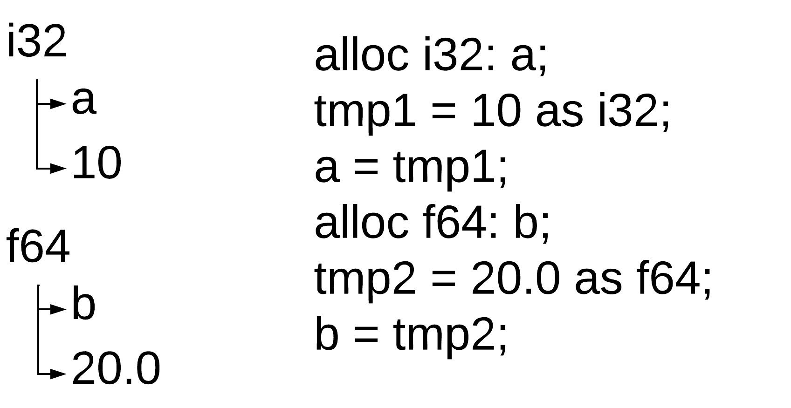
  <br>
  <em>Figure 5 — AST to HIR</em>
</p>

For instance, here is the HIR that was obtained from the [AST part](#ast-part)'s structure transformation:
<details>
<summary><strong>Cordell Compiler's HIR dump</strong></summary>

```
{
    fn _main(i32 argc, i8** argv)
    {
        i32s %2 = alloc;
        i32s %2 = load_starg();
        i8s** %3 = alloc;
        i8s** %3 = load_starg();
        {
            strs %4 = str_alloc(Hello world!);
            i8t* %5 = &(strs %4);
            use i8t* %5;
            call print1(ptr i8* msg) -> i0, argc args(i8t* %5,);
            exit num? 0;
        }
    }
}
```
</details>

P.S.: *You may have noticed the updated function name, `_main`. This is the virtual name of the `start` function. Virtual names are important for overloading and for different target architectures. For now, the key point is that user-facing names are linked to compiler-level virtual names.*

## CFG part
After obtaining the complete list of `3AC` instructions, we can move on to `CFG` (Control Flow Graph) [[?]](https://en.wikipedia.org/wiki/Control-flow_graph) [[?]](https://www.geeksforgeeks.org/software-engineering/software-engineering-control-flow-graph-cfg/) generation. There are several ways to split `3AC` into basic blocks. One is to use `leaders`; another is to create a block for every command. The second approach is straightforward: each `3AC` instruction becomes its own block. The `leaders` approach, described in the *Dragon Book*, defines three rules for identifying the start of a block:

- The first instruction in a function.
- The target of a JMP instruction.
- The instruction immediately following a JMP.

P.S.: *Both approaches are implemented in this compiler, but this example uses the Dragon Book approach.*

<p align="center">
  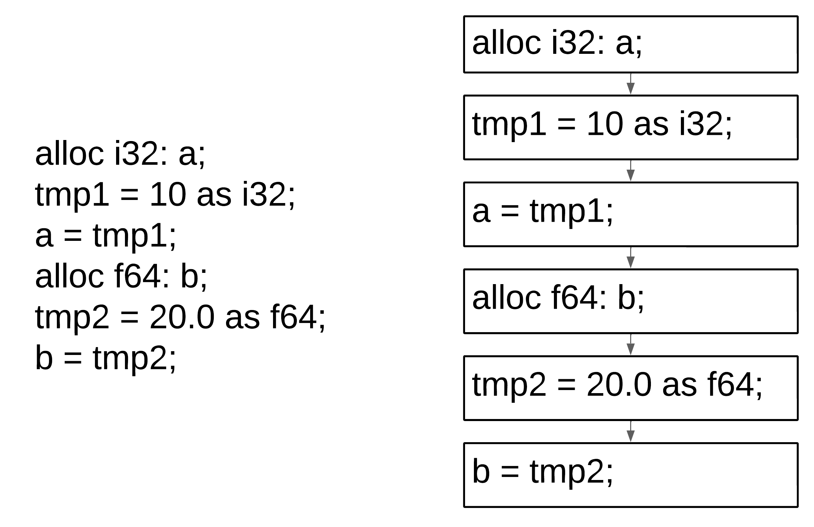
  <br>
  <em>Figure 6 — CFG from HIR</em>
</p>

<details>
<summary><strong>Cordell Compiler's example CFG dump</strong></summary>

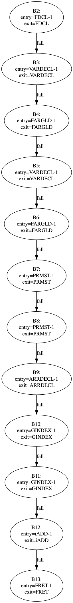
</details>

## Dominator calculation
With the structured `CFG`, we can move on to `SSA` form [[?]](https://en.wikipedia.org/wiki/Static_single-assignment_form) [[?]](https://www.geeksforgeeks.org/compiler-design/static-single-assignment-with-relevant-examples/) [[?]](https://dl.acm.org/doi/10.1145/75277.75280). First, we need to calculate dominators [[?]](https://en.wikipedia.org/wiki/Dominator_(graph_theory)) for each block in the `CFG`. In short, a dominator of a block `Y` is a block `X` that appears on every path from the start block to `Y`. Figure 7 illustrates how this works.

<p align="center">
  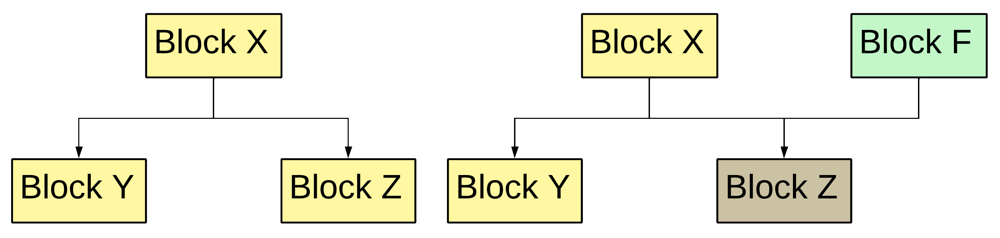
  <br>
  <em>Figure 7 — How we find a dominator</em>
</p>

### Strict dominance
Now we need to find a strict dominator for every block in the `CFG`. This is needed for placing `phi` functions, which are described later. </br>
Strict dominance tells us which block strictly dominates another. A block `X` strictly dominates block `Y` if `X` dominates `Y` (important note here: `X != Y`). Why do we need this? The basic dominance relation marks all blocks that dominate a given block, but later analyses often require only the closest one. A block `X` is said to be the strict dominator of `Y` if there is no other block `Z` such that `Z` strictly dominates `Y` and is itself strictly dominated by `X`. </br>
Figure 8 shows what strict dominators look like.

<p align="center">
  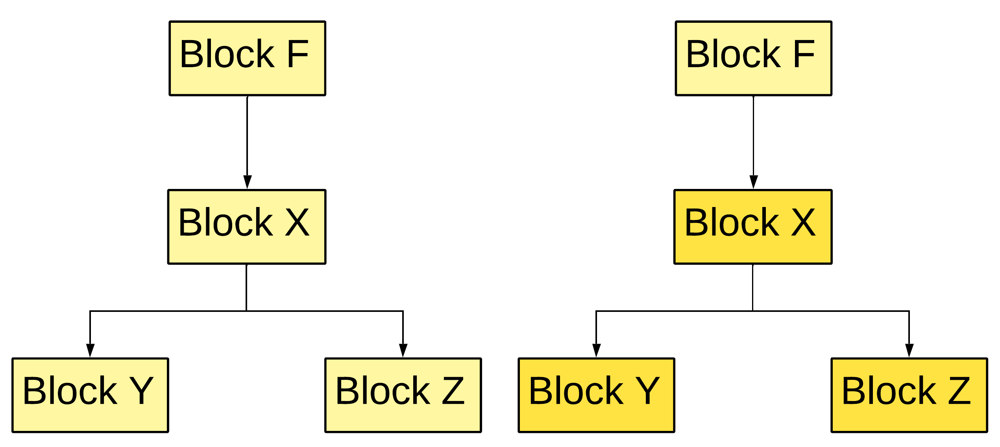
  <br>
  <em>Figure 8 — How we find a strict dominator</em>
</p>

### Dominance frontier
The dominance frontier [[?]](https://pages.cs.wisc.edu/~fischer/cs701.f05/lectures/Lecture22.pdf) [[?]](https://stackoverflow.com/questions/69794988/how-to-build-dominance-frontier-for-control-flow-graph) of a block `X` is the set of blocks where the dominance of `X` ends. More precisely, it represents all the blocks that are partially influenced by `X`: `X` dominates at least one of their predecessors, but does not dominate the block itself. In other words, it marks the boundary where control flow paths from inside `X`'s dominance region meet paths coming from outside (Figure 9).

<p align="center">
  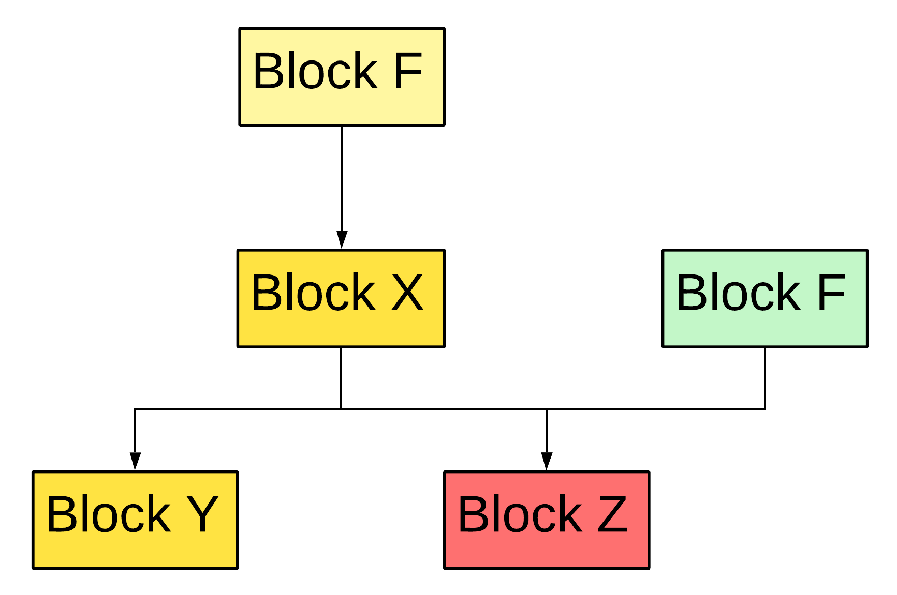
  <br>
  <em>Figure 9 — Finding the dominance frontier</em>
</p>

## SSA form
The `SSA` form renames all reassigned variables so that each assignment creates a new, unique variable. Modern `SSA` forms are more complex than this short description suggests; they are not limited to variable renaming after each assignment. For example, some `SSA` forms can handle arrays and indexes [[?]](https://dl.acm.org/doi/10.1145/268946.268956). </br>
At this moment, CordellCompiler supports the most "basic" `SSA` form, as presented in Figure 10.

<p align="center">
  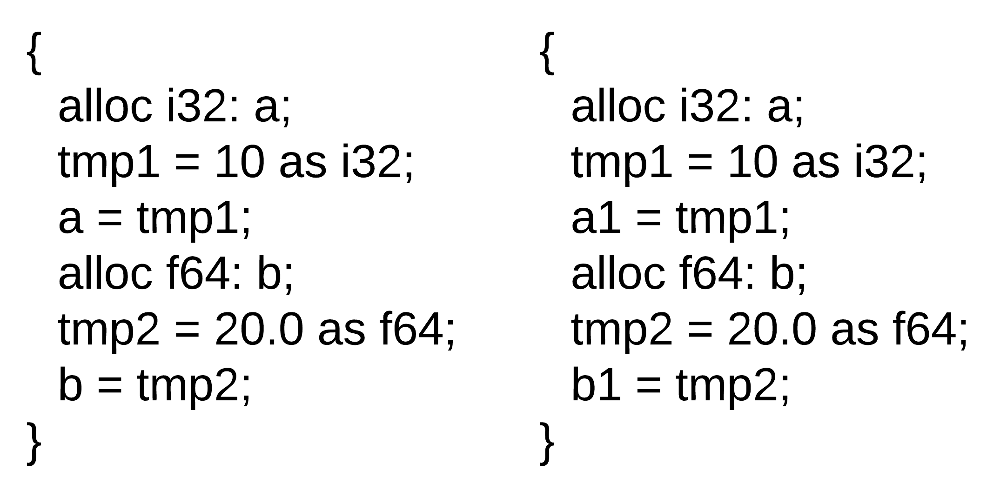
  <br>
  <em>Figure 10 — "Basic" SSA form</em>
</p>

### Phi function
But what happens when we encounter an `if` statement? What should we do when we cannot determine which unique variable version must be used in a `read` operation after a control-flow statement? Consider the example in Figure 11.

<p align="center">
  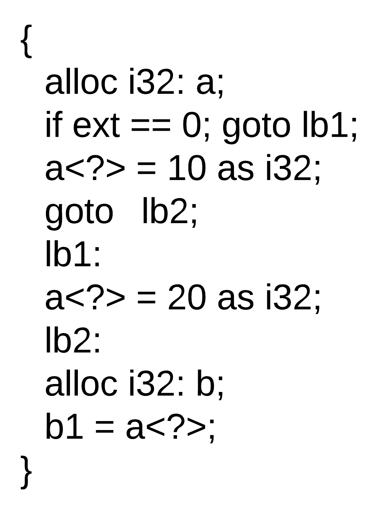
  <br>
  <em>Figure 11 — The "phi" problem</em>
</p>

Which version of the variable `a` should be used in the declaration of `b`? The answer is simple: `both`. In `SSA` form, we use a `φ (phi)` function, which tells the compiler which variable version to use depending on the incoming control-flow edge. An example of a `φ` function is shown in Figure 12.

<p align="center">
  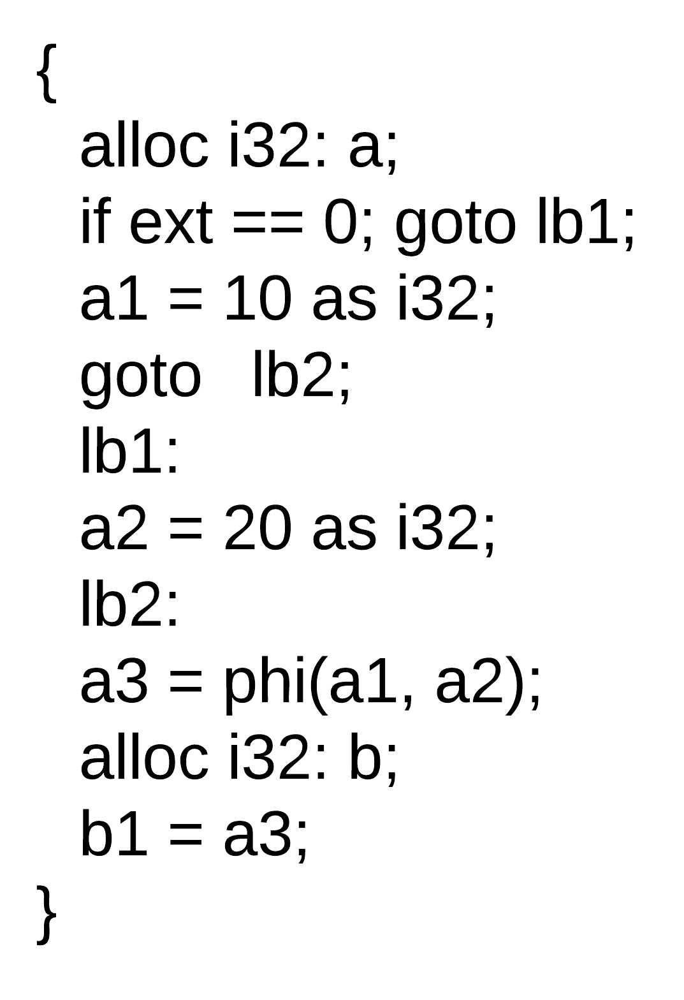
  <br>
  <em>Figure 12 — Phi function</em>
</p>

But how do we determine where to place this function? Here, we use previously computed dominance information. We traverse the entire symbol table of variables. For each variable, we collect the set of blocks where it is defined (either declared or assigned). Then, for each block with a definition, we take its dominance frontier blocks and insert a `φ` function there (Figure 13).

<p align="center">
  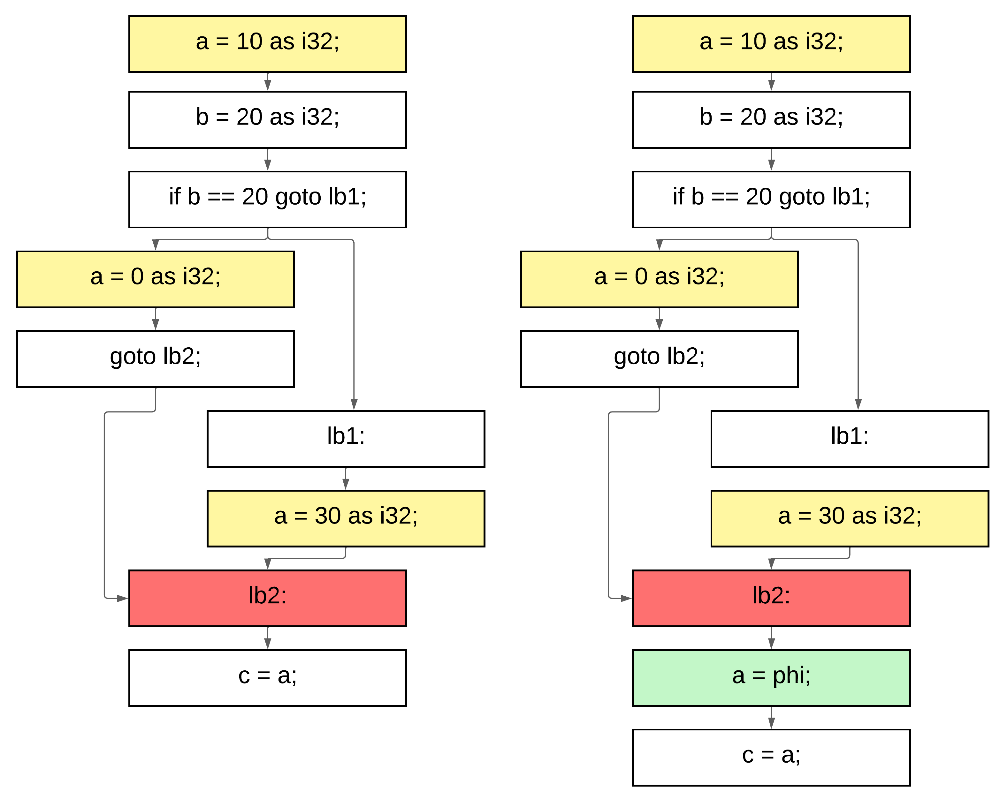
  <br>
  <em>Figure 13 — Phi function placement</em>
</p>

Then, during the SSA renaming process, we keep track of each block that passes through a `φ`-function block, recording the version of the variable and the block number. This completes the SSA renaming phase, producing the following result in Figure 14.

<p align="center">
  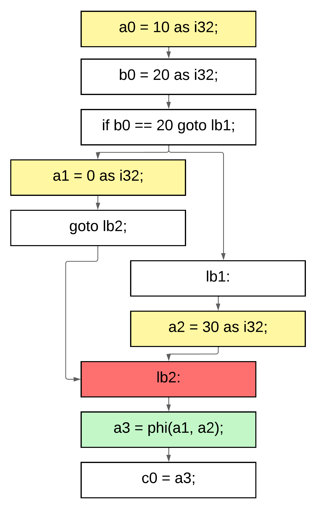
  <br>
  <em>Figure 14 — Final phi function</em>
</p>

## DAG part
With the complete `SSA` form, we can move on to the first optional optimizations. The first one requires building a `DAG` (Directed Acyclic Graph) [[?]](https://www.geeksforgeeks.org/compiler-design/directed-acyclic-graph-in-compiler-design-with-examples/) [[?]](https://en.wikipedia.org/wiki/Directed_acyclic_graph) representation of the code. In short, the `DAG` shows how every value in the program is derived and how each variable obtains its value, with some exceptions for `arrays` and `strings`. A basic example is provided in Figure 15.

<p align="center">
  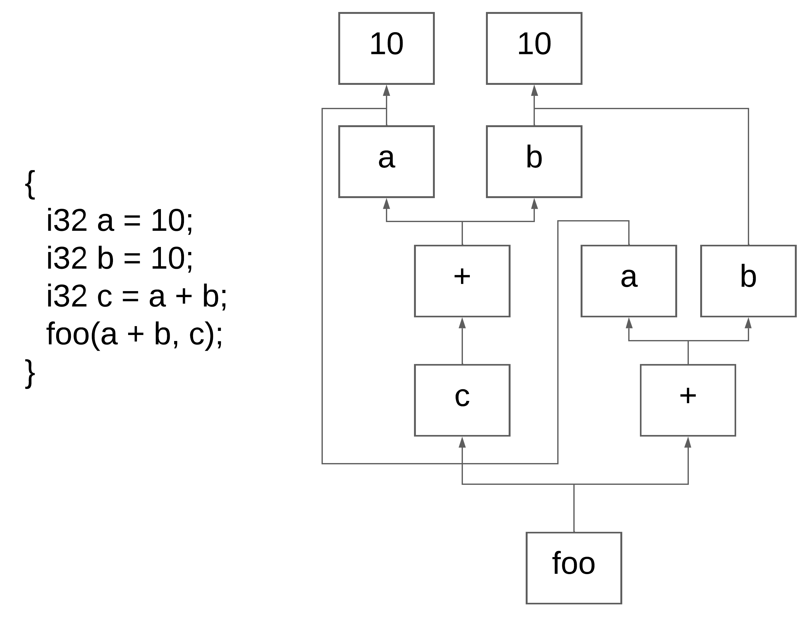
  <br>
  <em>Figure 15 — DAG</em>
</p>

Then, when we build the "basic" `DAG`, we check and merge all nodes that share the same hash (computed as a hash of their child nodes). If the nodes are identical and the base node is located in a dominating block, we can safely merge them.
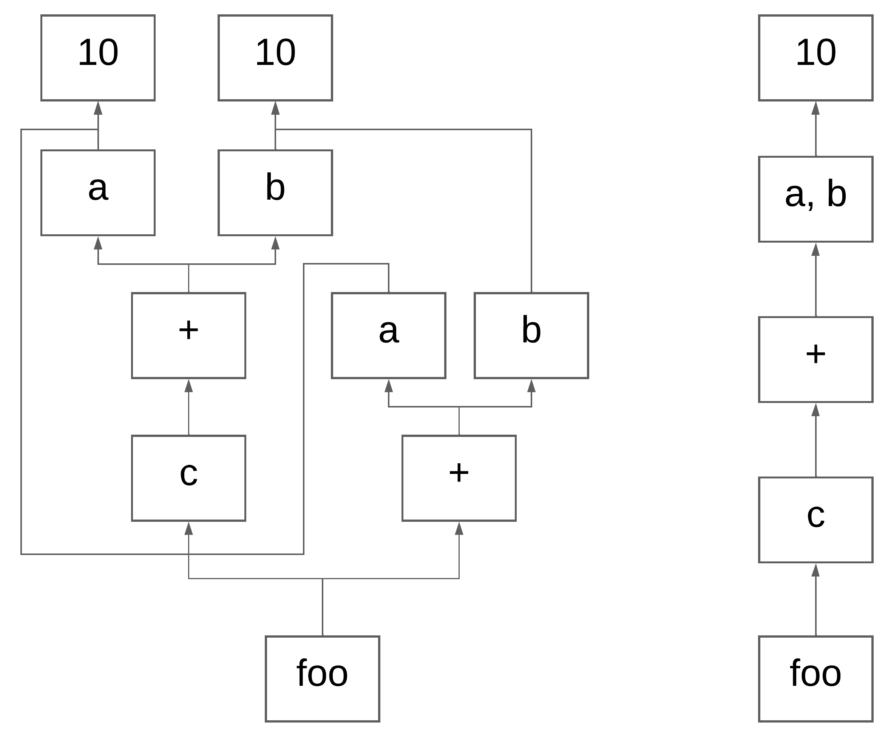

The result of using the DAG is optimized code with Common Subexpression Elimination applied.
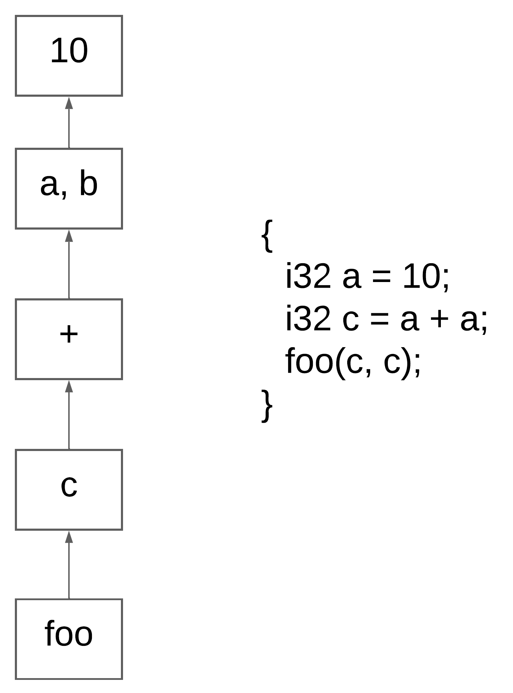

<details>
<summary><strong>DAG application in HIR optimization</strong></summary>

```cpl
{
    start(i64 argc, ptr u64 argv) {
        i32 a = 10;
        ptr i32 b = ref a;
        dref b = 11;
        i32 c = 10;
        exit c;
    }
}
```
->
```
{
    start {
        {
            i64s %0 = alloc;
            i64s %0 = load_starg();
            u64s %1 = alloc;
            u64s %1 = load_starg();
            {
                i32s %2 = alloc;
                i32t %5 = num?: 10 as i32;
                i32s %2 = i32t %5;
                u64s %3 = alloc;
                u64t %6 = &(i32s %2);
                u64s %3 = u64t %6;
                u64t %7 = num?: 11 as u64;
                *(u64s %3) = u64t %7;
                i32s %4 = alloc;
                i32t %8 = num?: 10 as i32;
                i32s %4 = i32t %8;
                exit i32s %4;
            }
        }
    }
}
```
</details>

## HIR optimization
Before going further, we should optimize HIR using the metadata available at this level. The simplest optimization here is constant folding based on the `DAG`. The same idea applies to `DFE`. Let us discuss these approaches.

### Constant folding / propagation (First pass)
With the formed `DAG`, we can determine which value is assigned to each variable. This stage does not transform code directly; it records variable values in the symbol table. We also track arithmetic, which allows simple operations over already known symbol-table values.
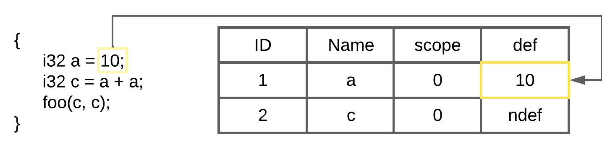

### Dead Function Elimination (DFE)
Dead function elimination, similar to `HIR` constant folding, does not transform source code directly. Instead, it marks unused functions as unused. This approach is based on a `Call Graph`, shown below.
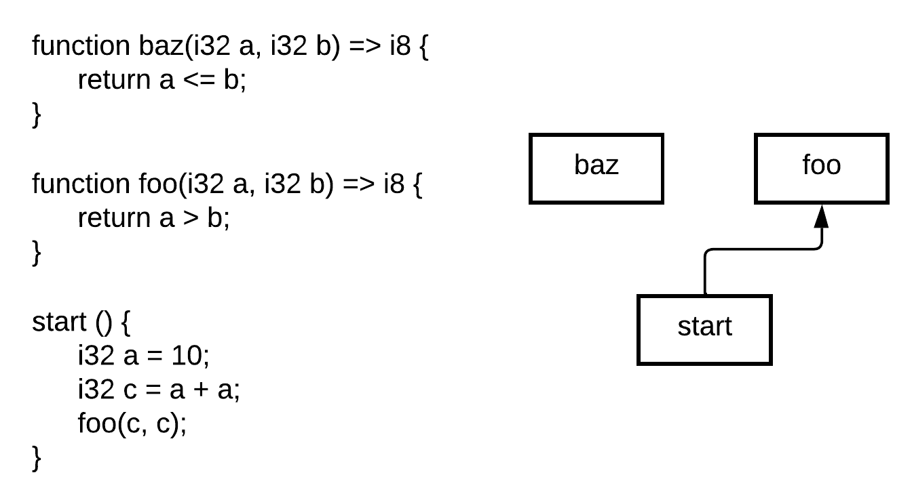

### Tail Recursion Elimination (TRE)
Tail recursion elimination, based on the CFG, finds functions that call themselves in tail position. The simplest example is below:
```cpl
function foo(i32 a = 10) -> i8 {
   if a > 20; { return a; }
   return foo(a + 1);
}
```

When such a function is found, the compiler determines whether it is ready for `TRE`. Then it transforms the recursion into a loop:
```cpl
function foo(i32 a = 10) -> i8 {
lbX:
   if a > 20; { return a; }
   a += 1;
goto lbX;
}
```

This optimization avoids repeated stack-frame allocation, which can be expensive when recursion occurs frequently.

### Function inlining
Function inlining happens when a function call gets a heuristic score of 3 or more. Each function call is evaluated with the following parameters:
- Is the function call inside a loop? `+2`
- One of the following:
   - Is the function size, measured in basic blocks, smaller than 2? `+3`
   - Is the function size smaller than 5? `+2`
   - Is the function size smaller than 10? `+1`
   - Is the function size larger than 15? `-3`

When a function call is marked as an `inline candidate`, the compiler copies the function body and rewrites argument assignments and returns:
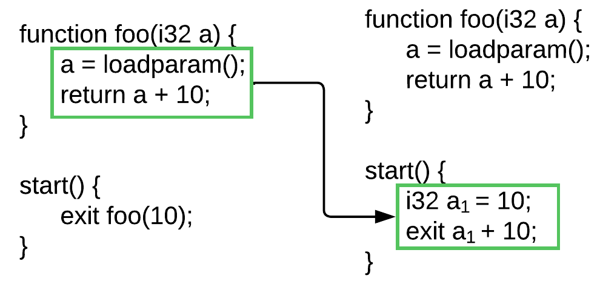

### Loop canonicalization
Loop canonicalization is an important step before LICM. The main idea of this stage is to create one entry point and one exit point for the loop. Consider the following `CFG`:
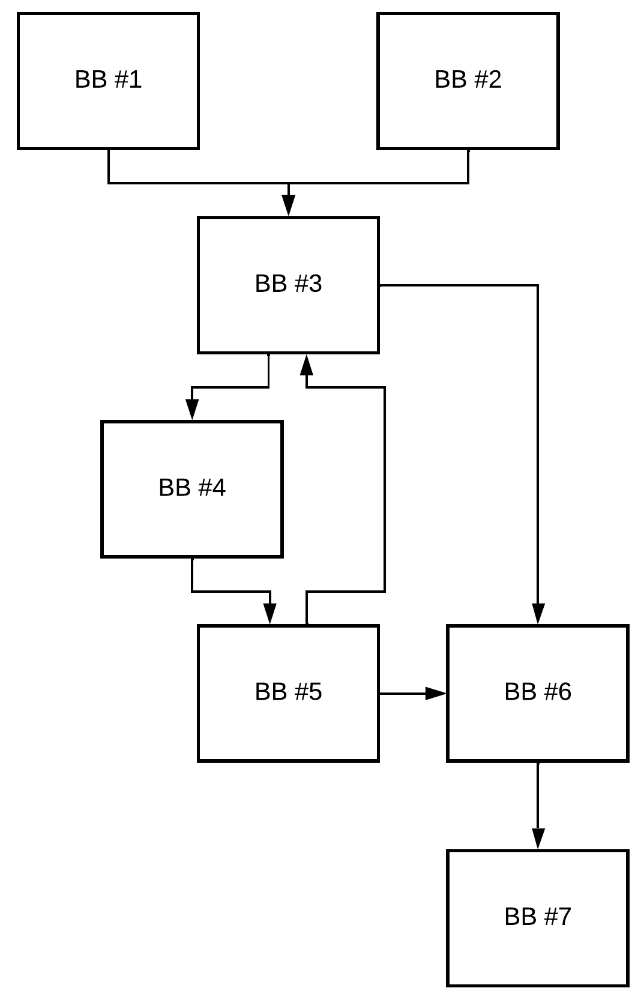

The main problem is the `critical edge` from `BB1` to `BB3`, which prevents us from moving some redundant code out of the loop. To solve it, we create a `preheader` basic block:
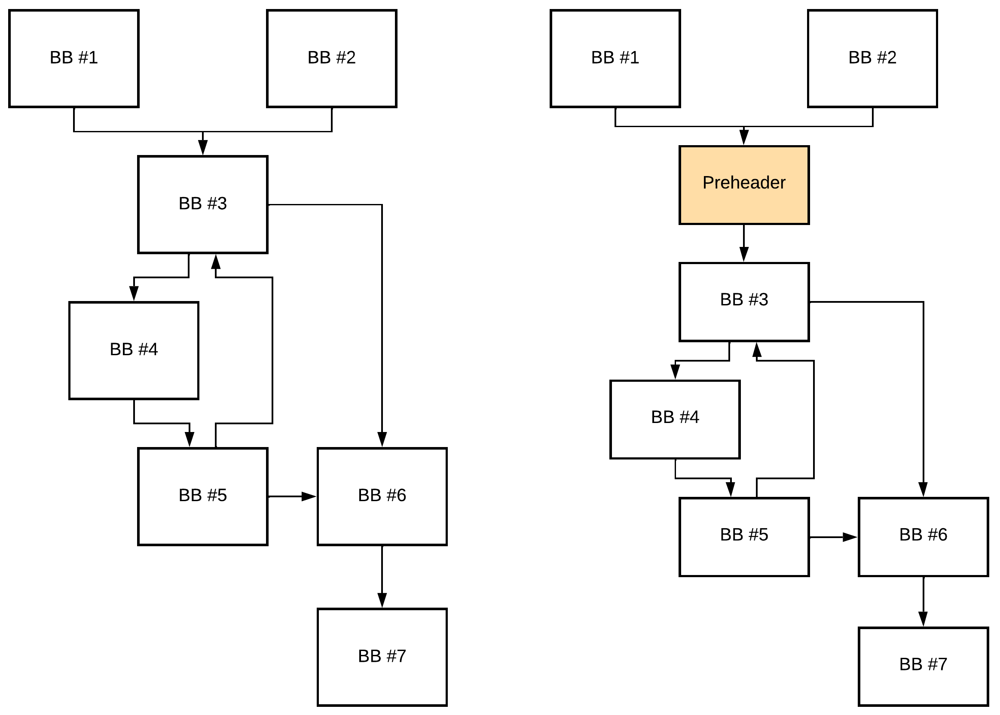

### Loop Invariant Code Motion (LICM)
Which `HIR` operations can be safely moved out of a loop?
- Operations that do not use induction variables.
- Operations that do not use loop variables.

## LIR part
In the same way as during `HIR` generation, we now produce an intermediate representation similar to `3AC`, but using only two addresses. This step is relatively straightforward, as it primarily involves adapting instructions to the target machine's addressing model. Because the exact implementation depends heavily on the target architecture (register count, instruction set, addressing modes, etc.), we typically do not spend much time optimizing or generalizing this layer. Its main goal is simply to bridge the high-level `HIR` representation and the target-specific assembly form, ensuring that each instruction can be directly translated to a valid machine instruction.
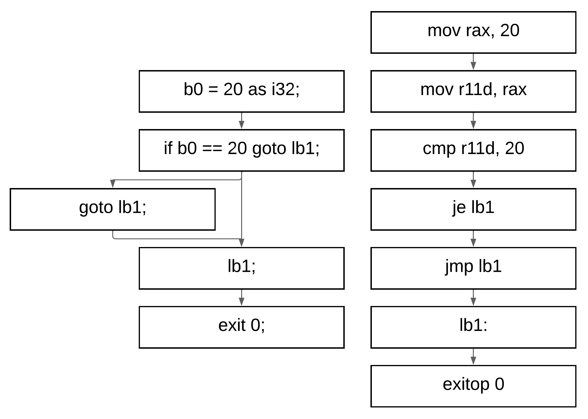

## LIR instruction planning
## LIR (x86_64) instruction selection
## LIR applying const propagation

## Liveness analyzer part
Several optimization techniques are based on data-flow analysis. Data-flow analysis itself relies on liveness analysis, which in turn depends on the program's `SSA` form and control-flow graph (CFG). Now that we have established these fundamental representations, we can proceed with the `USE-DEF-IN-OUT` computation process.

### USE and DEF
`USE` and `DEF` are two sets associated with every `CFG` block. These sets represent all definitions and usages of variables within the block (recall that the code is already in `SSA` form). In short:
- `DEF` contains all variables that are written (i.e., assigned a new value).
- `USE` contains all variables that are read (i.e., their value is used).
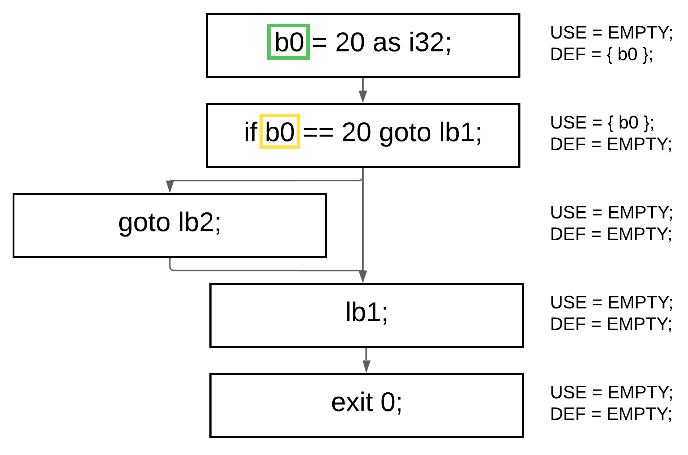

### IN and OUT
`IN` and `OUT` are a slightly more complex part of the analysis.
```
OUT[B] = union(IN[S])
IN[B]  = union(USE[B], OUT[B] − DEF[B])
```

First of all, to make the calculation much faster, we should traverse our list of `CFG` blocks in reverse order, computing `IN` and `OUT` for each block using the formulas above, and repeat this process until it stabilizes. Stabilization occurs when the previous sets (`primeIN` and `primeOUT`) are equal to the current sets (`currIN` and `currOUT`). This means that for every block we should maintain four sets:

- primeIN
- currIN
- primeOUT
- currOUT

After each iteration, the current values are copied into the corresponding prime sets, preparing them for the next comparison cycle.
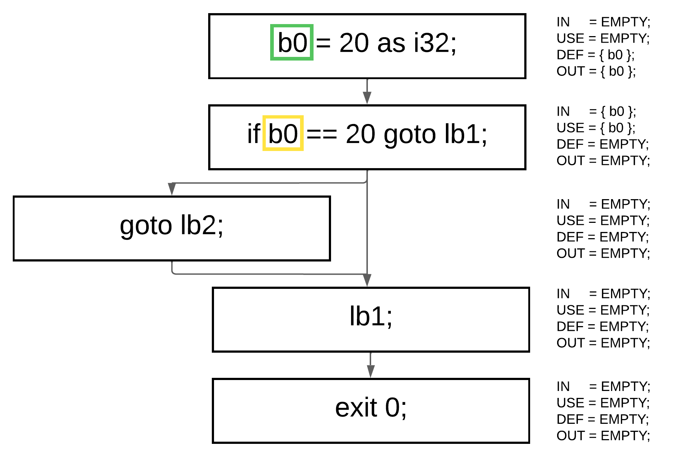

### Point of deallocation
At this point, we can determine where each variable dies. If a variable appears in the `IN` or `DEF` set but is not present in the `OUT` set, it means the variable is no longer used after this block, and we can safely insert a special `kill` instruction to mark it as dead. However, an important detail arises when dealing with pointer types. To handle them correctly, we construct a special structure called an `aliasmap`, which tracks ownership relationships between variables. This map records which variable owns another, meaning that one variable's lifetime depends on another's. For example, in code like this:
```cpl
{
   i32 a0 = 10;
   ptr i32 b0 = ref a0;
   dref b0 = 20;
}
```
the variable `a` is owned by `b`, so we must not kill `a` while `b` is still alive. In other words, the liveness of `a` depends on the liveness of `b`, and this dependency is preserved through the aliasmap.
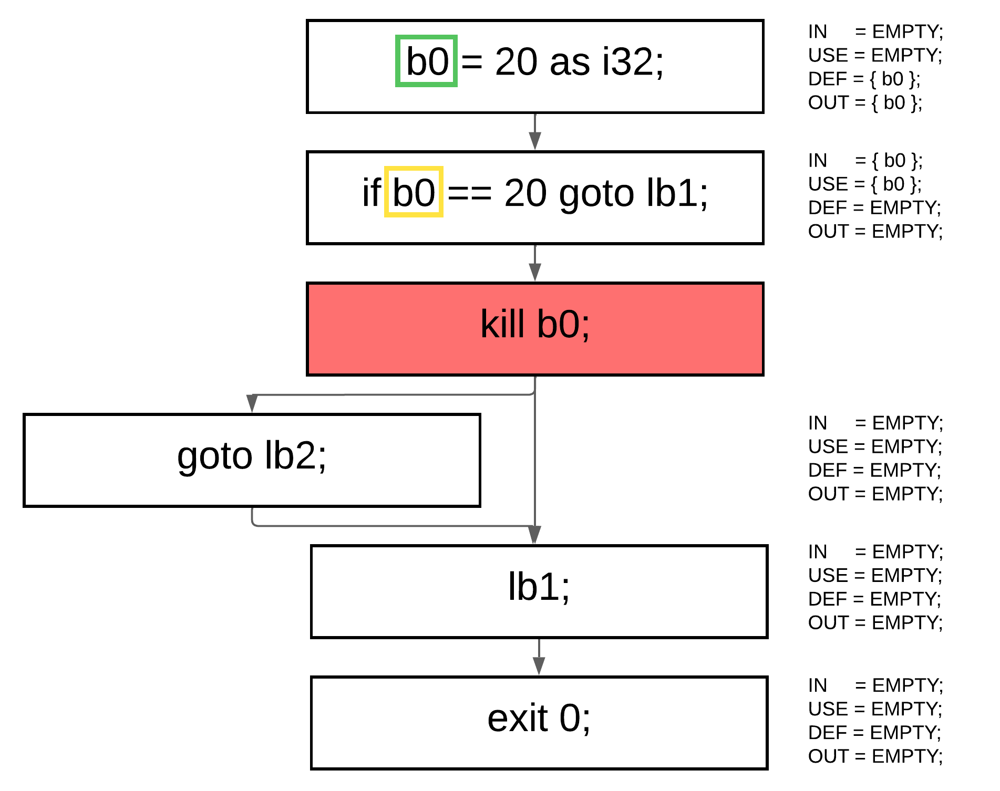

## Register allocation part
Now that we have the `IN`, `OUT`, `DEF`, and `USE` sets, we can construct an interference graph. The idea is straightforward: we create a vertex for each variable in the symbol table, and then, for every `CFG` block, we connect (i.e., add an edge between) each variable from the block's `DEF` set with every variable from its `OUT` set. This connection represents that these two variables are live at the same time. The resulting structure is the interference graph, where:
- Vertices represent program variables.
- Edges represent liveness conflicts (interference) between variables.
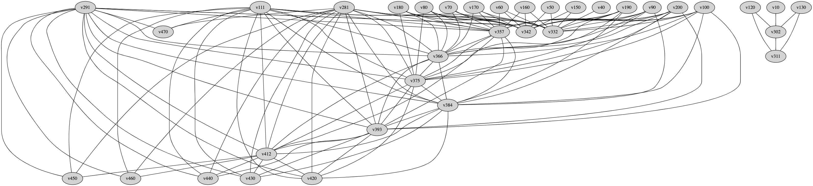

### Graph coloring
Now we can determine which variables can share the same register using graph coloring. The solution to this problem is purely mathematical, and there are many possible strategies to color a graph. In short, the goal is to assign a color to every node (variable) in such a way that no two connected nodes share the same color. The output of this algorithm is a colored interference graph, where each color represents a distinct physical register, and all variables with the same color can safely reuse the same register without overlapping lifetimes.
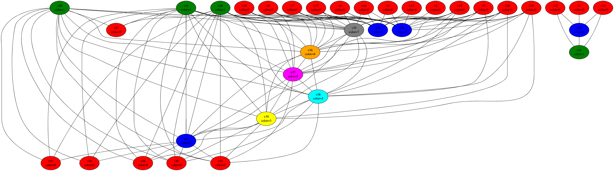

## LIR peephole optimization
Peephole optimization [[?]](https://www.geeksforgeeks.org/compiler-design/peephole-optimization-in-compiler-design/) is one of the simplest and most impactful optimizations in this compiler. In short, this optimization performs pattern matching and replacement, similar in spirit to regular expressions. It finds inefficient patterns in assembly code or LIR and replaces them with more efficient equivalents. </br>
The simplest example is replacing one inefficient command with a better one:
```asm
; mov rax, 0
xor rax, rax
```

### PTRN domain-specific language
As mentioned above, peephole optimization is mostly based on patterns. The problem is that there are many existing optimization patterns for assembly-like languages. Implementing all of them by hand in C would be inconvenient, especially because the optimizer must work over Cordell Compiler's LIR representation. </br>
To solve this problem, the compiler uses a small DSL that generates optimizers for LIR. For more information about this DSL, see [this README](src/lir/peephole/pattern_generator/README.md).

### First pass
The first pass of the peephole optimizer is a pattern-matching pass. It uses the generated pattern matcher described above.

### Second pass
The second pass propagates values to remove complex sequences of redundant `mov` operations. The following command sequence is an example:
```asm
mov rax, rbx
mov rdx, rax
mov rcx, rdx
mov r10, rcx
mov r11, r10
mov rax, r10
``` 

Such code can be produced after HIR and LIR optimizations. After the second pass, the code above is transformed into:
```asm
mov rax, rbx
mov rdx, rbx
mov rcx, rbx
mov r10, rbx
mov r11, rbx
mov rax, rbx
```

### Third pass
Once we have an optimized version of the code, we need to clean it up. To do this, we use the CFG and check whether the target register in the current line is used in a read operation. For example, consider `mov rax, rbx`: if `rax` is read later, we keep the instruction. If it is overwritten before any read, we can safely drop the line. </br>
After the second pass, `rax` is only used in a write operation at the end of the snippet, so the first line can be safely dropped.
```asm
; mov rax, rbx [dropped]
mov rdx, rbx
mov rcx, rbx
mov r10, rbx
mov r11, rbx
mov rax, rbx
```

Additionally, if a register does not affect the program environment, for example if it is not used in a syscall or function call, it can also be safely marked as `dropped`:
```asm
; mov rax, rbx [dropped]
; mov rdx, rbx [dropped]
; mov rcx, rbx [dropped]
; mov r10, rbx [dropped]
; mov r11, rbx [dropped]
; mov rax, rbx [dropped]
```

P.S. This is a fairly synthetic example, though.

## From HIR to LIR example

<details>
<summary><strong>From HIR to LIR example</strong></summary>

From the HIR we can produce a high-level LIR form:
```
fn strlen(i8* s) -> i64
{
    %12 = ldparam();
    {
        kill(cnst: 0);
        kill(cnst: 1);
        %13 = num: 0;
        %14 = %13;
        %8 = num: 1 as u64;
        lb10:
        %6 = *(%15);
        cmp %6, cnst: 0;
        jne lb11;
        je lb12;
        lb11:
        {
            %7 = %15 + %8;
            %16 = %7;
            %9 = %14 + num: 1;
            %17 = %9;
        }
        %14 = %17;
        %15 = %16;
        jmp lb10;
        lb12:
        return %14;
    }
}
kill(cnst: 14);

start {
    {
        %18 = strt_loadarg();
        %19 = strt_loadarg();
        {
            %4 = str_alloc(str(Hello world!));
            %5 = arr_alloc(X);
            %10 = &(%5);
            kill(cnst: 3);
            kill(cnst: 18);
            kill(cnst: 4);
            kill(cnst: 19);
            kill(cnst: 10);
            kill(cnst: 5);
            kill(cnst: 2);
            stparam(%10);
            call strlen(i8* s) -> i64;
            %11 = fret();
            exit %11;
        }
    }
    kill(cnst: 11);
}
```
</details>

## LIR x86_64 instruction selection
The next step is LIR lowering. The most common approach here is instruction selection. This is the first machine-dependent compiler step, so this layer contains abstractions and implementations for different assembly dialects, for example NASM x86_64 GNU and Mach-O x86_64 NASM.

<details>
<summary><strong>LIR selected instructions</strong></summary>

```
fn strlen(i8* s) -> i64
{
    {
        r11 = num: 0;
        r9 = r11;
        rdi = rdi;
        rbx = num: 1 as u64;
        lb10:
        r8 = *(rsi);
        cmp r8, cnst: 0;
        je lb12;
        jne lb11;
        lb11:
        {
            rax = rsi;
            rax = rax + rbx;
            rax = rax;
            rdx = rax;
            rsi = rdx;
            rax = r9;
            rax = rax + rbx;
            r10 = rax;
            rcx = r10;
            r9 = rcx;
            rbx = num: 1;
            rbx = rbx;
        }
        jmp lb10;
        lb12:
        return r9;
    }
}

start {
    {
        rbx = [rbp + 16];
        rax = rax;
        rbx = [rbp + 8];
        [rbp - 16] = num: 0;
        [rbp - 15] = num: 1;
        rdx = &([rbp - 16]);
        rdi = rdx;
        {
            [rbp - 29] = cnst: 72;
            [rbp - 28] = cnst: 101;
            [rbp - 27] = cnst: 108;
            [rbp - 26] = cnst: 108;
            [rbp - 25] = cnst: 111;
            [rbp - 24] = cnst: 32;
            [rbp - 23] = cnst: 119;
            [rbp - 22] = cnst: 111;
            [rbp - 21] = cnst: 114;
            [rbp - 20] = cnst: 108;
            [rbp - 19] = cnst: 100;
            [rbp - 18] = cnst: 33;
            [rbp - 17] = cnst: 0;
            kill(cnst: 4);
            kill(cnst: 5);
            call strlen(i8* s) -> i64;
            exit rax;
        }
    }
}
```

</details>

You may have noticed that register allocation is also applied here. The reason we wait until this stage is `pre-coloring`. The main idea is to pre-color some variables with already known registers, such as `rax` and `rbx` for arithmetic or `rdi`, `rsi`, and related registers for ABI function calls.

## Codegen (nasm) part
After completing the full code transformation pipeline, we can safely convert our `LIR` form into the `ASM` form, with a few small tricks applied during the unwrap process of special `LIR` instructions such as `EXITOP`, `STRT`, and others.
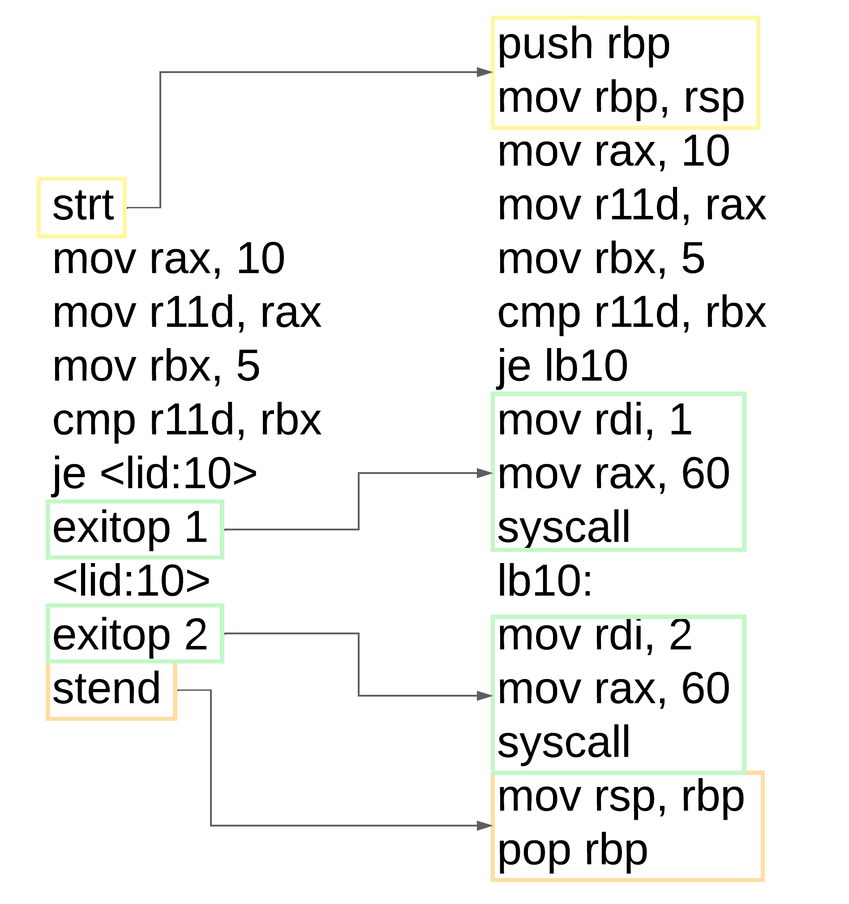

### Example of generated code

<details>
<summary><strong>Final ASM</strong></summary>

```
; Compiled .asm file. File generated by CordellCompiler!
section .data
section .rodata
section .bss
section .text
global _main

; BB20: 
_cpl_strlen:
push rbp
mov rbp, rsp
mov rcx, rdi
mov rsp, rdi
xor rbx, rbx
mov rbp, rbx

; BB27: 
mov rdi, rsp
mov rbx, rsp
mov rsi, rbp
mov rcx, rbp
mov rdx, 1

; BB21: 
lb11:
mov r11, rbx
mov r10b, [r11]
cmp r10b, 0
je lb13
jne lb12

; BB22: 
lb12:
mov r12, rbx
mov rax, rbx
add rax, rdx
mov rsi, rax
mov rbp, rax
mov r8, rax
mov r14, rax
mov rax, r14
shr rax, rax
mov r13, rax
mov rsp, rax
mov rax, rsp
mov r15, rsp
mov rcx, rsp
mov r9, rsp
mov rbx, rsp
jmp lb11

; BB23: 
lb13:
mov rdi, rcx
mov rax, rcx
mov rsp, rbp
pop rbp
ret

; BB24:

; BB25: 
_main:
push rbp
mov rbp, rsp
sub rsp, 16
mov byte [rbp - 13], 72
mov byte [rbp - 12], 101
mov byte [rbp - 11], 108
mov byte [rbp - 10], 108
mov byte [rbp - 9], 111
mov byte [rbp - 8], 32
mov byte [rbp - 7], 119
mov byte [rbp - 6], 111
mov byte [rbp - 5], 114
mov byte [rbp - 4], 108
mov byte [rbp - 3], 100
mov byte [rbp - 2], 33
mov byte [rbp - 1], 0
lea rax, qword [rbp - 13]
mov r11, rax
mov r15, qword [rbp + 16]
mov r8, qword [rbp + 8]
mov rbx, qword [rbp + 8]
mov r9, r11
mov rdi, r9
push rax
push rdx
push rsp
push r14
push r10
push rbp
push r11
push r12
push rax
call _cpl_strlen
pop rax
pop r12
pop r11
pop rbp
pop r10
pop r14
pop rsp
pop rdx
pop rax
mov r13, rax
mov rsp, rax
xor rbp, rbp
mov rax, rbp
mov r14, 1
mov rdi, r14
mov r12, r11
mov rsi, r12
mov r10, rsp
mov rdx, r10
syscall
xor rax, rax
mov rdx, rax
mov rax, 0x2000001
syscall

; BB26: 
; op=3
```
</details>

# Used links and literature
- Aarne Ranta. *Implementing Programming Languages. An Introduction to Compilers and Interpreters*
- Aho, Lam, Sethi, Ullman. *Compilers: Principles, Techniques, and Tools (Dragon Book)*
- Andrew W. Appel. *Modern Compiler Implementation in C (Tiger Book)*
- Cytron et al. *Efficiently Computing Static Single Assignment Form and the Control Dependence Graph* (1991)
- Daniel Kusswurm. *Modern x86 Assembly Language Programming. Covers x86 64-bit, AVX, AVX2 and AVX-512. Third Edition*
- Jason Robert, Carey Patterson. *Basic Instruction Scheduling (and Software Pipelining)* (2001)
