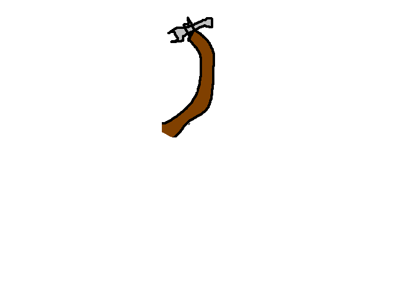

    <section class="cpl-home-hero">
        

            

                
                
            

        

        

        
 Language and compiler documentation 

            <h1 class="hero-title">
                 Cordell 
                 Programming 
                 Language 
            </h1>
            
 CPL is a deliberately small systems-language experiment and compiler infrastructure for studying parsing, semantic diagnostics, intermediate representations, optimization, register allocation, assembly generation, symtable optimization, and ML application. 

            

            <a href="#/pages/summary" class="hero-button primary">Overview</a>
            <a href="#/pages/hello-world-example" class="hero-button secondary">Start learning</a>
            <a href="#/pages/compiler-architecture" class="hero-button secondary">Compiler architecture</a>
        

        
$<code>git clone https://github.com/j1sk1ss/CordellCompiler.git</code>

        

    </section>
    <section class="cpl-home-band">
        <h2> Read this documentation by intent </h2>
        

            

                <h3> Language </h3>
                
 The language reference covers types, entry points, control flow, functions, macros, annotations, and low-level facilities such as pointers, syscalls, and inline assembly. 

            

            

                <h3> Compiler </h3>
                
 The compiler documentation explains preprocessing, AST/HIR/LIR stages, CFG and SSA construction, optimization, register allocation, diagnostics, and backend constraints. 

            

            

                <h3> Status </h3>
                
 The status pages state what CPL currently supports, what is intentionally out of scope, and how benchmark and changelog material should be interpreted. 

            

        

    </section>
    <section class="cpl-home-band dark">
        <h2> Recommended path </h2>
        

            <a href="#/pages/summary" class="doc-card">
                <h3> 1. Summary </h3>
                
 A concise statement of the language, the compiler pipeline, and the intended use of the project. 

            </a>
            <a href="#/pages/project-status" class="doc-card">
                <h3> 2. Status and scope </h3>
                
 Current capabilities, limitations, non-goals, target assumptions, and what remains experimental. 

            </a>
            <a href="#/pages/hello-world-example" class="doc-card">
                <h3> 3. First program </h3>
                
 A minimal entry point, explicit process exit, string output, and entry annotation form. 

            </a>
            <a href="#/pages/compiler-architecture" class="doc-card">
                <h3> 4. Compiler architecture </h3>
                
 How the repository maps to the implementation pipeline and where each compiler stage lives. 

            </a>
        

    </section>
    <section class="cpl-home-band">
        <h2> Reference sections </h2>
        

            <a href="#/pages/types" class="doc-card">
                <h3> Types and memory </h3>
                
 Primitive values, pointers, strings, arrays, containers, storage classes, and external symbols. 

            </a>
            <a href="#/pages/functions-and-inbuilt-macros" class="doc-card">
                <h3> Functions </h3>
                
 Definitions, prototypes, overloads, generics, function pointers, local functions, lambdas, varargs, syscalls, and assembly. 

            </a>
            <a href="#/pages/cpllib-reference" class="doc-card">
                <h3> Standard library </h3>
                
 How to include <code>cpllib</code> headers, which libc-style declarations are available, and which CPL containers are linked from <code>libcpl.a</code>. 

            </a>
            <a href="#/pages/containers" class="doc-card">
                <h3> Containers </h3>
                
 Value-layout custom types, nested fields, array fields, and explicit self calls. 

            </a>
            <a href="#/pages/compiler-usage" class="doc-card">
                <h3> Compiler usage </h3>
                
 Build commands, target options, output modes, optimization flags, and analysis flags. 

            </a>
            <a href="#/pages/semantic-static-checker" class="doc-card">
                <h3> Diagnostics </h3>
                
 AST-level and IR-level checks, including low-level experiments with symbolic reasoning. 

            </a>
            <a href="#/pages/benchmarking" class="doc-card">
                <h3> Evaluation </h3>
                
 Microbenchmark methodology and current performance measurements against GCC and Clang baselines. 

            </a>
            <a href="#/pages/used-links-and-literature" class="doc-card">
                <h3> Literature </h3>
                
 Compiler texts, SSA references, assembly material, and sources that shaped the implementation. 

            </a>
        

    </section>

