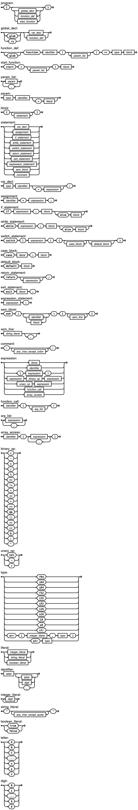

# Cordell Programming Language documentation
## Navigation
1. **Introduction**  
   1.1. [Overview](#overview)  
   1.2. [Hello, World! example](#hello-world-example)  
   1.3. [Code conventions](#code-conventions)
2. **Types**  
   2.1. [Primitives](#primitives)  
   2.2. [Strings and arrays](#strings-and-arrays)  
   2.3. [Pointers](#pointers)
3. **Casting**  
   - [Type casting rules](#casting)  
4. **Binary operations**  
   - [Operators and precedence](#binary-operations)  
5. **Scopes**  
   5.1. [Variables and lifetime](#variables-and-lifetime)  
   5.2. [Visibility rules](#visibility-rules)  
6. **Control flow statements**  
   6.1. [if statement](#if-statement)  
   6.2. [while statement](#while-statement)  
   6.3. [switch statement](#switch-statement)  
7. **Functions and inbuild macros**  
   7.1. [Functions](#functions)  
   7.2. [Inbuild macros](#inbuild-macros)
8. **Final language syntax**
   - [EBNF](#ebnf)
9. **Ownership rules**  
   - [Memory ownership model](#ownership-rules)
10. **Examples**  
   - [Practical code samples](#examples)  

# Introduction
## Overview
The **Cordell Programming Language (CPL)** is a system-level programming language designed for learning and experimenting with modern compiler concepts. It combines low-level capabilities from `ASM` with practices inspired by modern languages like `Rust` and `C`.  

CPL is intended for:
- **Systems programming** — operating systems, compilers, interpreters, and embedded software.  
- **Educational purposes** — a language to study compiler design, interpreters, and programming language concepts.  

### Key Features
- **Flexible typing**: variables may hold values of different types; the compiler attempts implicit conversions when assigning.  
- **Explicit memory model**: ownership rules and manual memory management are core features.  
- **Minimalistic syntax**: designed for readability and precision.  
- **Deterministic control flow**: no hidden behaviors; all execution paths are explicit.  
- **Extensibility**: functions and inbuilt macros allow both low-level operations and high-level abstractions.  

## Hello, World! example
```CPL
{
    function strlen(ptr i8 s) => i64 {
        i64 l = 0;
        while dref s; {
            s += 1;
            l += 1;
        }

        return l;
    }

    function puts(ptr i8 s) {
        i64 l = strlen(s);
        asm (s, l) {
            "mov rax, 1",
            "mov rdi, 1",
            "mov rsi, &s",
            "mov rdx, &l",
            "syscall"
        }
        return;
    }

    start(i64 argc, ptr u64 argv) {
        puts("Hello, World!");
        exit 0;
    }
}
```

## Code conventions
CPL encourages consistent and readable code.

### Naming conventions
- **Variables**: use lowercase letters and underscores  
```CPL
i32 counter = 0;
ptr i32 data_ptr = ref counter;
```

- **Constants**: use uppercase letters with underscores
```
glob ptr u8 FRAMEBUFFER;
glob ro i32 WIN_X = 1080;
glob ro i32 WIN_Y = 1920;
```

- **Functions**: use lowercase letters with underscores
```CPL
function calculate_sum(ptr i32 arr, i64 length) { :...: }
```

- **Scopes**: K&R style
```CPL
if cond; {
}

while cond; {
}

start() {
}
```

- **Comments**: Comments can be in one line with start and end symbol `:` and in several lines with same logic.
```CPL
: Hello there
:

:
Hello there :

: Hello there :

:
Hello there
:
```

# Types
## Primitives
- `f64`, `f32` - double and float; non-floating values are converted to double if used in double operations.
```CPL
f64 a = 0.01;
f32 b = 0.01;
i32 d = 1;
f64 c = a + b + d;
```

- `i64`, `u64` - Long / 64-bit value.
```CPL
i64 a = 123123123;
u64 b = 0b1110011;
i64 c = 0xFFFFFFF;
```

- `i32`, `u32` - Integer / 32-bit value.
```CPL
i32 a = 123123;
u32 b = 0b0111;
i32 c = 0xFFFF;
```

- `i16`, `u16` - Short / 16-bit value.
```CPL
i16 a = 123;
u16 b = 0b1;
i16 c = 0xF;
```

- `i8`, `u8` - Character / 8-bit value.
```CPL
i8 a = 255;
u8 b = 0b0;
i8 c = 0xF;
i8 d = 'a';
```

## Strings and arrays
- `str` - String data type. Similar to `ptr u8` type, but used for high-level inbuild operations like `strcmp`.
```CPL
str msg = "Hello world!";
if msg == "Hello world!"; {
}
```

- `arr` - Array data type. Can contain any primitive type.
```CPL
arr arr1[10, i32];                                    : <= Allocated data without initialization :
arr arr2[10, i32] = { 0, 0, 0, 0, 0, 0, 0, 0, 0, 0 }; : <= Allocated data with initialization    :
arr matrix[2, u64] = { arr1, arr2 };                  : <= Simple matrix                         :
```

Also array can have a unkkown in compile-time size. This will generate code that allocates memory in heap. 
```CPL
extern i8 size;
arr arr1[size, i32];
```

Runtime-size arrays will die when code returns from their home scope. That's why this code below still illegal:
```CPL
extern i8 size;
ptr u8 a;
{
    arr arr1[size, i32];
    a = ref arr1;
}                                                       : <= "arr1" is deallocated. Work with this "a" will cause a SF :
```

## Pointers
- `ptr` - Pointer modifier that can be add to every primitive (and `str`) type.
```CPL
ptr u64 a = 0;
ptr str b = "Hello world";
```

# Casting
CPL supports only implicit casting. This means, that any value or return type can be stored in any variable. But semantic module will inform, if it encounter an unexpected implicit casting.
```CPL
i32 a = 0xFFFF;
i8 b = a;                                             : <= Will produce a warning :

function a() => i64 { :...: }
i8 c = a();                                           : <= Will produce a warning :

i8 d = 0xFFF;                                         : <= Will produce a warning :
u8 f = -1;                                            : <= Will produce a warning :
```

# Binary operations
| Operation | Description    |
|-----------|----------------|
| `+`       | Addition       |
| `-`       | Subtraction    |
| `*`       | Multiplication |
| `/`       | Division       |
| `%`       | Module         |
| `==`      | Equality       |
| `!=`      | Inequality     |
| `not`     | Negation       |
| `+=` `-=` `*=` `/=`    | Assign operations                           |
| `>` `>=` `<` `<=`      | Comparison                                  |
| `&&` `\|\|`            | Logic operations (Lazy Evaluations support) |
| `>>` `<<` `&` `\|` `^` | Bit operations                              |

# Scopes
## Variables and lifetime
Variables live in their declared scopes. You cannot point to variables from an outer scope:
```CPL
start() {
   ptr u64 p;
   {
      arr t[10; i32];
      p = ref t;                 : <= No warning here, but it still illegal :
   }                             : <= array "t" died here                   :

   p[0] = 1;                     : <= Pointer to deallocated stack          :
   exit 0;
}
```

Note: It will cause memmory corruption error instead SegFault due stack allocation method in CPL.

## Visibility rules
Outer variables can be seen by current and nested scopes.
```
{
   {
      i32 a = 10;                   : <= Don't see any variables   :
   }

   i64 b = 10;                      : <= Don't see any variables   :

   {
      i8 c = 9;                     : <= See "b" variable          :

      {
         f32 a = 10;                : <= See "b" and "c" variables :
      }

      i8 a = 0;                     : <= See "b" and "c" variables :
   }
}
```

# Control flow statements
## if statement
`if` keyword similar to `C` statement. Key change here is `;` after condition. 
```CPL
if cond; {
}
else {
}
```

## while statement
Note: `else` block executes if the loop never runs or after the loop ends.
```CPL
while cond; {
}
else {
}
```

## switch statement
Note: `X` should be constant value (or primitive variable that can be `inlined`).
```CPL
switch cond; {
   case X; {
   }
   default; {
   }
}
```

# Functions and inbuilt macros
## Functions
Functions can be defined by `function` keyword. Also, if you want to use function in another `.cpl`/(or whatever language that support extern) file, you can append `glob` keyword. One note here, that if you want to invoke this function from another language, keep in mind, that CPL change function name by next pattern: `__{name}__`. 
```CPL
function foo() => i32 { :...: }
glob function bar(i32 a = 10) => ptr u64 { :...: }
```

CPL support default values in functions. Compiler will pass this default args in function call if you don't provide enoght.
```CPL
bar(); : => bar(10); :
```

## Inbuilt macros
There is two inbuild functions that can be usefull for system programmer. First is `syscall` function.
- `syscall` function called similar to default user functions, but can handler variate number of arguments. For example here is the write syscall:
```CPL
str msg = "Hello, World!";
syscall(1, 1, ref msg, strlen(ref msg));
```

- `asm` - Second usefull function that allows inline assembly code. Main feature here is variables line, where you can pass any number of arguments, then use them in assembly code block via `&` symbol.
```CPL
i32 a = 0;
i32 ret = 0;
asm(a, ret) {
   "mov rax, &a",
   "syscall",
   "mov &ret, rax"
}
```

Note: Inlined assembly block don't optimized by any alghorithms.

# EBNF


# Ownership rules
## Ownership model vs Rust
CPL introduces a lightweight ownership model that resembles Rust’s borrow checker, but it serves a different purpose and operates with fewer restrictions.  

### Similarities
- **Ownership tracking**:  
  Each variable can have one or more owners. Ownership is explicitly transferred with the `ref` keyword.  
- **Lifetime-based reuse**:  
  When a variable and all of its owners are no longer used, its stack slot can be safely reused by another variable.  
- **Compile-time analysis**:  
  The compiler analyzes usage and ownership before code generation, preventing unsafe reuse of stack slots.

### Differences
1. **Multiple owners allowed**  
   In Rust, only one owner exists at a time, while in CPL multiple owners may coexist in the ownership list.
2. **Optimization-oriented**  
   Rust’s borrow checker enforces memory safety rules.  
   Cordell’s ownership tracking exists primarily to enable **stack slot reuse** and reduce stack frame size.
3. **Memory reuse instead of drops**  
   Rust frees resources automatically at the end of a lifetime (`Drop`).  
   CPL does not guarantee cleanup but instead marks the memory slot as reusable once ownership is gone.
4. **Low-level design**  
   CPL's model is closer to compiler optimizations such as **SSA transformation, register allocation, or stack coloring**, while Rust’s model is a high-level safety feature of the language.

### Example
```CPL
{
    start() {
        : 16 : i32 a = 0;        <= Allocate 8 bytes
        : 24 : ptr i32 p;        <= Allocate 8 bytes
        if 1; {
            p = ref a;           <= "p" becomes new owner of "a"
        }

        : 32 : i32 c = 0;        <= "p" is still alive, so "a" is not reusable yet
        exit p;
    }
}
```

# Examples
## Brainfuck
```CPL
{
    from "stdio.cpl" import puts, putc, gets;

    glob arr tape[30000, i8];
    glob arr code[10000, i8];
    glob arr bracketmap[10000, i32];
    glob arr stack[10000, i32];

    start() {
        puts("Brainfuck interpriter! Input code: ");

        i32 pos = 0;
        i32 stackptr = 0;
        i32 codelength = gets(code, 10000);
        while pos < codelength; {
            i8 c = code[pos];
            switch c; {
                case '['; {
                    stack[stackptr] = pos;
                    stackptr += 1;
                }
                case ']'; {
                    if stackptr > 0; {
                        stackptr = stackptr - 1;
                        i32 matchpos = stack[stackptr];
                        bracketmap[pos] = matchpos;
                        bracketmap[matchpos] = pos;
                    }
                }
            }
            
            pos = pos + 1;
        }
        
        i32 pc = 0;
        i32 pointer = 0;

        while pc < codelength; {
            switch code[pc]; {
                case '>'; {
                    pointer += 1;
                    pc += 1;
                }
                case '<'; {
                    pointer -= 1;
                    pc += 1;
                }
                case '+'; {
                    tape[pointer] += 1;
                    pc += 1;
                }
                case '-'; {
                    tape[pointer] -= 1;
                    pc += 1;
                }
                case '.'; {
                    putc(tape[pointer]);
                    pc += 1;
                }
                case ','; {
                    gets(ref tape[pointer], 1);
                    pc += 1;
                }
                case '['; {
                    if not tape[pointer]; {
                        pc = bracketmap[pc];
                    }
                    else {
                        pc += 1;
                    }
                }
                case ']'; {
                    if tape[pointer]; {
                        pc = bracketmap[pc];
                    }
                    else {
                        pc += 1;
                    }
                }
                default {
                    pc += 1;
                }
            }
        }

        exit 1;
    }
}
```