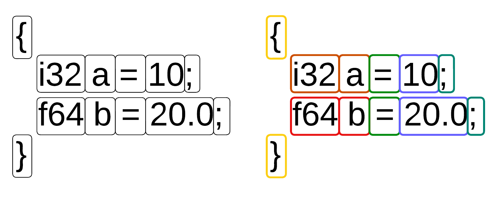

# Tokenization part
The tokenization part is responsible for splitting the input byte sequence into basic tokens. This module ignores all whitespace and separator symbols (such as newlines and tabs). It also classifies each token into one of the basic types: `number`, `string`, `delimiter`, `comma`, or `dot`.


The implementation of the tokenizer is straightforward, but in languages like C, it requires some development effort. Below is a snippet from the compiler’s source code. The full code can be found [here](https://github.com/j1sk1ss/CordellCompiler/tree/HIR_LIR_SSA/src/prep).
```C
if (
      curr_ctx.in_token && 
      (
         char_type == LINE_BREAK_TOKEN ||
         // char_type == UNKNOWN_CHAR_TOKEN ||  /* Chars can't be larger then 1 symbol */
         char_type == UNKNOWN_BRACKET_VALUE ||  /* Same with the brackets */
         curr_ctx.token_len + 1 > TOKEN_MAX_SIZE ||
         curr_ctx.ttype != char_type
      )
) {
      token_t* nt = TKN_create_token(curr_ctx.ttype, token_buf, curr_ctx.token_len, curr_ctx.line);
      if (!nt || !list_add(tkn, nt)) {
         print_error("Can't add token! tt=%i, tb=[%s], tl=%i", curr_ctx.ttype, token_buf, curr_ctx.token_len);
         mm_free(nt);
         list_free_force(tkn);
         return 0;
      }

      curr_ctx.in_token  = 0;
      curr_ctx.token_len = 0;
      curr_ctx.ttype     = LINE_BREAK_TOKEN;
      curr_ctx.neg       = 0;
}
``` 

## Example of tokenized code
Code above will produce next list of tokens.
```
line=1, type=1, data=[{], 
line=1, type=2, data=[function], 
line=1, type=2, data=[sum], 
line=1, type=1, data=[(], 
line=1, type=2, data=[i32], 
line=1, type=2, data=[a], 
line=1, type=7, data=[,], 
line=1, type=2, data=[i32], 
line=1, type=2, data=[b], 
line=1, type=1, data=[)], 
line=1, type=0, data=[=>], 
<...>
line=16, type=1, data=[}], 
line=17, type=2, data=[i32], 
line=17, type=2, data=[l], 
line=17, type=0, data=[=], 
line=17, type=2, data=[ref], 
line=17, type=2, data=[f], 
line=18, type=6, data=[;], 
line=18, type=2, data=[exit], 
line=18, type=2, data=[dref], 
line=18, type=2, data=[l], 
line=19, type=6, data=[;], 
line=20, type=1, data=[}]
```

# Markup part
The markup stage is the second part of tokenization, but it is separated from the tokenizer in this compiler due to a different design approach. It operates only on the list of tokens and includes support for scopes. The main idea is to perform basic semantic markup of variables — for example, if we declare a variable `i32 a`, all occurrences of `a` within the corresponding scope can be marked as having the `i32` type.


Similar to the tokenization part, the markuper is simple to implement in high-level programming languages. In C, however, it’s better to use special structures such as `list_t` ([source code](https://github.com/j1sk1ss/CordellCompiler/blob/HIR_LIR_SSA/std/list.c)) to simplify the process. Below is a snippet from the source code. The full code can be found in the [same](https://github.com/j1sk1ss/CordellCompiler/tree/HIR_LIR_SSA/src/prep) place as the tokenizer’s code.

```C
foreach(token_t* curr, tkn) {
   switch (curr->t_type) {
      case OPEN_BLOCK_TOKEN:  scope_push(&scope_stack, ++s_id, 0); break;
      case CLOSE_BLOCK_TOKEN: scope_pop(&scope_stack);             break;
      case NEGATIVE_TOKEN:  neg  = 1; _remove_token(tkn, curr); continue;
      case DREF_TYPE_TOKEN: dref = 1; _remove_token(tkn, curr); continue;
      case REF_TYPE_TOKEN:  ref  = 1; _remove_token(tkn, curr); continue;
      case UNKNOWN_CHAR_TOKEN:
      case UNKNOWN_STRING_TOKEN: {
            for (int s = scope_stack.top; s >= 0; s--) {
               int curr_s = scope_stack.data[s].id;
               foreach(variable_t* v, &vars) {
                  if (curr->body->equals(curr->body, v->name) && v->scope == curr_s) {
                        curr->t_type     = v->type;
                        curr->flags.ext  = v->ext;
                        curr->flags.ro   = v->ro;
                        curr->flags.glob = v->glob;
                        curr->flags.ptr  = v->ptr;
                        curr->flags.ref  = ref;
                        curr->flags.dref = dref;
                        curr->flags.neg  = neg;
                        goto _resolved;
                  }
               }
            }

_resolved: {}
            break;
      }

      default: break;
   }

   ref  = 0;
   dref = 0;
   neg  = 0;
}
```

## Example of markup result
```
line=1, type=12, data=[{], 
line=1, type=44, data=[function], 
line=1, type=45, data=[sum], 
line=1, type=10, data=[(], 
line=1, type=24, data=[i32], 
line=1, type=79, data=[a], 
line=1, type=7, data=[,], 
line=1, type=24, data=[i32], 
line=1, type=79, data=[b], 
line=1, type=11, data=[)], 
line=1, type=39, data=[=>],
<...>
line=13, type=6, data=[;], 
line=14, type=12, data=[{], 
line=14, type=38, data=[exit], 
glob line=14, type=3, data=[1], 
line=15, type=6, data=[;], 
line=16, type=13, data=[}], 
line=17, type=24, data=[i32], 
line=17, type=79, data=[l], 
line=17, type=62, data=[=], 
line=17, type=79, data=[f], ref 
line=18, type=6, data=[;], 
line=18, type=38, data=[exit], 
line=18, type=79, data=[l], dref 
line=19, type=6, data=[;], 
line=20, type=13, data=[}]
```

# AST part
Next, we need to parse this sequence of marked tokens to construct an `AST` (Abstract Syntax Tree). There are many approaches to achieve this — for example, `LL` parsing, `LR` parsing, or even `hybrid` techniques that combine `LL` and `LR`. A more complete list of parser types can be found [here](https://www.geeksforgeeks.org/compiler-design/types-of-parsers-in-compiler-design/) or in related compiler design books.


The AST generator is significantly more complex to implement than the tokenizer or the markuper. The main idea behind the implementation is to register handlers for each token type in the token list. The CPL compiler parses tokens using an LL parser, which means that the AST structure to be constructed is determined by the type of the first token. The source code for this layer is available [here](https://github.com/j1sk1ss/CordellCompiler/blob/HIR_LIR_SSA/src/ast), and a snippet of the main module block is shown below.
```C
static ast_node_t* _navigation_handler(list_iter_t* it, ast_ctx_t* ctx, sym_table_t* smt) {
    switch (((token_t*)list_iter_current(it))->t_type) {
        case START_TOKEN:           return cpl_parse_start(it, ctx, smt);
        case ASM_TOKEN:             return cpl_parse_asm(it, ctx, smt);
        case OPEN_BLOCK_TOKEN:
        case CLOSE_BLOCK_TOKEN:     return cpl_parse_scope(it, ctx, smt);
        case STR_TYPE_TOKEN:
        case F32_TYPE_TOKEN:
        case F64_TYPE_TOKEN:
        case I8_TYPE_TOKEN:
        case I16_TYPE_TOKEN:      
        case I32_TYPE_TOKEN:
        case I64_TYPE_TOKEN:
        case U8_TYPE_TOKEN:
        case U16_TYPE_TOKEN:
        case U32_TYPE_TOKEN:
        case U64_TYPE_TOKEN:        return cpl_parse_variable_declaration(it, ctx, smt);
        case SWITCH_TOKEN:          return cpl_parse_switch(it, ctx, smt);
        case IF_TOKEN:              
        case WHILE_TOKEN:           return cpl_parse_condop(it, ctx, smt);
        case STR_VARIABLE_TOKEN:
        case ARR_VARIABLE_TOKEN:
        case I8_VARIABLE_TOKEN:
        case I16_VARIABLE_TOKEN:
        case I32_VARIABLE_TOKEN:
        case I64_VARIABLE_TOKEN:
        case F32_VARIABLE_TOKEN:
        case F64_VARIABLE_TOKEN:
        case U8_VARIABLE_TOKEN:
        case U16_VARIABLE_TOKEN:
        case U32_VARIABLE_TOKEN:
        case U64_VARIABLE_TOKEN:
        case UNKNOWN_STRING_TOKEN: 
        case UNKNOWN_NUMERIC_TOKEN: return cpl_parse_expression(it, ctx, smt);
        case SYSCALL_TOKEN:         return cpl_parse_syscall(it, ctx, smt);
        case EXTERN_TOKEN:          return cpl_parse_extern(it, ctx, smt);
        case IMPORT_SELECT_TOKEN:   return cpl_parse_import(it, ctx, smt);
        case ARRAY_TYPE_TOKEN:      return cpl_parse_array_declaration(it, ctx, smt);
        case CALL_TOKEN:            return cpl_parse_funccall(it, ctx, smt);
        case FUNC_TOKEN:            return cpl_parse_function(it, ctx, smt);
        case EXIT_TOKEN:
        case RETURN_TOKEN:          return cpl_parse_rexit(it, ctx, smt);
        default:                    return NULL;
    }
}
```

## Example of AST
```
[ block ]
   { scope, id=1 }
      [function] (t=44, v_id=0, s_id=0)
         [sum] (t=45, v_id=0, s_id=0)
            [i32] (t=24, v_id=0, s_id=0)
         { scope, id=2 }
            [i32] (t=24, v_id=0, s_id=0)
               [a] (t=79, v_id=0, s_id=2)
            [i32] (t=24, v_id=0, s_id=0)
               [b] (t=79, v_id=1, s_id=2)
            { scope, id=3 }
               [arr] (t=32, v_id=0, s_id=0)
                  [c] (t=87, v_id=2, s_id=3)
                  [2] (t=3, v_id=0, s_id=0, glob)
                  [i32] (t=24, v_id=0, s_id=0)
                  [a] (t=79, v_id=0, s_id=2)
                  [b] (t=79, v_id=1, s_id=2)
               [return] (t=37, v_id=0, s_id=3)
                  [+] (t=53, v_id=0, s_id=0)
                     [c] (t=87, v_id=2, s_id=3)
                        [0] (t=3, v_id=0, s_id=0, glob)
                     [c] (t=87, v_id=2, s_id=3)
                        [1] (t=3, v_id=0, s_id=0, glob)
      [start] (t=36, v_id=1, s_id=0)
         [i64] (t=23, v_id=0, s_id=0)
            [argc] (t=78, v_id=3, s_id=1)
         [u64] (t=27, ptr, v_id=0, s_id=0)
            [argv] (t=82, ptr, v_id=4, s_id=1)
         [ block ]
            { scope, id=4 }
               [i32] (t=24, v_id=0, s_id=0)
                  [a] (t=79, v_id=5, s_id=4)
                  [10] (t=3, v_id=0, s_id=0, glob)
               [i32] (t=24, v_id=0, s_id=0)
                  [b] (t=79, v_id=6, s_id=4)
                  [10] (t=3, v_id=0, s_id=0, glob)
               [i32] (t=24, v_id=0, s_id=0)
                  [c] (t=79, v_id=7, s_id=4)
                  [10] (t=3, v_id=0, s_id=0, glob)
               [i32] (t=24, v_id=0, s_id=0)
                  [d] (t=79, v_id=8, s_id=4)
                  [10] (t=3, v_id=0, s_id=0, glob)
               [i32] (t=24, v_id=0, s_id=0)
                  [k] (t=79, v_id=9, s_id=4)
                  [10] (t=3, v_id=0, s_id=0, glob)
               [i32] (t=24, v_id=0, s_id=0)
                  [f] (t=79, v_id=10, s_id=4)
                  [10] (t=3, v_id=0, s_id=0, glob)
               [if] (t=51, v_id=0, s_id=4)
                  [>] (t=67, v_id=0, s_id=0)
                     [sum] (t=46, v_id=0, s_id=0)
                        [a] (t=79, v_id=5, s_id=4)
                        [b] (t=79, v_id=6, s_id=4)
                     [+] (t=53, v_id=0, s_id=0)
                        [+] (t=53, v_id=0, s_id=0)
                           [+] (t=53, v_id=0, s_id=0)
                              [+] (t=53, v_id=0, s_id=0)
                                 [*] (t=55, v_id=0, s_id=0)
                                    [a] (t=79, v_id=5, s_id=4)
                                    [b] (t=79, v_id=6, s_id=4)
                                 [c] (t=79, v_id=7, s_id=4)
                              [d] (t=79, v_id=8, s_id=4)
                           [k] (t=79, v_id=9, s_id=4)
                        [f] (t=79, v_id=10, s_id=4)
                  { scope, id=5 }
                     [exit] (t=38, v_id=0, s_id=5)
                        [1] (t=3, v_id=0, s_id=0, glob)
               [i32] (t=24, v_id=0, s_id=0)
                  [l] (t=79, v_id=11, s_id=4)
                  [f] (t=79, ref, v_id=10, s_id=4)
               [exit] (t=38, v_id=0, s_id=4)
                  [l] (t=79, dref, v_id=11, s_id=4)
```

## AST optimization
Now we have a correct `AST` representation of the input code. Before proceeding further, we can optionally perform some optimizations at this stage. We will not spend much time here and will only cover a few examples. Note that `AST-level` optimizations are mostly redundant in this project and are included primarily for learning purposes.
- Condition unrolling: If we have an `if` statement with a constant condition, such as `if 1 { ... }`, or similar constructs with `while` or `switch`, we can unroll them by removing the condition and keeping only the scope that will always execute.
- Dead function elimination: This simple technique removes all unused functions.
- Dead scope elimination: If a scope does not affect the environment, it can be removed.
