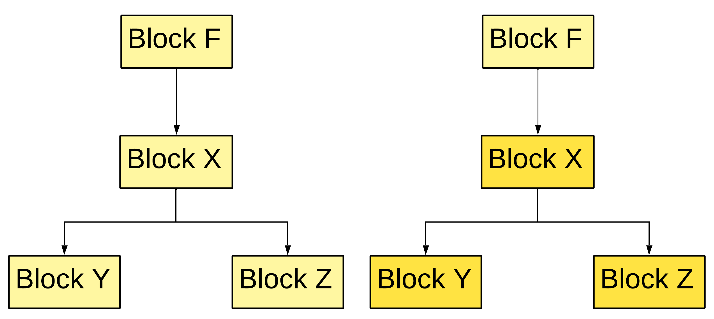

# CFG part
With `3AC`, we can move on to `CFG` (Control Flow Graph) creation. There are several ways to split `3AC` into basic blocks. One approach is using `leaders`, while another is to create a block for every command. The second approach is straightforward — each `3AC` instruction becomes its own block. The `leaders` approach, described in the *Dragon Book*, defines three rules for identifying the start of a block:

- The first instruction in a function.
- The target of a JMP instruction.
- The instruction immediately following a JMP.

In this compiler, both approaches are implemented, but for the following explanations, we will use the approach of creating a block for every command.


The source code implementing these approaches can be found [here](https://github.com/j1sk1ss/CordellCompiler/tree/HIR_LIR_SSA/src/hir/cfg). A small code snippet is also presented in this README. Also CFG part requieres [set](https://github.com/j1sk1ss/CordellCompiler/blob/HIR_LIR_SSA/std/set.c) and [map](https://github.com/j1sk1ss/CordellCompiler/blob/HIR_LIR_SSA/std/map.c) implementations.
```c
#define DRAGONBOOK_CFG_LEADER
int CFG_create_cfg_blocks(cfg_func_t* f, cfg_ctx_t* ctx) {
    int term = 0;
    hir_block_t* hh = f->entry;
    while (hh) {
        hir_block_t* entry = hh;
#ifdef DRAGONBOOK_CFG_LEADER
        while (hh->next && hh != f->exit && !set_has(&f->leaders, hh->next)) {
            hh = hh->next;
        }

        _add_cfg_block(entry, hh, f, ctx);
#else
        if (!HIR_issyst(entry->op)) _add_cfg_block(entry, entry, f, ctx);
#endif
        if (hh == f->exit) break;
        hh = hh->next;
    }

    return 1;
}
```

## Example of CFG


# Dominant calculation
With the `CFG`, we can determine the dominators of each block. In simple terms, a dominator of a block `Y` is a block `X` that appears on every path from the entry block to `Y`. For example, the following figure illustrates how this works:


Dominant calculation code placed in the [same](https://github.com/j1sk1ss/CordellCompiler/tree/HIR_LIR_SSA/src/hir/cfg) place with CFG generation source code. Also that's how it implemented.
```c
int HIR_CFG_compute_dom(cfg_func_t* fb) {
    list_iter_t bit;
    list_iter_hinit(&fb->blocks, &bit);
    cfg_block_t* cb;
    while ((cb = (cfg_block_t*)list_iter_next(&bit))) {
        if (cb == list_get_head(&fb->blocks)) set_add(&cb->dom, cb);
        else {
            list_iter_t bbit;
            list_iter_hinit(&fb->blocks, &bbit);
            cfg_block_t* ccb;
            while ((ccb = (cfg_block_t*)list_iter_next(&bbit))) {
                set_add(&cb->dom, ccb);
            }
        }
    }

    int changed = 1;
    while (changed) {
        changed = 0;
        list_iter_hinit(&fb->blocks, &bit);
        while ((cb = (cfg_block_t*)list_iter_next(&bit))) {
            if (cb == list_get_head(&fb->blocks)) continue;

            set_t nd;
            set_init(&nd);
            int first = 1;

            set_iter_t it;
            set_iter_init(&cb->pred, &it);
            cfg_block_t* p;
            while (set_iter_next(&it, (void**)&p)) {
                if (first) {
                    set_copy(&nd, &p->dom);
                    first = 0;   
                }
                else {
                    set_t tmp;
                    set_init(&tmp);
                    set_intersect(&tmp, &nd, &p->dom);
                    set_free(&nd);
                    set_copy(&nd, &tmp);
                    set_free(&tmp);
                }
            }

            if (first) {
                set_free(&nd);
                set_init(&nd);
            }

            set_add(&nd, cb);

            if (!set_equal(&nd, &cb->dom)) {
                set_free(&cb->dom);
                set_copy(&cb->dom, &nd);
                changed = 1;
            }

            set_free(&nd);
        }
    }

    return 1;
}
```

## Strict dominance
Strict dominance tells us which block strictly dominates another. A block `X` strictly dominates block `Y` if `X` dominates `Y` and `X` != `Y`. Why do we need this? The basic dominance relation marks all blocks that dominate a given block, but later analyses often require only the closest one. A block `X` is said to be the immediate dominator of `Y` if `X` strictly dominates `Y`, and there is no other block `Z` such that `Z` strictly dominates `Y` and is itself strictly dominated by `X`.


Implementation of strict dominance calculation:
```c
int HIR_CFG_compute_sdom(cfg_func_t* fb) {
    list_iter_t bit;
    list_iter_hinit(&fb->blocks, &bit);
    cfg_block_t* cb;
    while ((cb = (cfg_block_t*)list_iter_next(&bit))) {
        if (cb == list_get_head(&fb->blocks)) {
            cb->sdom = NULL;
            continue;
        }

        cfg_block_t* sdom = NULL;

        set_iter_t it;
        set_iter_init(&cb->dom, &it);
        cfg_block_t* d;
        while (set_iter_next(&it, (void**)&d)) {
            if (d == cb) continue;
            int dominated_by_other = 0;

            set_iter_t it2;
            set_iter_init(&cb->dom, &it2);
            cfg_block_t* other;
            while (set_iter_next(&it2, (void**)&other)) {
                if (other == cb || other == d) continue;
                if (set_has(&other->dom, d)) {
                    dominated_by_other = 1;
                    break;
                }
            }

            if (!dominated_by_other) {
                sdom = d;
                break;
            }
        }

        cb->sdom = sdom;
    }

    return 1;
}
```

## Dominance frontier
The dominance frontier of a block `X` is the set of blocks where the dominance of `X` ends. More precisely, it represents all the blocks that are partially influenced by `X`: `X` dominates at least one of their predecessors, but does not dominate the block itself. In other words, it marks the boundary where control flow paths from inside `X’s` dominance region meet paths coming from outside.


Dominance frontier calculation code:
```c
static int _build_domtree(cfg_func_t* fb) {
    list_iter_t bit;
    list_iter_hinit(&fb->blocks, &bit);
    cfg_block_t* cb;
    while ((cb = (cfg_block_t*)list_iter_next(&bit))) {
        if (!cb->sdom || cb->sdom == cb) continue;
        cb->dom_s = cb->sdom->dom_c;
        cb->sdom->dom_c = cb;
    }

    return 1;
}

static void _compute_domf_rec(cfg_block_t* b) {
    if (b->l && b->l->sdom != b)     set_add(&b->domf, b->l);
    if (b->jmp && b->jmp->sdom != b) set_add(&b->domf, b->jmp);

    for (cfg_block_t* c = b->dom_c; c; c = c->dom_s) {
        _compute_domf_rec(c);

        set_iter_t it;
        set_iter_init(&c->domf, &it);
        cfg_block_t* w;
        while (set_iter_next(&it, (void**)&w)) {
            if (w->sdom != b) set_add(&b->domf, w);
        }
    }
}

int HIR_CFG_compute_domf(cfg_func_t* fb) {
    _build_domtree(fb);
    _compute_domf_rec(list_get_head(&fb->blocks));
    return 1;
}
```
