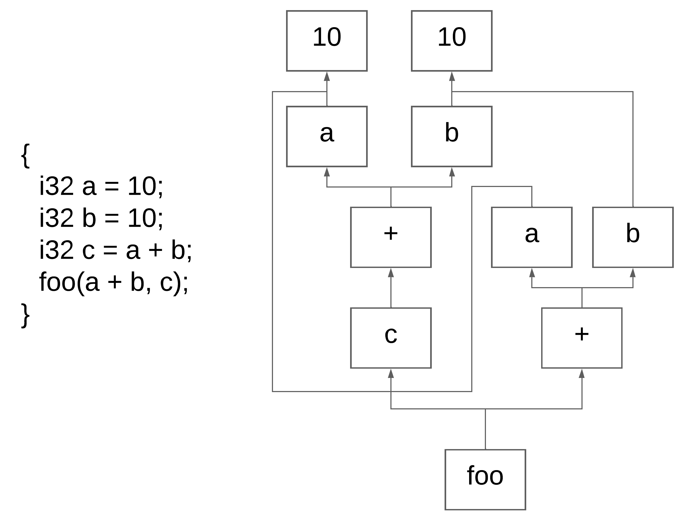
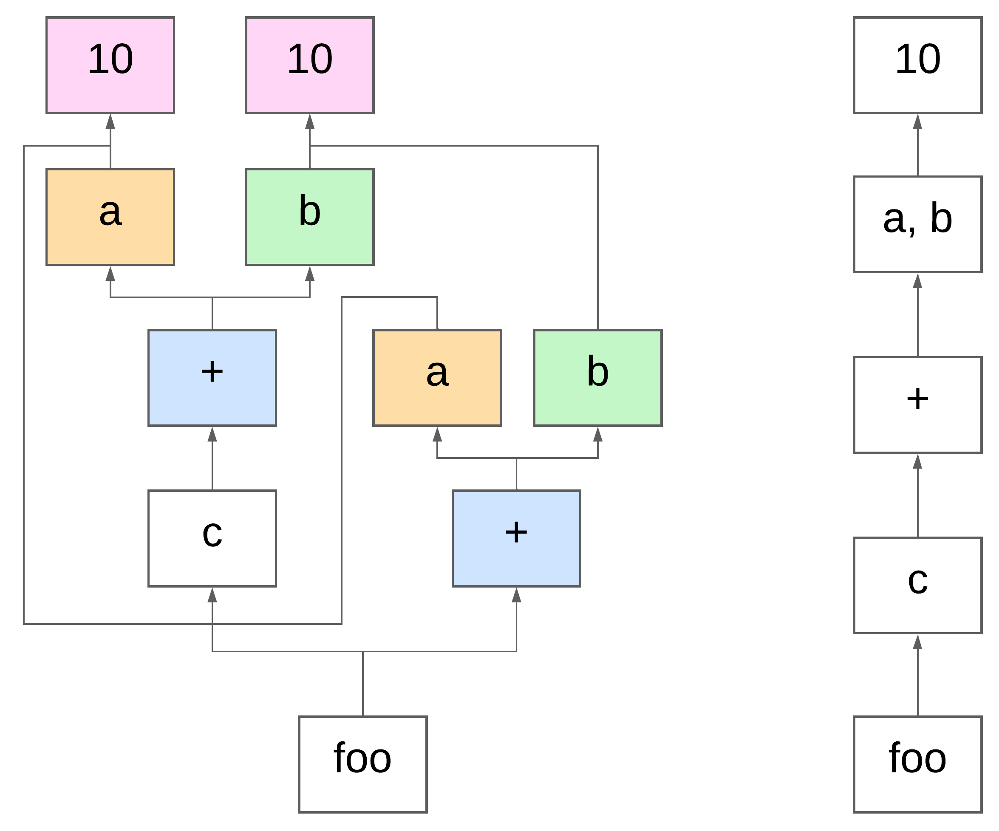

# DAG part
With the complete `SSA` form, we can move on to the first optional optimizations. The first one requires building a `DAG` (Directed Acyclic Graph) representation of the code. In short, a `DAG` shows how every value in the program is derived. In other words, this graph illustrates how each variable obtains its value (with some exceptions for `arrays` and `strings`).


The implementation of this phase is straightforward. We need to include all subjects that are used in write operations into the DAG map.
```c
case HIR_PHI_PREAMBLE:
case HIR_STORE_ECLL:
case HIR_STORE_FCLL:
case HIR_STORE_SYSC:
case HIR_FARGLD:
case HIR_STARGLD: {
    dag_node_t* dst = DAG_GET_NODE(dctx, hh->farg);
    if (!dst) break;
    // ...
}

case HIR_STORE:
case HIR_TF64: case HIR_TF32:
case HIR_TI64: case HIR_TI32: case HIR_TI16: case HIR_TI8:
case HIR_TU64: case HIR_TU32: case HIR_TU16: case HIR_TU8:
case HIR_iADD: case HIR_iSUB: case HIR_iMUL: case HIR_iDIV:
case HIR_iMOD: case HIR_iLRG: case HIR_iLGE: case HIR_iLWR:
case HIR_iLRE: case HIR_iCMP: case HIR_iNMP:
case HIR_iAND: case HIR_iOR: case HIR_iBLFT: case HIR_iBRHT:
case HIR_bAND: case HIR_bOR: case HIR_bXOR: {
    dag_node_t* src1 = DAG_GET_NODE(dctx, hh->sarg);
    dag_node_t* src2 = DAG_GET_NODE(dctx, hh->targ);
    dag_node_t* dst  = DAG_GET_NODE(dctx, hh->farg);
    // ...
}
```

Then, when we build the "basic" DAG, we check and merge all nodes that share the same hash (computed as a hash of their child nodes). If the nodes are identical and the base node is located in a dominating block, we can safely merge them.


This part includes the usage of the groups map, where we store all operators such as `+`, `-`, etc. The main idea here is the use of the dominance set: we cannot use an existing group if the current block is not dominated by the block where that group was defined.
```c
dag_node_t* existed;
if (!map_get(&dctx->groups, dst->hash, (void**)&existed)) _register_node(dctx, dst, src1, src2);
else {
    set_t owners;
    if (
        !set_has(&dst->home->dom, existed->home) ||
        (ALLIAS_get_owners(existed->src->storage.var.v_id, &owners, &smt->m) && set_size(&owners))
    ) _register_node(dctx, dst, src1, src2);
    else {
        map_remove(&dctx->dag, HIR_hash_subject(dst->src));
        HIR_DAG_unload_node(dst);
        set_add(&existed->link, (void*)HIR_hash_subject(hh->farg));
        set_free_force(&owners);
    }
}
```

The result of using the DAG is optimized code with Common Subexpression Elimination applied.


With a complete DAG, we have the opportunity to rebuild our HIR using existing nodes instead of creating new ones.
```c
int HIR_DAG_CFG_rebuild(cfg_ctx_t* cctx, dag_ctx_t* dctx) {
    list_iter_t fit;
    list_iter_hinit(&cctx->funcs, &fit);
    cfg_func_t* fb;
    while ((fb = (cfg_func_t*)list_iter_next(&fit))) {
        hir_block_t* hh = fb->entry;
        while (hh) {
            if (hh->op != HIR_PHI) {
                hir_subject_t* nodes[3] = { hh->farg, hh->sarg, hh->targ };
                for (int i = HIR_is_writeop(hh->op); i < 3; i++) {
                    if (!nodes[i]) continue;
                    dag_node_t* nd = DAG_ACQUIRE_NODE(dctx, nodes[i]);
                    if (!nd) continue;
                    if (HIR_hash_subject(nd->src) == HIR_hash_subject(nodes[i])) continue;
                    switch (i) {
                        case 0: HIR_unload_subject(hh->farg); hh->farg = nd->src; break;
                        case 1: HIR_unload_subject(hh->sarg); hh->sarg = nd->src; break;
                        case 2: HIR_unload_subject(hh->targ); hh->targ = nd->src; break;
                    }
                }
            }

            if (hh == fb->exit) break;
            hh = hh->next;
        }
    }

    return 1;
}
```