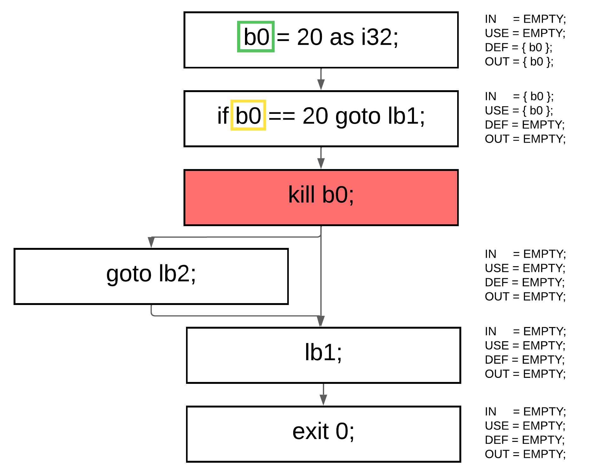

# SSA form
Static Single Assignment (SSA) form requires renaming all assigned variables so that each assignment creates a new, unique variable. A simple example is shown below:


## Phi function
But here we encounter a problem. What should we do in this specific case?


Which version of the variable `a` should be used in the declaration of `b`? The answer is simple — `both`. Here’s the twist: in `SSA` form, we can use a `φ (phi)` function, which tells the compiler which variable version to use. An example of a `φ` function is shown below:

But how do we determine where to place this function? Here, we use previously computed dominance information. We traverse the entire symbol table of variables. For each variable, we collect the set of blocks where it is defined (either declared or assigned). Then, for each block with a definition, we take its dominance frontier blocks and insert a `φ` function there.

Then, during the SSA renaming process, we keep track of each block that passes through a φ-function block, recording the version of the variable and the block number. This completes the SSA renaming phase, producing the following result:


# Liveness analyzer part
Several optimization techniques are based on data-flow analysis. Data-flow analysis itself relies on liveness analysis, which in turn depends on the program’s `SSA` form and control-flow graph (CFG). Now that we have established these fundamental representations, we can proceed with the `USE–DEF–IN–OUT` computation process.

## USE and DEF
`USE` and `DEF` are two sets associated with every `CFG` block. These sets represent all definitions and usages of variables within the block (recall that the code is already in `SSA` form). In short:
- `DEF` contains all variables that are written (i.e., assigned a new value).
- `USE` contains all variables that are read (i.e., their value is used).


## IN and OUT
`IN` and `OUT` is a little bit complex part here. 
```
OUT[B] = union(IN[S])
IN[B]  = union(USE[B], OUT[B] − DEF[B])
```

First of all, to make the calculation much faster, we should traverse our list of `CFG` blocks in reverse order, computing `IN` and `OUT` for each block using the formulas above, and repeat this process until it stabilizes. Stabilization occurs when the previous sets (`primeIN` and `primeOUT`) are equal to the current sets (`currIN` and `currOUT`). This means that for every block we should maintain four sets:

- primeIN
- currIN
- primeOUT
- currOUT

After each iteration, the current values are copied into the corresponding prime sets, preparing them for the next comparison cycle.


## Point of deallocation
At this point, we can determine where each variable dies. If a variable appears in the `IN` or `DEF` set but is not present in the `OUT` set, it means the variable is no longer used after this block, and we can safely insert a special `kill` instruction to mark it as dead. However, an important detail arises when dealing with pointer types. To handle them correctly, we construct a special structure called an `aliasmap`, which tracks ownership relationships between variables. This map records which variable owns another — meaning that one variable’s lifetime depends on another’s. For example, in code like this:
```cpl
{
   i32 a0 = 10;
   ptr i32 b0 = ref a0;
   dref b0 = 20;
}
```
the variable `a` is owned by `b`, so we must not kill `a` while `b` is still alive. In other words, the liveness of `a` depends on the liveness of `b`, and this dependency is preserved through the aliasmap.


## Example code
```cpl
{
    start(i64 argc, ptr u64 argv) {
        i32 a = 10;
        ptr i32 b = ref a;
        dref b = 11;
        i32 c = 10;
        exit c;
    }
}
```
->
```
{
    start {
        alloc i64s argc0;
        kill c0
        load_starg(i64s argc9);
        kill c9
        alloc u64s argv1;
        kill c1
        load_starg(u64s argv10);
        kill c10
        {
            alloc i32s a2;
            kill c2
            i32t tmp5 = n10 as i32;
            i32s a11 = i32t tmp5;
            kill c5
            alloc u64s b3;
            kill c3
            u64t tmp6 = &(i32s a11);
            u64s b12 = u64t tmp6;
            kill c6
            u64t tmp7 = n11 as u64;
            *(u64s b12) = u64t tmp7;
            kill c11
            kill c12
            kill c7
            alloc i32s c4;
            kill c4
            i32t tmp8 = n10 as i32;
            i32s c13 = i32t tmp8;
            kill c8
            exit i32s c13;
            kill c13
        }
    }
}
```