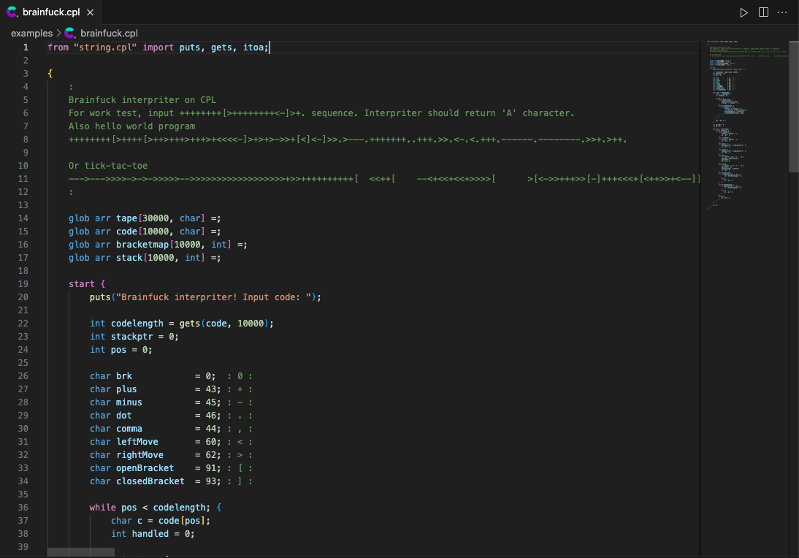

# CPL — VS Code Extension
This is a little extension for VScode for working with this hobby language. Source code can be found in `snippets/`, `src/` and `syntaxes/`.

<p align="center">
    
</p>

## Quick install
If you want to build extention in your host machine, just execute the next sequence of commands:
```bash
npm install
npm run build
vsce package
```

## Docker
If you prefer Docker as a base for the building, execute the next querry:
```bash
docker build -t cpl-extension .
docker run --rm -v $(pwd):/app -v $(pwd)/output:/output cpl-extension
```
